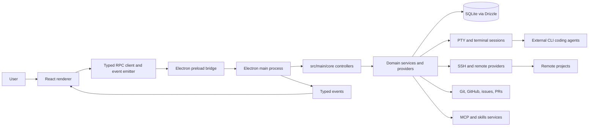

# Project Overview

Rundash is a cross-platform Electron app for orchestrating multiple AI coding agents in
parallel, each isolated in its own Git worktree and able to run locally or over SSH.
It combines provider-agnostic CLI agent execution, task and conversation management,
diff review, integrations, terminal sessions, and packaging for desktop releases.

## Repository Structure

- `.claude/` - Local Claude agent settings for this checkout.
- `.github/` - GitHub issue templates, reusable actions, CI, and release workflows.
- `.husky/` - Git hooks that run lint-staged formatting and linting on commits.
- `agents/` - Agent-facing architecture, workflow, convention, integration, and risk docs.
- `build/` - Electron packaging assets; avoid edits unless working on packaging or signing.
- `drizzle/` - Generated Drizzle SQL migrations and metadata.
- `node_modules/` - Installed dependencies; generated and never edited manually.
- `scripts/` - Release, verification, and build support scripts.
- `src/main/` - Electron main process, RPC controllers, services, database, PTY, SSH.
- `src/preload/` - Typed Electron preload bridge exposed to the renderer.
- `src/renderer/` - React app organized around `app/`, `features/`, `lib/`, and tests.
- `src/shared/` - Shared IPC primitives, provider metadata, events, MCP, skills, and types.
- `src/types/` - Ambient and cross-cutting TypeScript declarations.
- `tooling/` - Development and test infrastructure that is not bundled into production.
- Root config files - Electron Vite, Vitest, TypeScript, Drizzle, pnpm, Nix, and packaging config.

## Build & Development Commands

Install dependencies:

```bash
pnpm install
```

Start the app:

```bash
pnpm run d
pnpm run dev
```

Run main-process or renderer-only dev watches:

```bash
pnpm run dev:main
pnpm run dev:renderer
```

Run with debug logging:

```bash
pnpm run dev:debug
```

Use an isolated development database for schema or migration work:

```bash
pnpm run db:dev
pnpm run db:dev:reset
```

Build the app:

```bash
pnpm run build
pnpm run build:main
pnpm run build:renderer
```

Package desktop artifacts locally:

```bash
pnpm run package
pnpm run package:mac
pnpm run package:linux
pnpm run package:win
```

Run formatting, linting, type checks, and tests:

```bash
pnpm run format
pnpm run lint
pnpm run typecheck
pnpm run test
```

Run focused database validation:

```bash
pnpm run db:setup
pnpm run db:fixtures
pnpm run test:migrations
```

Run Docker-backed SSH development infrastructure:

```bash
pnpm run run:docker-ssh
```

Rebuild native Electron dependencies after native dependency changes:

```bash
pnpm run rebuild
```

Clean and reset dependencies:

```bash
pnpm run clean
pnpm run reset
```

Deploy releases through GitHub Actions:

```bash
gh workflow run release-prod.yml --ref main -f arch=both
gh workflow run release-canary.yml --ref main -f arch=both
```

## Code Style & Conventions

- Use Node `24.14.0` from `.nvmrc` and `pnpm@10.28.2`.
- Use `pnpm` for root project work; do not introduce npm or yarn lockfile churn.
- Format with `oxfmt`; config is `.oxfmtrc.json`.
- Keep formatted lines near the configured `printWidth` of 100 characters.
- Use 2 spaces, semicolons, single quotes in TS, double quotes in JSX, LF endings,
  trailing commas where valid in ES5, and sorted imports.
- Lint with `oxlint`; config is `.oxlintrc.json` with correctness errors,
  TypeScript, React hooks, and local repo rules enabled.
- TypeScript strict mode is enabled in the single root `tsconfig.json`.
- Avoid `any`; if a registry or boundary needs it, keep the escape local and documented.
- Use top-level `import` statements; do not use `require()`.
- Never re-export as a shortcut; import from the original source.
- Components use `PascalCase`; hooks use `useX` camelCase or an existing local pattern.
- Tests use `*.test.ts` or `*.test.tsx`.
- Main-process RPC handlers live in `src/main/core/*/controller.ts` and delegate to
  imported operation or service functions.
- Renderer RPC calls go through `rpc` from `src/renderer/lib/ipc.ts`.
- Feature UI lives under `src/renderer/features/<feature>/`; shared renderer
  primitives, stores, hooks, modal infrastructure, PTY, Monaco, and UI live under
  `src/renderer/lib/`.
- New modals must be registered in `src/renderer/app/modal-registry.ts`.
- New views must be registered in `src/renderer/app/view-registry.ts`.
- New commands should use `src/renderer/lib/commands/registry.ts` and view-level
  `commandProvider` hooks where possible.
- Commit messages should follow Conventional Commits:

```text
<type>(<scope>): <short imperative summary>

Examples:
fix(opencode): change initialPromptFlag from -p to --prompt for TUI
feat(docs): add changelog tab with GitHub releases integration
```

## Architecture Notes



The app boots from `src/main/index.ts`, loads environment and database state,
registers RPC controllers through `src/main/rpc.ts`, creates the Electron window,
and exposes a typed preload API from `src/preload/index.ts`. The renderer is a
React app that calls typed RPC methods, subscribes to typed events, and coordinates
views, modals, command providers, project state, terminals, and task workflows.
Shared IPC primitives, provider metadata, events, MCP types, skills types, and
domain types live under `src/shared/`.

Major main-process domains live under `src/main/core/`: account, agent hooks,
app, conversations, dependencies, editor, filesystem, Git, GitHub, GitLab, issues,
Jira, Linear, MCP, projects, prompt library, PTY, pull requests, repository,
resource monitor, search, settings, skills, SSH, tasks, telemetry, terminals,
updates, view state, and workspaces. Stateful main-process concerns use singleton
services; expected failures should use the `Result<T, E>` pattern from
`src/main/lib/result.ts`.

## Testing Strategy

- Local merge gate:

```bash
pnpm run format
pnpm run lint
pnpm run typecheck
pnpm run test
```

- Unit tests run with Vitest in the `node` project for `src/**/*.test.ts`.
- Main database integration tests run in the `main-db` Vitest project.
- Migration tests run in the `migrations` project via `pnpm run test:migrations`.
- Fixture generation runs in the `fixtures` project via `pnpm run db:fixtures`.
- Renderer browser tests run in the `browser` project using Playwright-backed
  `@vitest/browser-playwright`.
- Main-process tests are colocated in `src/main/core/**/*.test.ts`.
- Renderer unit tests live under `src/renderer/tests/`.
- Renderer browser tests live under `src/renderer/tests/browser/`.
- Integration-style tests create temporary repos and worktrees in `os.tmpdir()`.
- CI currently runs `.github/workflows/code-consistency-check.yml`, which enforces:

```bash
pnpm run format:check
pnpm run typecheck
pnpm run lint
```

- Tests are still expected locally before merge even though the consistency workflow
  currently covers format, typecheck, and lint.

## Security & Compliance

- The project is licensed under Apache-2.0; see `LICENSE.md`.
- Do not commit secrets, tokens, private keys, app databases, logs, build artifacts,
  or generated dependency folders.
- Application secrets are stored through encrypted app secret services and Electron
  safe storage; SSH credentials are managed through SSH services and OS-backed storage.
- Release secrets live in GitHub Actions secrets, including PostHog, Cloudflare R2,
  Apple signing/notarization, Azure Trusted Signing, and Cachix credentials.
- Telemetry must remain optional; users can disable it with `TELEMETRY_ENABLED=false`
  or in the app settings.
- File logging redacts common secret patterns; preserve this behavior when touching
  logging, telemetry, or error-reporting code.
- PTY environment passthrough must use the allowlist in `src/main/core/pty/pty-env.ts`.
- Treat SSH command construction, shell escaping, PTY spawning, and worktree paths as
  security-sensitive.
- Do not bypass path-safety, shell escaping, or validation helpers.
- Use `pnpm-lock.yaml` for dependency integrity and review dependency changes.

## Agent Guardrails

- Load only the relevant `agents/` docs for the area being changed.
- Do not hand-edit numbered Drizzle migrations or `drizzle/meta/`.
- Use `pnpm run db:generate` for new migrations, then update fixtures and migration tests.
- Avoid editing `dist/`, `release/`, `out/`, `build/`, and generated package artifacts
  unless the task is explicitly about packaging, signing, or release behavior.
- Do not dispatch release workflows, publish packages, or upload artifacts unless the
  user explicitly asks for release work.
- Treat `src/main/core/pty/`, `src/main/core/ssh/`, `src/main/db/`, and updater code
  as high risk and read the matching `agents/risky-areas/` page first.
- Do not weaken shell quoting, spawn behavior, env allowlists, or secret redaction casually.
- Prefer existing service, provider, RPC, modal, view, and store patterns over new abstractions.
- New RPC methods belong in the appropriate `src/main/core/*/controller.ts` and are
  registered through `src/main/rpc.ts`.
- Keep renderer-main calls on typed RPC and typed events. The preload bridge in
  `src/preload/index.ts` should stay small; add direct `window.electronAPI` surface
  only when a browser/Electron primitive cannot fit the RPC/event path.
- Access task and project MobX stores through selectors and task view hooks:
  `getTaskStore`, `asProvisioned`, `taskViewKind`, `getTaskManagerStore`,
  `getProjectStore`, `asMounted`, `useTaskViewKind`, `useWorkspace`,
  `useWorkspaceId`, `useDevServers`, `useWorkspaceViewModel`, `useConversations`,
  and `useTerminals`.
- Never use `asProvisioned(...)!` or `asMounted(...)!`; use explicit null checks.
- State guards must check `kind !== 'ready'` rather than enumerating non-ready states.
- Access task managers through `getTaskManagerStore(projectId)`, not `project.taskManager`.
- Access mounted projects through `asMounted(getProjectStore(id))`, not inline guards.
- Task selectors live in `src/renderer/features/tasks/stores/task-selectors.ts`.
- Project selectors live in `src/renderer/features/projects/stores/project-selectors.ts`.
- For provider changes, update shared provider metadata, PTY env passthrough if needed,
  agent-hook classifiers, renderer assumptions, and tests for non-standard behavior.
- For MCP changes, keep canonical data in shared types and adapt provider formats at edges.
- Run the local merge gate before merging:

```bash
pnpm run format
pnpm run lint
pnpm run typecheck
pnpm run test
```

## Extensibility Hooks

- Agent providers are defined in `src/shared/agent-provider-registry.ts`.
- Provider detection lives in `src/main/core/dependencies/dependency-manager.ts`.
- Provider PTY behavior and env passthrough live under `src/main/core/pty/`.
- Provider event classifiers live in `src/main/core/agent-hooks/classifiers/`.
- Modal definitions are centralized in `src/renderer/app/modal-registry.ts`.
- View definitions and navigation guards are centralized in `src/renderer/app/view-registry.ts`.
- MCP server config handling lives in `src/main/core/mcp/services/McpService.ts`,
  `src/main/core/mcp/utils/`, `src/shared/mcp/`, and `src/renderer/features/mcp/`.
- Skills types and validation live under `src/shared/skills/`; skills UI and service
  code live in `src/renderer/features/skills/` and `src/main/core/skills/`.
- Worktree runtime settings can be supplied through `.rundash.json`:
  `preservePatterns`, `scripts.setup`, `scripts.run`, `scripts.teardown`, and
  `shellSetup`.
- Project settings such as `worktreeDirectory`, `defaultBranch`, `baseRemote`,
  `pushRemote`, `tmux`, and `workspaceProvider` are DB-backed, not `.rundash.json`.
- Optional environment variables:
  `TELEMETRY_ENABLED`, `RUNDASH_DB_FILE`, `RUNDASH_DISABLE_NATIVE_DB`,
  `RUNDASH_DISABLE_CLONE_CACHE`, `RUNDASH_DISABLE_PTY`, `CODEX_SANDBOX_MODE`, and
  `CODEX_APPROVAL_POLICY`.
- Build-time telemetry configuration may use `VITE_POSTHOG_KEY` and
  `VITE_POSTHOG_HOST`; release workflows pass PostHog secrets through GitHub Actions.
- Runtime feature flags are read through telemetry-backed feature flag helpers.
- Path aliases are defined in `tsconfig.json` and mirrored in `electron.vite.config.ts`:
  `@/*`, `@renderer/*`, `@main/*`, `@shared/*`, and `@root/*`.

## Further Reading

- [Agent docs map](agents/README.md)
- [Quickstart](agents/quickstart.md)
- [Architecture overview](agents/architecture/overview.md)
- [Main process architecture](agents/architecture/main-process.md)
- [Renderer architecture](agents/architecture/renderer.md)
- [Shared modules](agents/architecture/shared.md)
- [Testing workflow](agents/workflows/testing.md)
- [Worktrees workflow](agents/workflows/worktrees.md)
- [Remote development workflow](agents/workflows/remote-development.md)
- [Provider integration](agents/integrations/providers.md)
- [MCP integration](agents/integrations/mcp.md)
- [IPC conventions](agents/conventions/ipc.md)
- [Main-process patterns](agents/conventions/main-patterns.md)
- [Renderer patterns](agents/conventions/renderer-patterns.md)
- [TypeScript and React conventions](agents/conventions/typescript.md)
- [Config file rules](agents/conventions/config-files.md)
- [Database risk notes](agents/risky-areas/database.md)
- [PTY risk notes](agents/risky-areas/pty.md)
- [SSH risk notes](agents/risky-areas/ssh.md)
- [Updater risk notes](agents/risky-areas/updater.md)
- [Contributing guide](CONTRIBUTING.md)
- [Project README](README.md)
