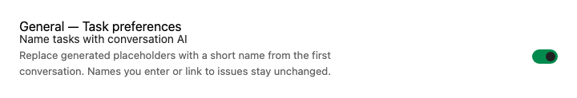
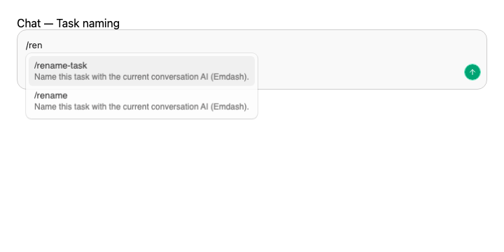

<div align="center">

[Download](https://emdash.sh/download) · [Docs](https://emdash.sh/docs) · [Releases](https://github.com/generalaction/emdash/releases/latest) · [Discord](https://discord.gg/f2fv7YxuR2) · [Contributing](CONTRIBUTING.md)

<br />

[](./LICENSE.md)
[](https://github.com/generalaction/emdash/releases)
[](https://github.com/generalaction/emdash)
[](https://github.com/generalaction/emdash/commits/main)
[](https://github.com/generalaction/emdash/graphs/commit-activity)

[](https://discord.gg/f2fv7YxuR2)
<a href="https://www.ycombinator.com"></a>
[](https://twitter.com/intent/follow?screen_name=emdashsh)

</div>

Emdash is a desktop app for running AI coding agents in parallel. Each task runs in its
own Git worktree, so you can explore multiple fixes or features at once, review the
diffs, and merge what works.

It works with local projects and remote machines over SSH. Bring the CLI agents you
already use: Claude Code, Codex, OpenCode, Amp, and more.


## What You Can Do

- Run multiple coding agents at once without juggling terminals.
- Let the first conversation AI replace a generated task name with a description of up to five words.
- Keep every agent isolated in its own Git worktree and branch.
- Send issues and tickets from Linear, GitHub, Jira, GitLab, Asana, Featurebase,
  Monday.com, Forgejo, Plain, or YouTrack into an agent.
- Review diffs, create pull requests, inspect CI checks, and merge from one place.
- Work locally or on your own remote machines over SSH/SFTP.

## Installation

| Platform | Install |
| --- | --- |
| macOS | `brew install --cask emdash` · [Apple Silicon](https://github.com/generalaction/emdash/releases/latest/download/emdash-arm64.dmg) · [Intel](https://github.com/generalaction/emdash/releases/latest/download/emdash-x64.dmg) |
| Windows | [Installer](https://github.com/generalaction/emdash/releases/latest/download/emdash-x64.msi) · [Portable](https://github.com/generalaction/emdash/releases/latest/download/emdash-x64.exe) |
| Linux x64 | [AppImage](https://github.com/generalaction/emdash/releases/latest/download/emdash-x86_64.AppImage) · [DEB](https://github.com/generalaction/emdash/releases/latest/download/emdash-amd64.deb) · [RPM](https://github.com/generalaction/emdash/releases/latest/download/emdash-x86_64.rpm) |
| Linux ARM64 | [AppImage](https://github.com/generalaction/emdash/releases/latest/download/emdash-arm64.AppImage) · [DEB](https://github.com/generalaction/emdash/releases/latest/download/emdash-arm64.deb) · [RPM](https://github.com/generalaction/emdash/releases/latest/download/emdash-aarch64.rpm) |

See the [latest release](https://github.com/generalaction/emdash/releases/latest) for
all desktop builds.

## Agents

Emdash detects installed provider CLIs automatically. It supports agents like Claude
Code, Codex, Cursor, OpenCode, Amp, Devin, Qwen Code, Droid, and GitHub
Copilot.

For agents with lifecycle-hook support, Emdash installs marker-tagged entries in the agent's
user-level config. These hooks let Emdash track status, notifications, and resumable sessions, and
silently do nothing when the agent runs outside an Emdash session.

See [Providers](https://emdash.sh/docs/providers) for the full list, setup commands,
and provider-specific behavior.

### Automatic Task Names

**Settings → General → Name tasks with conversation AI** is enabled by default. New tasks
created with a generated placeholder can be renamed once from their first conversation's work.
For example, `shaggy-canyons-appear` can become `fix-login-timeout`. Names use up to five
hyphenated words and the existing 64-character limit.

Names you type and names derived from linked issues or pull requests are preserved. You can
rename a task yourself at any time; a pending AI response will then leave that name alone.
Renaming changes the displayed task name while retaining its Git branch and worktree path.

Chat UI conversations use the provider's session title when available. Terminal conversations
ask the active agent to submit a name when lifecycle-hook support is available. With an empty
initial prompt, the agent is instructed to wait for your first work request before naming.
Tasks created without an agent remain eligible for their first conversation. The original name
stays when a provider does not return a usable name,
its sandbox blocks the callback, or the proposed name already exists in the project.
Naming uses your selected agent and does not start a separate AI session.



In Chat UI, type `/rename-task` to ask the active conversation AI for a fresh name as the
work changes. `/rename` is also available when the provider has not reserved that command.
These deliberate requests work after startup naming has finished and when automatic naming
is disabled. They can replace a custom name; a newer manual edit made while the AI responds
is preserved. You can also use **Name Task with Conversation AI** in the command palette
while a connected Chat UI conversation is active.

The request runs in the same conversation and can finish after you switch tasks. Invalid,
canceled, or duplicate suggestions leave the current name intact. Terminal slash commands
continue to belong to the selected CLI provider.



## Remote Projects

Connect to remote machines with SSH/SFTP and run the same parallel workflow on remote
codebases. Emdash supports SSH agent, key, and password authentication, including OpenSSH
certificates held by the agent, with credentials stored in your OS keychain.

See [Remote Projects](https://emdash.sh/docs/remote-projects) for setup details.

## Privacy

Emdash is local-first. App state is stored in a local SQLite database, and Emdash does
not send your code or chats to Emdash servers.

Agent CLIs may send code, prompts, and context to their own providers. Their data
handling depends on the provider you choose.

Telemetry is optional and can be disabled in Settings or by launching with:

```bash
TELEMETRY_ENABLED=false
```

See [Telemetry](https://emdash.sh/docs/telemetry) for details.

## Contributing

Contributions are welcome. Read the [Contributing Guide](CONTRIBUTING.md), open an
issue, or join the [Discord](https://discord.gg/f2fv7YxuR2).

## License

Licensed under the [Apache-2.0 license](LICENSE.md).
