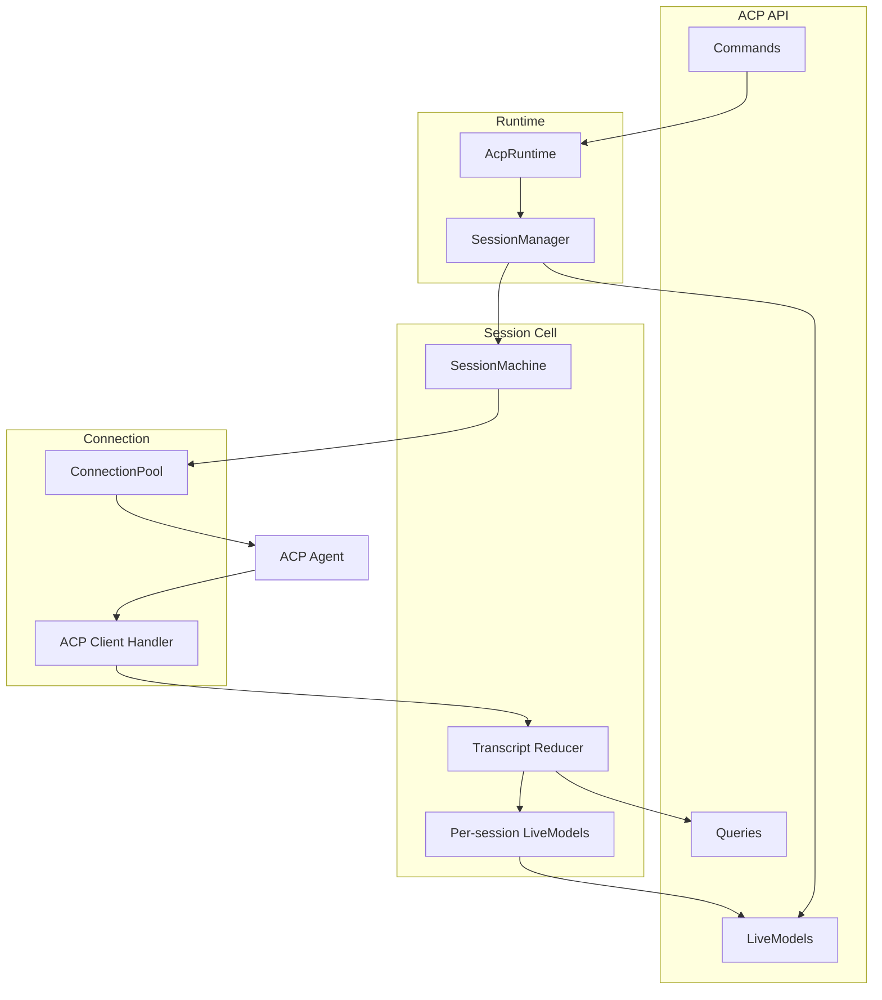

# ACP Runtime Architecture

The ACP runtime is the domain service that serves the ACP API contract. It owns
the host-scoped dependencies needed to run provider ACP sessions, but it should
not mix cross-session routing with per-session state projection.

## Ownership

- `AcpRuntime` is the composition root. It wires the ACP API contract to shared
  ports, the connection pool, and the session manager.
- `SessionManager` owns cross-session lifecycle: session creation, routing ACP
  `sessionId`s to conversation cells, process cleanup, and the sessions-list live
  model.
- `SessionCell` owns one conversation: the state machine, transcript reducer,
  per-session live models, permission broker, prompt queue effects, and turn
  quiescence.
- `ConnectionPool` owns provider processes. Processes are keyed by provider and
  workspace and can host multiple ACP sessions.
- Models under `packages/core/src/acp/models/` are the shared vocabulary for
  reducer output, live model state, and the public ACP API contract.

## Command and Read Paths

Commands enter through the API and are routed by `AcpRuntime` to the
`SessionManager`. Lifecycle commands such as starting and stopping sessions are
handled by the manager because there is no cell before a session exists. Session
commands are routed to an existing `SessionCell`, where the pure
`SessionMachine` decides whether the command is valid and emits effects for the
cell to interpret.

Provider updates move in the opposite direction. The connection handler receives
ACP callbacks, normalizes raw `SessionUpdate`s through the provider's enrich
hook, and asks the `SessionManager` to route the event to a cell. The cell folds
the event through the reducer and publishes changed slices through live models.

`editCurrentPrompt` and `exportACPTranscript` are intentionally contract-only
placeholders for now. Workspace-server stubs should keep typechecking against
the contract, but core does not serve implementations until those workflows are
designed.

## Models and Protocol Versioning

The ACP API contract should reference the schemas in `packages/core/src/acp/models/`
instead of maintaining duplicate workspace-server schemas. This means wire-facing
model changes are protocol changes. Follow the workspace-server compatibility
rules:

- Add optional fields for backward-compatible minor changes.
- Treat required field changes, removals, renames, and incompatible union changes
  as major protocol changes.
- Keep wire envelopes such as history pages, terminal output stream events, and
  runtime errors in the ACP API layer because they are transport framing, not
  domain models.
