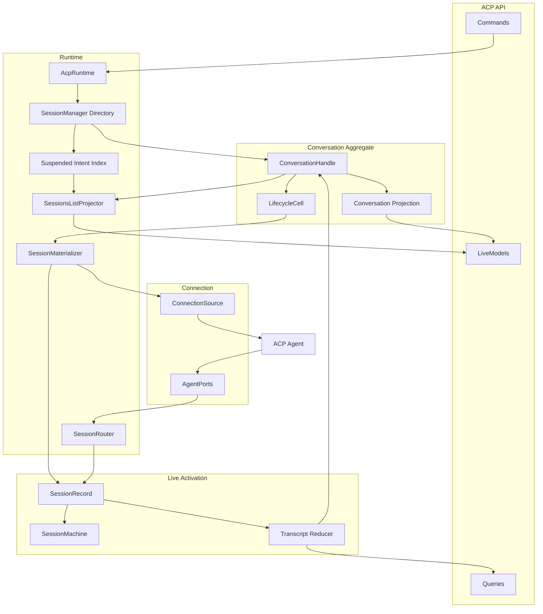

# ACP Runtime Architecture

The ACP runtime is the domain service that serves the ACP API contract. It owns
the host-scoped dependencies needed to run provider ACP sessions, but it should
not mix cross-session routing with per-session state projection.

## Ownership

- `AcpRuntime` is the composition root. It wires the ACP API contract to shared
  ports, the resource-cached connection source, and the session manager.
- `SessionManager` is the conversation directory and cross-conversation coordinator. It owns the
  handle map, suspended-intent index, process-close fan-out, lifecycle-chassis wiring, and the
  composition of the router, materializer, and list projector. Activity tracking, idle sweeping,
  intent persistence, lifecycle reports, and eviction sequencing remain delegated to the shared
  session-lifecycle chassis (`packages/core/src/services/session-lifecycle/`). Its explicit
  `inspect()` seam exposes identifier-only lifecycle snapshots for deterministic ownership and leak
  assertions without revealing the directory maps.
- `ConversationHandle` is the aggregate root for one conversation. It owns the wake descriptor,
  desired configuration, retained presentation snapshot, conversation-lifetime projection,
  explicit lifecycle state and epoch, current `SessionRecord`, activation snapshot construction,
  and its single-key `LifecycleCell`. Descriptor and retained-presentation changes write through one
  intent-persistence seam, while killed/disposed state and the epoch invalidate stale asynchronous
  materialization and command work before directory removal.
- `LifecycleCell` provides coalesced starts, leases, interrupt-before-drain teardown, and bounded
  draining for one handle. The multi-key `LifecycleRegistry` remains available to other runtimes.
- `SessionMaterializer` is stateless. It acquires a connection, loads or creates the provider
  session, creates the record's machine-state binding, applies retained configuration and mode, and
  returns a `SessionRecord` for the handle to adopt. Provisional loading registration and replay
  setup share one cleanup path so failures cannot leave routing residue.
- `SessionRouter` owns ACP `sessionId` routing and one scoped provisional load route per process
  generation. The materializer serializes `loadSession` handshakes for each generation, so a
  provider that reports a rebound session ID still resolves unambiguously. Unknown or stale updates
  outside that scope are dropped rather than retained across activations; generation invalidation
  drops provisional and registered routes. Its maps stay private; identifier-only queries support
  lifecycle leak assertions.
  `SessionsListProjector` composes live handle summaries with lightweight suspended-intent rows.
- `SessionCell` owns one live activation: the state machine, transcript reducer, permission broker,
  prompt queue effects, turn quiescence, and whether the provider's config catalog is pending or
  ready. It does not own the conversation-lifetime projection or retained rematerialization
  descriptor.
- The ACP connection source owns provider processes through `createResourceCache`.
  Cache identity includes provider, cwd, and an opaque fingerprint of the requested environment;
  the process route id stays provider/cwd plus generation and can host multiple ACP sessions with
  the same environment.
- Models under `packages/core/src/acp/models/` are the shared vocabulary for
  reducer output, live model state, and the public ACP API contract.
- Runtime implementation code lives under `packages/core/src/runtimes/acp/node/`; the portable
  contract and client models stay under `packages/core/src/runtimes/acp/api/`.
- The Node surface exports `createAcpComponent()`. App-owned worker entries call
  `runWireComponentWorker(createAcpComponent(...))`; `@emdash/core` does not export
  process bootstrap helpers.

```mermaid
flowchart TD
  subgraph api [ACP API]
    commands[Commands]
    liveModels[LiveModels]
    queries[Queries]
  end
  subgraph runtime [Runtime]
    root[AcpRuntime]
    manager[SessionManager Directory]
    router[SessionRouter]
    materializer[SessionMaterializer]
    intentIndex[Suspended Intent Index]
    listProjector[SessionsListProjector]
  end
  subgraph conversation [Conversation Aggregate]
    handle[ConversationHandle]
    lifecycle[LifecycleCell]
    projection[Conversation Projection]
  end
  subgraph session [Live Activation]
    record[SessionRecord]
    machine[SessionMachine]
    reducer[Transcript Reducer]
  end
  subgraph connection [Connection]
    source[ConnectionSource]
    ports[AgentPorts]
  end
  agent[ACP Agent]

  commands --> root --> manager --> handle
  manager --> intentIndex --> listProjector --> liveModels
  handle --> lifecycle --> materializer --> source --> agent
  materializer --> record --> machine
  agent --> ports --> router --> record
  record --> reducer --> handle --> projection --> liveModels
  handle --> listProjector
  reducer --> queries
```

## Command and Read Paths

Commands enter through the API and are routed by `AcpRuntime` to the
`SessionManager`. The manager locates or lazily creates a `ConversationHandle`; wake commands ask
the handle's lifecycle cell to ensure an activation and acquire the appropriate lease. Session
commands then reach the `SessionCell`, where the pure
`SessionMachine` decides whether the command is valid and emits effects for the
cell to interpret.

Provider updates move in the opposite direction. The connection handler receives
ACP callbacks, normalizes raw `SessionUpdate`s through the provider's enrich
hook, and asks the `SessionRouter` to resolve the owning conversation. The cell folds the event
through the reducer; its handle republishes the resulting activation snapshot through the
conversation-keyed projection.

The public API describes user intent instead of exposing lifecycle choreography. Desktop resolves
the authoritative conversation configuration and fresh provider environment, then `attach` creates
or refreshes the handle and publishes its retained projection without spawning a provider.
`loadHistory` and `sendPrompt` ensure an activation internally and coalesce through the handle's
lifecycle cell. `setOption` updates one of the provider's model, mode, or effort dimensions without
waking a suspended session. Headless callers that need creation and activation as one atomic
operation use `launch`; there is no public `ensureActivation`, `start`, or `resume` procedure.

The handle persists an explicitly allowlisted, versioned intent containing provider/session
identity, cwd, desired model/mode/effort, and a bounded non-secret presentation snapshot. Provider
environment, MCP credentials, runtime endpoints, and unknown descriptor fields are never persisted.
The runtime reports provider session identity and resume outcomes through the host conversation
index. Interactive callers therefore never persist lifecycle response data themselves.

Parsed transcript and raw ACP log exports are live-activation reads. They never wake a suspended
conversation because the raw log is activation-local and a post-wake export would describe the
replay rather than the evicted process.

## Suspension and Rematerialization

The public identity is always `conversationId`; provider process activations are internal. A
retained conversation keeps its wake descriptor and presentation after its live `SessionCell` is
evicted. The presentation separates desired configuration from last-known provider catalogs, MCP
summaries, usage, and observation time. During one runtime generation, its handle and projection
move between `closed`, `suspended`, `materializing`, and `active`; suspended and materializing
projections keep controls visible and prompt submission enabled while clearing activation-local
queues, permissions, terminals, active turns, plans, and agents.

While a rematerialized session's provider config catalog is pending, the handle projects the
retained catalog to avoid transiently removing its controls. A ready catalog atomically replaces
all retained model, effort, mode, and collaboration-mode groups; explicit empty or unsupported
groups are authoritative and must not fall back to retained values. Available commands have a
separate readiness lifecycle and are retained independently while materialization is pending.

On worker boot, every valid persisted intent is restored only as a lightweight suspended index row;
the worker never starts a provider from disk. The first desktop `attach` hydrates a handle using a
trusted fresh descriptor and publishes the retained presentation. Terminating an index-only entry
deletes its intent without starting a provider. Legacy or over-broad intents are parsed through a
restricted migration and rewritten in the safe schema.

`loadHistory`, `sendPrompt`, and the headless `launch` operation materialize a suspended activation.
Mode, model, and effort changes update desired state and persist without waking when suspended or
materializing; the latest revision is applied after load and before the first queued prompt. Other
reads, exports, callbacks, cancellation, permission resolution, and queued-prompt edits never wake
one. If a provider cannot replay history, `loadHistory` returns a successful page marked
`unavailable: true`; callers retain their existing transcript instead of replacing it with an empty
one.

Materialization is server-side and coalesced by the handle's lifecycle cell. A prompt submitted
while materializing joins that activation and dispatches once after the latest desired configuration
has been applied. Active mode and config changes use shorter leases. Eviction, termination, and runtime
disposal abort pending materialization and interrupt the cell and provider session before waiting
for leases, then continue after a bounded drain timeout if a provider does not settle. Process-close
callbacks carry a connection generation so a stale process cannot suspend sessions on its
replacement.

## Process Hosting

Desktop-local ACP and workspace-server ACP both register logical workers through
`WireWorkerHost` and use the Node `childProcessSpawner()` by default. The child
process entry calls `runWireComponentWorker(createAcpComponent(...))`, which constructs
`AcpRuntime`, a machine-scoped `AgentPluginHost`, `ChildAcpProcessHost`, and
`LocalAttachmentStore`. Host executable resolution comes from the injected
`HostDependencies` resolver contract; ACP does not construct a dependency manager or keep a
runtime-local executable cache. ACP-specific resources such as process handles, ACP ports,
terminal management, attachment storage, and session cells stay inside the ACP runtime. Each host
owns a worker manifest that maps the ACP worker id to the emitted child-process entry path for that
host's build.

Desktop draft mementos may reference attachment bytes that do not appear in a transcript. Runtime
attachment cleanup must therefore use explicit attachment deletion or whole-conversation deletion;
absence from transcript history does not prove that stored bytes are orphaned.

Desktop composes the ACP client and renderer exposure in
`apps/emdash-desktop/src/main/gateway/desktop-workers.ts`. The raw stable worker client is consumed
by typed desktop Wire controllers and by headless runtime services; renderer clients receive the
smaller conversations contract. `WireWorkerHost` itself does not own client decoration, startup
policy, or renderer exposure.

The concrete plugin registry is injected by each host entry (`emdash-desktop` and
`workspace-server`) rather than imported by `@emdash/core/runtimes`; this keeps runtime
from depending back on `@emdash/plugins` while still letting plugin resolution be
owned by the runtime composition root.

Desktop relies on Electron's `child_process.fork` behavior, which runs children
with `ELECTRON_RUN_AS_NODE`. The packaged app must keep the `RunAsNode` fuse
enabled while this fork model is used. If the app later disables that fuse for
macOS hardening, the wire package exposes the Electron
`utilityProcessSpawner()` seam for utility-process generations.

ACP terminal callbacks execute as client-hosted sibling processes rather than operating-system
children of the provider process. Their environment therefore starts from the provider process's
resolved spawn environment, then applies command-specific variables from the ACP request.

## Models and Protocol Versioning

The ACP API contract should reference the schemas in `packages/core/src/acp/models/`
instead of maintaining duplicate workspace-server schemas. This means wire-facing
model changes are protocol changes. Follow the workspace-server compatibility
rules:

- Add optional fields for backward-compatible minor changes.
- Treat required field changes, removals, renames, and incompatible union changes
  as major protocol changes.
- Keep wire envelopes such as history pages, terminal output stream events, and
  runtime errors in the ACP API layer because they are transport framing, not
  domain models.
