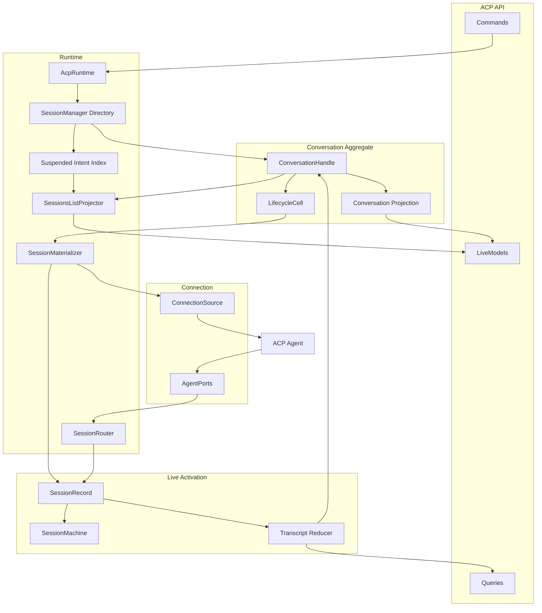

# ACP Runtime Architecture

The ACP runtime is the domain service that serves the ACP API contract. It owns
the host-scoped dependencies needed to run provider ACP sessions, but it should
not mix cross-session routing with per-session state projection.

## Ownership

- `AcpRuntime` is the composition root. It wires the ACP API contract to shared
  ports, the resource-cached connection source, and the session manager.
- `SessionManager` is the conversation directory and cross-conversation coordinator. It owns the
  handle map, suspended-intent index, process-close fan-out, lifecycle-chassis wiring, and the
  composition of the router, materializer, and list projector. Activity tracking, idle sweeping,
  intent persistence, lifecycle reports, and eviction sequencing remain delegated to the shared
  session-lifecycle chassis (`packages/core/src/services/session-lifecycle/`).
- `ConversationHandle` is the aggregate root for one conversation. It owns the wake descriptor,
  configuration overrides, conversation-lifetime projection, explicit lifecycle state and epoch,
  current `SessionRecord`, and its single-key `LifecycleCell`. Descriptor changes write through one
  intent-persistence seam, while the epoch invalidates stale asynchronous materialization work.
- `LifecycleCell` provides coalesced starts, leases, interrupt-before-drain teardown, and bounded
  draining for one handle. The multi-key `LifecycleRegistry` remains available to other runtimes.
- `SessionMaterializer` is stateless. It acquires a connection, loads or creates the provider
  session, applies retained configuration and mode, and returns a `SessionRecord` for the handle to
  adopt.
- `SessionRouter` owns ACP `sessionId` routing and the provisional loading-conversation fallback.
  `SessionsListProjector` composes live handle summaries with lightweight suspended-intent rows.
- `SessionCell` owns one live activation: the state machine, transcript reducer, permission broker,
  prompt queue effects, and turn quiescence. It does not own the conversation-lifetime projection
  or retained rematerialization descriptor.
- The ACP connection source owns provider processes through `createResourceCache`.
  Cache identity includes provider, workspace, and cwd; the process route id stays
  provider/workspace and can host multiple ACP sessions.
- Models under `packages/core/src/acp/models/` are the shared vocabulary for
  reducer output, live model state, and the public ACP API contract.
- Runtime implementation code lives under `packages/core/src/runtimes/acp/node/`; the portable
  contract and client models stay under `packages/core/src/runtimes/acp/api/`.
- The Node surface exports `createAcpComponent()`. App-owned worker entries call
  `runWireComponentWorker(createAcpComponent(...))`; `@emdash/core` does not export
  process bootstrap helpers.

```mermaid
flowchart TD
  subgraph api [ACP API]
    commands[Commands]
    liveModels[LiveModels]
    queries[Queries]
  end
  subgraph runtime [Runtime]
    root[AcpRuntime]
    manager[SessionManager Directory]
    router[SessionRouter]
    materializer[SessionMaterializer]
    intentIndex[Suspended Intent Index]
    listProjector[SessionsListProjector]
  end
  subgraph conversation [Conversation Aggregate]
    handle[ConversationHandle]
    lifecycle[LifecycleCell]
    projection[Conversation Projection]
  end
  subgraph session [Live Activation]
    record[SessionRecord]
    machine[SessionMachine]
    reducer[Transcript Reducer]
  end
  subgraph connection [Connection]
    source[ConnectionSource]
    ports[AgentPorts]
  end
  agent[ACP Agent]

  commands --> root --> manager --> handle
  manager --> intentIndex --> listProjector --> liveModels
  handle --> lifecycle --> materializer --> source --> agent
  materializer --> record --> machine
  agent --> ports --> router --> record
  record --> reducer --> handle --> projection --> liveModels
  handle --> listProjector
  reducer --> queries
```

## Command and Read Paths

Commands enter through the API and are routed by `AcpRuntime` to the
`SessionManager`. The manager locates or lazily creates a `ConversationHandle`; wake commands ask
the handle's lifecycle cell to ensure an activation and acquire the appropriate lease. Session
commands then reach the `SessionCell`, where the pure
`SessionMachine` decides whether the command is valid and emits effects for the
cell to interpret.

Provider updates move in the opposite direction. The connection handler receives
ACP callbacks, normalizes raw `SessionUpdate`s through the provider's enrich
hook, and asks the `SessionRouter` to resolve the owning conversation. The cell folds the event
through the reducer; its handle republishes the resulting activation snapshot through the
conversation-keyed projection.

The handle writes retained provider `sessionId`, mode, model, and configuration overrides through
to the runtime's session intent after successful changes. The runtime also returns the session id
from `start` and `resume`; desktop persists that value in its conversation record at the client
boundary instead of using a child-to-host callback.

Parsed transcript and raw ACP log exports are live-activation reads. They never wake a suspended
conversation because the raw log is activation-local and a post-wake export would describe the
replay rather than the evicted process.

## Suspension and Rematerialization

The public identity is always `conversationId`; provider process activations are internal. A
retained conversation keeps its wake descriptor after its live `SessionCell` is evicted. During one
runtime generation, its handle and projection explicitly move between `closed`, `suspended`, and
`active` sources. On boot, suspended intents remain lightweight index entries instead of eagerly
allocating handles and projections. The sessions-list projector still publishes an index-derived
row so cleanup and discovery see every suspended conversation. First start or wake hydrates the
handle; killing an index-only entry deletes its intent without starting a provider. Suspended state
uses the existing `closed` lifecycle plus the additive `suspended: true` marker, keeps prompt
submission enabled, and clears activation-local queues, permissions, terminals, and active turns.

Only explicit `start`/`resume` and state-changing user commands (`sendPrompt`, `setMode`, and
`setConfigOption`) materialize a suspended activation. Reads, exports, callbacks, cancellation,
permission resolution, and queued-prompt edits never wake one. In particular, suspended history
returns a successful page marked `unavailable: true`; callers keep their existing transcript and
wait for a later replay-completion refresh.

Materialization is server-side and coalesced by the handle's lifecycle cell. `sendPrompt` leases the
activation for the full provider turn, while mode and config changes use shorter leases. Eviction,
kill, and runtime disposal abort pending materialization and interrupt the cell and provider session
before waiting for leases, then continue after a bounded drain timeout if a provider does not
settle. Process-close callbacks carry a connection generation so a stale process cannot suspend
sessions on its replacement.

## Process Hosting

Desktop-local ACP and workspace-server ACP both register logical workers through
`WireWorkerHost` and use the Node `childProcessSpawner()` by default. The child
process entry calls `runWireComponentWorker(createAcpComponent(...))`, which constructs
`AcpRuntime`, a machine-scoped `AgentPluginHost`, `ChildAcpProcessHost`, and
`LocalAttachmentStore`. Host executable resolution comes from the injected
`HostDependencies` resolver contract; ACP does not construct a dependency manager or keep a
runtime-local executable cache. ACP-specific resources such as process handles, ACP ports,
terminal management, attachment storage, and session cells stay inside the ACP runtime. Each host
owns a worker manifest that maps the ACP worker id to the emitted child-process entry path for that
host's build.

Desktop draft mementos may reference attachment bytes that do not appear in a transcript. Runtime
attachment cleanup must therefore use explicit attachment deletion or whole-conversation deletion;
absence from transcript history does not prove that stored bytes are orphaned.

Desktop composes the ACP client and renderer exposure in
`apps/emdash-desktop/src/main/core/wire-workers/desktop-workers.ts`: the raw
stable worker client is wrapped there for session-ID persistence, then forwarded
to Electron windows through `exposeWireToWindows()`. `WireWorkerHost` itself
does not own client decoration, startup policy, or renderer exposure.

The concrete plugin registry is injected by each host entry (`emdash-desktop` and
`workspace-server`) rather than imported by `@emdash/core/runtimes`; this keeps runtime
from depending back on `@emdash/plugins` while still letting plugin resolution be
owned by the runtime composition root.

Desktop relies on Electron's `child_process.fork` behavior, which runs children
with `ELECTRON_RUN_AS_NODE`. The packaged app must keep the `RunAsNode` fuse
enabled while this fork model is used. If the app later disables that fuse for
macOS hardening, the wire package exposes the Electron
`utilityProcessSpawner()` seam for utility-process generations.

## Models and Protocol Versioning

The ACP API contract should reference the schemas in `packages/core/src/acp/models/`
instead of maintaining duplicate workspace-server schemas. This means wire-facing
model changes are protocol changes. Follow the workspace-server compatibility
rules:

- Add optional fields for backward-compatible minor changes.
- Treat required field changes, removals, renames, and incompatible union changes
  as major protocol changes.
- Keep wire envelopes such as history pages, terminal output stream events, and
  runtime errors in the ACP API layer because they are transport framing, not
  domain models.
