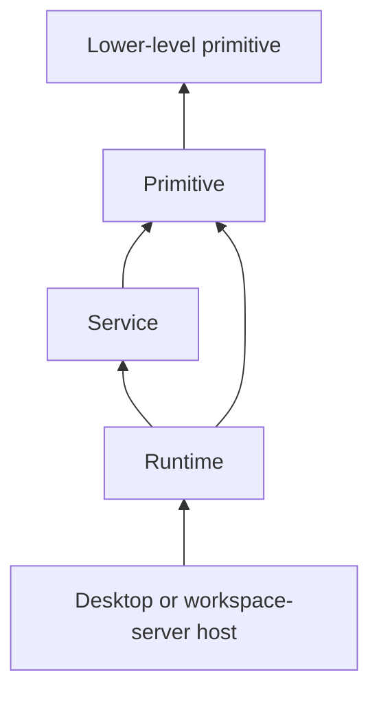

# Core Module Architecture

This page defines the target organization of `packages/core/src/`. Core is organized by module
type so that shared domain APIs and their platform implementations can remain close without
collapsing their dependency boundaries.

This is a target architecture. Paths may temporarily differ while implementations move from
`packages/runtime/` into `packages/core/`.

## Why Core Owns Both APIs And Implementations

The desktop app and workspace-server deploy many of the same capabilities in different hosts.
Keeping their contracts in one package and their implementations in another makes a single domain
span distant trees, duplicates export and build configuration, and makes coordinated changes harder
to review.

Core therefore owns both:

- portable public APIs used across process and machine boundaries; and
- platform implementations used by the hosts that serve those APIs.

Separate subpath exports preserve the important platform boundary. Colocation does not mean that
browser code may import Node implementations.

## Module Types

Every top-level Core module belongs to one of three types:

```text
packages/core/src/
  runtimes/
  services/
  primitives/
```

### Runtimes

A runtime is a host-scoped composition root for a larger product domain.

A runtime typically:

- implements a public Wire contract;
- owns domain state, resources, caches, and background work;
- orchestrates multiple injected services and primitives;
- is created once per host, workspace, or another explicit host boundary; and
- exposes lifecycle through a caller-owned `Scope` or an equivalent explicit owner.

Examples include ACP, Git, Files, agent configuration, TUI agents, and workspaces.

Runtimes are peers. **A runtime must never depend on another runtime**, including another runtime's
API surface. Shared vocabulary belongs in a primitive. Shared active behavior belongs in a service.
Cross-runtime workflows are composed by the application host, not by either runtime.

Node runtime implementations that expose a Wire contract should also provide a `WireComponent`
definition from their `node/` surface. The component is the deployment wrapper: it declares typed
requirements, validates config at the creation/worker boundary, and creates the existing runtime and
controller. It must not auto-locate other services or recursively construct dependencies.

### Services

A service is a focused, injectable capability that can be reused by runtimes.

A service may:

- own a bounded resource or lifecycle;
- provide a swappable port with Node or browser implementations;
- expose a Wire contract when it must run out of process; and
- depend on primitives.

A service must not depend on a runtime or another service. Shared contracts, vocabulary, and
portable ports that need to cross service boundaries belong in primitives. Concrete service
implementations are composed by a runtime or host.

Examples include filesystem watching, PTY management, host dependency detection, and other
cross-domain host capabilities.

Services that need to run in process or out of process use the same `WireComponent` convention as
runtimes. The distinction between runtime and service remains architectural ownership, not a
different hosting primitive.

### Primitives

A primitive is reusable vocabulary or behavior that does not orchestrate a product domain.

A primitive should:

- have no dependency on a runtime or service;
- avoid independently managed background work;
- be deterministic or narrowly effectful;
- represent values, algorithms, policies, or small infrastructure abstractions; and
- be reusable by multiple runtimes or services.

Examples include host-aware paths, resource identifiers, concurrency helpers, and pure validation
or normalization utilities.

Primitives may depend on other primitives, but those dependencies must remain acyclic.

## Shared Foundations

`@emdash/shared` owns package-level foundations that are below Core, Wire, desktop,
workspace-server, and tests. Do not move these into Core primitives just because Core uses them:

- `@emdash/shared/concurrency` owns `Scope`, `Run`, `LifecycleRegistry`, `Machine`, machine
  effect drivers, `Mailbox`, `ResourceCache`, `SharedResource`, `AsyncCache`, bounded buffers,
  and disposable helpers.
- `@emdash/shared/scheduling` owns `Clock`, `TimerHandle`, timeout helpers, retry schedules,
  and `retry()`.
- `@emdash/shared/testing` owns `ManualClock`, deferred promises, `waitFor()`, and stub logger
  helpers.
- `@emdash/shared/util` owns stable generic utilities such as `stableStringify()`.

Core primitives should hold Emdash domain vocabulary, portable contracts, and narrowly scoped
domain behavior. Shared foundations should hold reusable lifecycle, concurrency, scheduling,
testing, result, logging, and utility behavior that has no Core domain ownership.

Choose lifecycle primitives by ownership shape:

- Use `Scope` for cleanup ordering, cancellation, child ownership, and tracked async work.
- Use `LifecycleRegistry` for keyed local resources with explicit `start()`, `stop()`,
  `register()`, queryable state, typed start/stop results, and state-change observers.
- Use `Machine` for local command/event/effect protocols where commands decide domain events,
  events evolve state, and host-owned effect interpreters keep side effects explicit.
- Use `ResourceCache` when resource lifetime is lease-driven through `acquire()` and `release()`,
  optionally with an idle TTL. Use `SharedResource` for one unkeyed leased resource and
  `AsyncCache` for cached async values without finalizers.
- Use Wire `WorkerSlot` when supervising a process-hosted Wire contract with a stable client,
  readiness, restart backoff, and process generations. Application code should reach it through
  `WireWorkerHost.create(component, ...)` or `spawn(component, ...)`.
- Use Wire `LiveJob` when work must be visible over the Wire protocol as a cancellable job with
  progress, terminal state, retention, and remote client handles.

`LifecycleRegistry` is not a replacement for `Scope`: it uses scopes internally for each entry,
but its public job is lifecycle state and explicit transitions. It is also not a `ResourceCache`
because it does not ref-count demand or create resources through leases. It remains local and
protocol-free, unlike `WorkerSlot` and `LiveJob`.

## Standard Module Shape

Each module uses platform surfaces rather than mixing portable and host-specific exports:

```text
<module-type>/<module-name>/
  api/
    index.ts
  node/
    index.ts
    process.ts       # optional
  browser/
    index.ts         # optional
```

Modules only add surfaces they actually need. A pure primitive may have only `api/`; a Node-only
service may have `api/` and `node/`.

### `api/`

`api/` is the portable public definition of the module. It may contain:

- Wire contracts;
- serialized models and DTOs;
- Zod schemas;
- commands, queries, and typed errors;
- public ports and interfaces; and
- pure helpers required by consumers of the API.

An API must not:

- import from its own `node/` or `browser/` surface;
- import Node or browser platform modules;
- spawn processes or access process-global state;
- own resources or background work; or
- expose implementation-only models.

`api/` does not mean “Wire-only.” A service without a Wire contract still places its portable
consumer interface in `api/`.

### `node/`

`node/` contains the Node implementation of the module. It may contain:

- runtime and service factories;
- Wire controllers and procedure implementations;
- filesystem, Git, PTY, and subprocess behavior;
- resource allocation and lifecycle management; and
- Node-specific adapters.

Importing a `node/` entry must not start work as a module side effect. Factories receive their
dependencies explicitly and use caller-owned scopes whenever the caller owns the resulting
lifetime.

An optional `node/process.ts` adapts the implementation to process hosting. It may initialize
process logging, parse environment input, and call `serveProcessRuntime()`. The application or
worker entry invokes the exported function.

### `browser/`

`browser/` contains browser-specific implementations of the module's portable API. It may use DOM
or browser APIs but must not import Node code.

Browser code imports another module's `api/` or `browser/` surface only. It must never import a
`node/` surface.

## Subpath Export Convention

All Core module exports follow:

```text
@emdash/core/<module-type>/<module-name>/<surface>
```

Examples:

```ts
import { gitContract } from '@emdash/core/runtimes/git/api';
import { createGitRuntime } from '@emdash/core/runtimes/git/node';
import { serveGitRuntimeProcess } from '@emdash/core/runtimes/git/node/process';

import type { WatchService } from '@emdash/core/services/fs-watch/api';
import { createNativeWatchService } from '@emdash/core/services/fs-watch/node';

import { parseAbsolute, type HostAbsolutePath } from '@emdash/core/primitives/path/api';
```

Do not add an ambiguous module-root export such as `@emdash/core/runtimes/git`. Consumers must
select `api`, `node`, or `browser` explicitly.

Each exported surface has one `index.ts`. Nested implementation directories do not add barrel files
unless they are also deliberate package exports.

Build entry names mechanically mirror subpaths:

```text
runtimes-git-api
runtimes-git-node
runtimes-git-node-process
services-fs-watch-api
services-fs-watch-node
primitives-path-api
```

## Dependency Rules

The allowed dependency direction is:



Within a module:

```text
api <- node
api <- browser
node <- node/process
```

Across modules:

- runtimes may import services and primitives;
- runtimes may not import other runtimes;
- services may import primitives only;
- services may not import runtimes or other services;
- primitives may import only primitives;
- `browser/` may not import `node/`; and
- `api/` may not import either platform surface.

If code does not fit this graph, move the shared concept down a layer or compose the behavior in the
host. Do not bypass the boundary with relative deep imports.

## Example Runtime

```text
runtimes/git/
  api/
    index.ts
    contract.ts
    schemas.ts
    errors.ts
  node/
    index.ts
    git-runtime.ts
    controller.ts
    allocation/
    checkout/
    repository/
    process.ts
```

The API describes what Git exposes. The Node surface implements Git execution and canonical
resource ownership. The process entry only hosts that implementation. No code in this module may
import another runtime.

## Example Service

```text
services/fs-watch/
  api/
    index.ts
    contract.ts
    models.ts
    watch-service.ts
  node/
    index.ts
    native-backend.ts
    process-backend.ts
    process.ts
```

Runtimes depend on the portable `WatchService` interface and receive an implementation from their
host or factory. They do not reach into the service's private backend files.

## Choosing A Module Type

Use these questions in order:

1. Does it orchestrate a product domain and own its host-scoped state? It is a runtime.
2. Is it an injectable active capability reused by runtimes? It is a service.
3. Is it reusable vocabulary or narrowly scoped behavior without domain orchestration? It is a
   primitive.
4. Is it only application composition, persistence, UI, or Electron RPC glue? It belongs in the
   application rather than Core.

Do not use `lib/`, `utils/`, `common/`, or `shared/` as escape hatches inside Core. Classify the
ownership before adding the code.

## Enforcement

The architecture should be enforced mechanically:

- package exports allow only declared `api`, `node`, `browser`, and `node/process` surfaces;
- lint rules reject forbidden imports between module types and platform surfaces;
- renderer code cannot import any `node/` surface;
- tests validate that build entries and package exports match source surfaces; and
- new modules document their type and host scope in their public API.

Relative imports may be used within one module. Imports crossing a module boundary must use the
module's public subpath export so that boundary checks remain reliable.

## Migration Guidance

Move one domain at a time:

1. create its `api/` surface from the existing Core contract and models;
2. move its implementation from `packages/runtime/` into `node/`;
3. move process serving into `node/process.ts`;
4. add the new explicit package exports and build entries;
5. migrate consumers without introducing cross-runtime imports; and
6. remove the old runtime package export after all consumers move.

Keep `@emdash/wire` and `@emdash/shared` as lower-level packages. This module taxonomy organizes
Emdash domain ownership; it does not absorb the Wire framework, logging implementation, Result
type, or other package-level foundations.
