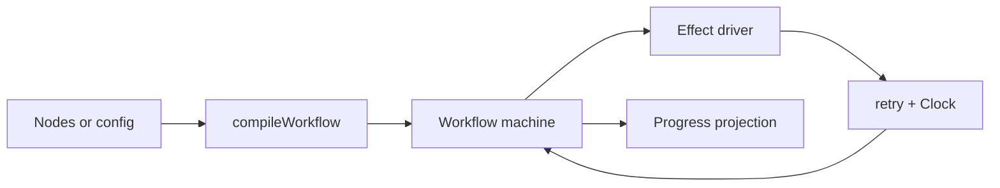

# Workflow Engine Primitive

The workflow engine is a Core primitive for dependency-ordered async work. It lives under
`packages/core/src/primitives/workflow/api/` and is exported as
`@emdash/core/primitives/workflow/api`.

Use it when work is naturally a graph of named steps:

- multiple independent steps can run in parallel;
- later steps need facts from earlier steps;
- transient failures should retry with a shared `RetrySchedule`;
- progress and output should be observable by a runtime or Wire job; and
- expected errors should be returned as `Result` values.

Do not use it for long-lived keyed resources (`LifecycleRegistry`), lease-driven caches
(`ResourceCache`), or a single command/event/effect protocol (`Machine`). The workflow engine uses a
machine internally; callers consume the higher-level DAG API.

## Layering



- `compileWorkflow(nodes)` validates duplicate ids, self dependencies, unknown dependencies, and
  cycles. It also precomputes topological order, roots, reverse edges, and indegree counts.
- The pure machine owns `WorkflowState`: phase, node status, remaining dependency counts, attempts,
  progress, warnings, facts, and terminal error.
- The effect driver executes `run-node` effects, wraps transient failures in shared `retry()`, and
  feeds outcomes back as machine events.
- Callers can subscribe to `workflow.machine` directly or bind it to `LiveState` at a Wire edge.

## Authoring Paths

There are two intended authoring paths.

Internal workflows are hand-authored in TypeScript. Workspace bootstrap can define nodes directly in
the runtime or adapt an existing internal plan into a node graph. `compileWorkflow()` still runs, but
it acts as a construction-time assertion: a cycle or unknown dependency is a programmer error caught
before any side effects start.

User workflows are compiled from data. Future `.emdash.json` workflow config should parse and
normalize user input, map entries to a trusted set of command nodes, and then call
`compileWorkflow()`. Compile errors are user-facing validation errors, not thrown exceptions. The
Git/bootstrap node catalog should not be exposed to user config.

## Direct TypeScript DAG

```ts
import { createScope } from '@emdash/shared/concurrency';
import { retrySchedules } from '@emdash/shared/scheduling';
import {
  createWorkflow,
  defineWorkflowNode,
} from '@emdash/core/primitives/workflow/api';

const scope = createScope({ label: 'workspace-bootstrap' });
const workflow = createWorkflow({
  scope,
  nodes: [
    defineWorkflowNode({
      id: 'fetch',
      retry: retrySchedules.sequence([1000, 4000]),
      run: async () => {
        await fetchRemote();
        return { status: 'done' };
      },
    }),
    defineWorkflowNode({
      id: 'branch',
      dependsOn: ['fetch'],
      run: async () => {
        await createBranch();
        return { status: 'done', facts: { branchName: 'feature/demo' } };
      },
    }),
    defineWorkflowNode({
      id: 'worktree',
      dependsOn: ['branch'],
      run: async ({ deps }) => {
        const branch = deps.branch as { branchName: string };
        const path = await addWorktree(branch.branchName);
        return { status: 'done', facts: { path } };
      },
    }),
  ],
});

if (!workflow.success) {
  // duplicate-node, unknown-dependency, self-dependency, or cycle
  throw new Error(workflow.error.message);
}

const result = await workflow.data.run();
```

Independent roots run in parallel. A serial workflow is just a graph where each node depends on the
previous node.

## User Script Compilation

For user-authored config, keep the compiler separate from the engine:

```ts
type ScriptConfig = Record<
  string,
  string | { run: string; dependsOn?: string[]; optional?: boolean }
>;

function scriptConfigToNodes(config: ScriptConfig) {
  return Object.entries(config).map(([id, entry]) => {
    const spec = typeof entry === 'string' ? { run: entry } : entry;
    return defineWorkflowNode({
      id,
      dependsOn: spec.dependsOn ?? [],
      fatal: !spec.optional,
      run: async (ctx) => {
        const result = await runShell(spec.run, {
          signal: ctx.signal,
          emit: ctx.emit,
        });
        return result.success
          ? { status: 'done' }
          : {
              status: 'failed',
              failure: 'permanent',
              error: { type: 'script-failed', message: result.error.message },
            };
      },
    });
  });
}
```

The engine validates the graph after this mapping step. Errors like unknown dependencies and cycles
can be shown directly in the UI.

## Progress and Wire

The primitive does not depend on Wire. Runtimes and services can project `WorkflowState` into their
own API views:

```ts
const unsubscribe = workflow.data.machine.subscribe((batch) => {
  ctx.progress({
    steps: Object.values(batch.state.nodes).map((node) => ({
      id: node.id,
      label: node.label ?? node.id,
      status: node.status,
      attempt: node.attempt,
      progress: node.progress,
      warnings: node.warnings,
      error: node.error,
    })),
  });
});
```

When a persistent live state is useful, use `bindMachineToLiveState()` from `@emdash/wire` at the
Wire boundary and keep the workflow primitive transport-free.

## Current Consumer

`runBootstrapPlan()` in
`packages/core/src/runtimes/workspace/node/provisioning/lifecycle/runner/runner.ts` is the first
consumer. It preserves the existing public bootstrap plan API by adapting each planned step into a
workflow node and linking nodes linearly with `dependsOn`.

This keeps today's behavior while replacing the runner's custom retry loop, skip propagation, and
progress bookkeeping with the shared primitive.

## Deferred Extensions

- Resource gates or concurrency pools, only if a future workflow needs "at most N nodes for this
  resource" without expressing a semantic ordering edge.
- Long-running service nodes with readiness probes for richer `.emdash.json` automation.
- A future workspace-bootstrap cleanup where the runtime receives `BootstrapGitIntent` and
  hand-authors the DAG directly instead of transporting a serialized step list.
