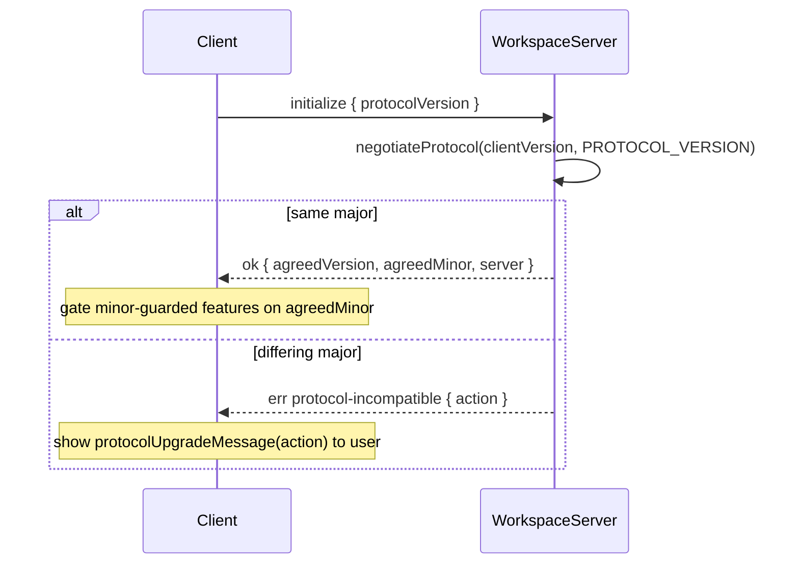

# Workspace Server

The Workspace Server (`apps/workspace-server/`) is a Node daemon that runs on a remote machine and exposes workspace runtimes (git, files, deps, ACP, …) to Emdash clients over the `@emdash/wire` protocol. Clients connect over an SSH-forwarded Unix socket; the daemon is independently lived and can be running when clients upgrade, downgrade, or are absent entirely.

The desktop client and managed installation flow live in
`apps/emdash-desktop/src/core/services/workspace-server/`. For an SSH host, the runtime broker asks
the provisioner to ensure the pinned artifact is installed and running, then holds one reconnecting
Wire client lease for the broker session. Ordinary SSH disconnects preserve that lease; terminal
client failures, exhausted SSH reconnects, and machine edits invalidate it.

Managed Linux installations use `~/.emdash/workspace-server/` with immutable version directories,
an atomic `current` symlink, staging and install-lock paths, and an explicitly selected socket under
`run/`. Artifacts are pulled by the remote, verified against their SHA-256 sidecars, and extracted
before `current` changes.

The contract lives in `packages/core/src/workspace-server/`, shared by the server and every client so TypeScript clients stay in sync at build time. Non-TypeScript clients (e.g. a future mobile app) use the negotiation handshake at runtime — compile-time sharing is a convenience, not the contract.

The daemon is the Electron-free equivalent of the desktop runtime host. Every core runtime is a
required supervised child worker in both socket and stdio modes: ACP, agent config, automations,
file search, files, Git, terminals, TUI agents, and workspace. The filesystem watcher is also a
worker because it is the shared dependency for files, Git, file search, and workspace. Server
startup fails if any required worker cannot become ready; there are no unavailable-domain fallback
implementations in the aggregate controller.

The parent mounts each complete runtime contract under `workspaceWireContract`. Aggregate
forwarding rebinds live endpoint definitions to their namespaced contract ids while retaining the
standalone worker client's upstream topic handles, and translates mutation cursor model ids to the
same aggregate namespace. Runtime-owned persistence lives below the workspace-server state
directory, including automation and file-search databases, session intents, ACP attachments, and
other runtime state. Repository and worktree placement is desktop-owned; the server reports its
home directory through the files runtime and executes plans containing absolute paths.

Host dependencies are mounted under `workspaceWireContract.hostDependencies`.
The daemon parent owns one local `HostDependencies` component backed by a JSON-file
`KeyValueStore` under the workspace-server state directory and forwards only the narrow resolver
contract into process-spawning child runtimes. The full contract remains available to clients for
inspection, refresh, explicit PATH selection, and plugin-declared update commands. This keeps
workspace-server dependency state local to the remote host while preserving the same source and
selection model used by the desktop SQLite-backed component.

Port-forward inspection is mounted under `workspaceWireContract.portForwards`.
The daemon probes its own loopback interfaces and reports whether a requested
port is accepting connections on IPv4, IPv6, or both. Desktop clients can use
this as the wire control plane before opening a transport-native data stream for
preview traffic.

## Protocol Version

The wire contract is versioned with a single [semver](https://semver.org) string, defined in
[`packages/core/src/workspace-server/versions/index.ts`](../../packages/core/src/workspace-server/versions/index.ts):

```ts
export const PROTOCOL_VERSION = '5.0.0';
```

### What each component means

| Component | Meaning | Compatibility |
|-----------|---------|---------------|
| **major** | Breaking wire change — removed or retyped field, changed procedure name, changed framing | Incompatible across differing majors |
| **minor** | Additive, backward-compatible — new procedure, new optional field, new ignorable event kind | Compatible; negotiated feature level is `min(clientMinor, serverMinor)` |
| **patch** | No wire impact — bugfix, performance, internal refactor | Always compatible; informational only, ignored by negotiation |

**Compatibility rule**: same major implies compatible. On a major mismatch, the lower major is the stale side and determines the upgrade prompt.

## Behavior-Change and Versioning Rules

### When to bump minor (additive, non-breaking)

- Adding a new procedure.
- Adding an optional field to an existing request or response schema (must be `.optional()` or carry a default; never add a required field in a minor bump).
- Adding a new event kind to an event iterator output where old clients can safely ignore the unknown kind.
- Introducing opt-in behavior that is gated on `agreedMinor >= N` — the client checks `agreedMinor` and falls back gracefully when the server doesn't offer it.

### When to bump major (breaking)

- Removing or renaming a field, procedure, or error code.
- Changing the type or semantics of an existing field.
- Changing how requests are framed or how errors are encoded on the wire.
- Adding an event kind that old clients **must** handle (rather than ignore).

### When to bump patch (no wire change)

- Fixing a bug that does not alter observable wire behavior.
- Internal performance or correctness improvements.

### Never do these

- Silently change the semantics of an existing call at the same version.
- Add a required field to an existing schema in a minor bump.
- Repurpose an existing field for a different meaning — add a new field and deprecate the old one.
- Remove a field or procedure without a major bump and a deprecation window.

### Discriminated unions

The contract uses many discriminated unions (e.g. `GitPathInspection`, `GitStatusModel`, error unions). Adding a new variant is a **minor bump only if** old clients can safely ignore unknown variants with a default/fallback branch. If the client must handle the new variant to function correctly, it is a **major bump**.

### Schema parsing and unknown fields

Zod strips unknown keys on `.parse()` by default. This is the correct behavior for a tolerant reader: an old client receiving a new response silently ignores new fields. Do not rely on parse to preserve unknown fields if the value is forwarded elsewhere.

## Initialize Handshake

Every client must call `initialize` before using a new connection for workspace operations. `health`
is the only pre-initialization exception because daemon lifecycle probes use it to distinguish an
absent daemon from an incompatible one. Because the daemon is independently lived, `initialize`
must be re-called on every reconnect: the daemon may have changed versions between connections.

The reconnecting desktop transport treats `connectOnce` as a readiness barrier. A candidate stream
is not installed, queued messages are not flushed, and live topics are not reattached until the
candidate's `initialize` call succeeds. A protocol incompatibility is permanent for that client
version and stops the reconnect loop; ordinary I/O failures remain retryable.

### Request (client → server)

```ts
{
  protocolVersion: string;  // the client's PROTOCOL_VERSION
}
```

### Response (server → client)

```ts
{
  protocolVersion: string;  // the server's own PROTOCOL_VERSION
  agreedVersion: string;    // major.min(clientMinor, serverMinor).0
  agreedMinor: number;      // clients gate minor-guarded features on this
  server: {
    appVersion: string;
    daemonId: string;       // stable per-process identity, set at startup
    startedAt: number;      // Unix ms when the daemon started
  };
}
```

### Failure: protocol-incompatible

When majors differ, the fallible `initialize` procedure returns a typed error:

```ts
{
  code: 'protocol-incompatible';
  action: 'upgrade-client' | 'upgrade-server';
  clientProtocolVersion: string;
  serverProtocolVersion: string;
}
```

`action` is `'upgrade-client'` when the client major is lower (stale desktop app) and `'upgrade-server'` when the client major is higher (stale daemon). Use `protocolUpgradeMessage(action)` from `@emdash/core/workspace-server` to produce a consistent user-facing string.

### Negotiation flow



### Gating a minor-guarded feature (example)

```ts
// Server introduces a new subscribe feature at protocol 1.1.0.
// Clients with agreedMinor >= 1 may call it; others fall back to polling.
const session = await connect(client);
if (session.agreedMinor >= 1) {
  // use git.worktree.subscribe
} else {
  // fall back to polling
}
```

## Key Files

| Path | Role |
|------|------|
| [`packages/core/src/workspace-server/versions/index.ts`](../../packages/core/src/workspace-server/versions/index.ts) | `PROTOCOL_VERSION`, `negotiateProtocol`, `protocolUpgradeMessage` |
| [`packages/core/src/workspace-server/wire/schemas.ts`](../../packages/core/src/workspace-server/wire/schemas.ts) | initialize/health schemas |
| [`packages/core/src/workspace-server/wire/contract.ts`](../../packages/core/src/workspace-server/wire/contract.ts) | aggregate control-plane and core-runtime wire contract |
| [`packages/core/src/workspace-server/port-forwards/contract.ts`](../../packages/core/src/workspace-server/port-forwards/contract.ts) | daemon-local preview port inspection contract |
| [`apps/workspace-server/src/api/controller.ts`](../../apps/workspace-server/src/api/controller.ts) | Server-side procedure and live-model handlers |
| [`apps/workspace-server/src/gateway/workspace-workers.ts`](../../apps/workspace-server/src/gateway/workspace-workers.ts) | required worker graph, runtime configuration, and dependency composition |
| [`apps/workspace-server/src/gateway/worker-manifest.ts`](../../apps/workspace-server/src/gateway/worker-manifest.ts) | shared Core and app-local packaged subprocess entries |
| [`apps/workspace-server/src/gateway/worker-paths.ts`](../../apps/workspace-server/src/gateway/worker-paths.ts) | packaged worker executable path resolution |
| [`apps/workspace-server/src/gateway/entries/`](../../apps/workspace-server/src/gateway/entries/) | plugin-injecting ACP, agent config, and TUI-agent worker entries |
| [`apps/workspace-server/src/index.ts`](../../apps/workspace-server/src/index.ts) | CLI and daemon entry point |
| [`apps/emdash-desktop/src/core/services/workspace-server/`](../../apps/emdash-desktop/src/core/services/workspace-server/) | Desktop client, installer, provisioner, and lifecycle policy |
