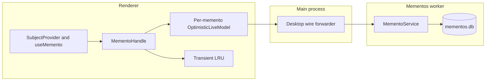
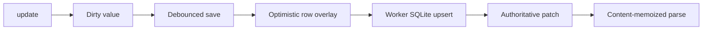

# Mementos

Mementos are small, typed pieces of UI state that survive longer than the
component that currently renders them. A contributor defines a memento beside
the feature that owns the state; a subject supplies the domain identity to which
that state belongs.

The system supports two retention tiers:

- `persisted`: stored in `mementos.db`, survives application restarts;
- `transient`: stored in a renderer-window LRU, survives unmounts and subject
  switches but not a renderer reload.

State that only matters while one component is mounted is ephemeral state and
should remain ordinary React or view-model state.

## Why identity is separate from hierarchy

Navigation, layouts, and component trees change frequently. Persisted keys do
not encode those hierarchies. A memento row is keyed only by:

```text
(mementoId, subject.kind, subject.key)
```

For example, `tasks.drawer` can move between panels without invalidating its
state for `task:123`. Hierarchy remains useful for context dispatch in React,
but it is not storage identity.

## Architecture



The vertical slice is split by runtime:

- `api/`: runtime-independent definitions, retention, catalog helpers, and wire
  contract;
- `browser/`: `MementoClient`, subject spaces, optimistic handles, transient
  LRU, and `sanitizedMemento`;
- `react/`: providers and hooks;
- `src/core/services/mementos/node/`: worker-hosted persistence and live-model
  service.

Each persisted memento has its own `OptimisticLiveModel`. Updating one memento
cannot invalidate another memento on the same subject. The handle keeps a local
dirty value during the debounce interval and primes a content-memoized parser
with its serialized value. The flow is:



The authoritative echo reuses the value reference remembered for the same
serialized `data` string, avoiding an additional observer notification.

## Define a subject and memento

Subject definitions belong in their domain's API-visible code:

```ts
import { defineSubject } from '@core/primitives/subjects/api';
import { z } from 'zod';

export const taskSubject = defineSubject({
  kind: 'task',
  key: z.object({ taskId: z.string().uuid() }),
  encode: ({ taskId }) => taskId,
});
```

Define each memento beside the feature that owns the state. Defaults are
required, so reads are total even when no row exists or an old row is invalid.

```ts
import { defineVersionedSchema } from '@emdash/core/primitives/versioned-schema/api';
import { days, defineMemento } from '@core/primitives/mementos/api';
import { z } from 'zod';
import { taskSubject } from '../tasks/api/task-subject';

const drawerSchema = defineVersionedSchema()
  .initial(
    '1',
    z.object({
      version: z.literal('1'),
      open: z.boolean(),
      heightPx: z.number().int().positive(),
    })
  )
  .build();

export const terminalDrawerMemento = defineMemento({
  id: 'pty.terminal-drawer',
  subject: taskSubject,
  schema: drawerSchema,
  default: {
    version: '1' as const,
    open: false,
    heightPx: 240,
  },
  retention: {
    tier: 'persisted',
    maxAge: days(60),
    maxEntries: 500,
  },
});
```

IDs are global and contributor-namespaced. Every definition requires a subject;
use `appSubject` explicitly for application-global state.

Register persisted definitions in `src/core/manifests/memento-catalog.ts`:

```ts
import { terminalDrawerMemento } from './features/pty/api/mementos';

export const mementoCatalog = [
  terminalDrawerMemento,
] satisfies readonly MementoCatalogEntry[];
```

The worker derives sweep policies from this catalog. The renderer prefetches
cataloged definitions before `SubjectProvider` renders its children. Definitions
must therefore remain importable from API halves without pulling Node or browser
code into the opposite process.

## Headless browser usage

Use a subject space from a MobX view model or other non-React renderer code:

```ts
import { createScope } from '@emdash/shared/concurrency';
import {
  getMementosWireClient,
  MementoClient,
} from '@core/primitives/mementos/browser';
import { mementoCatalog } from '@core/manifests/memento-catalog';

const scope = createScope({ label: `task-view:${taskId}` });
const client = new MementoClient(await getMementosWireClient(), {
  catalog: mementoCatalog,
});
const space = client.subject(taskSubject({ taskId }));
const drawer = space.handle(terminalDrawerMemento);
scope.add(() => client.dispose());
scope.add(() => space.release());

await space.ready;

drawer.update((current) => ({
  ...current,
  open: true,
}));

drawer.autoPersist(() => viewModel.drawerState, scope);
```

`update` is synchronously visible. Persisted handles debounce writes for one
second by default. Call `await handle.flush()` before a controlled transition
that must durably save pending state. `MementoClient.flush()` drains every live
handle, and the client also starts a flush on `beforeunload`.

`reset()` deletes the persisted row rather than storing the default. Every open
renderer converges to the definition's default through the live model.

## React usage

Provide one client near the renderer root and a subject at the domain boundary:

```tsx
import {
  MementoClientProvider,
  SubjectProvider,
} from '@core/primitives/mementos/react';

<MementoClientProvider client={mementoClient}>
  <SubjectProvider
    subject={taskSubject({ taskId })}
    fallback={<TaskViewSkeleton />}
  >
    <TaskView />
  </SubjectProvider>
</MementoClientProvider>;
```

Consume state without manually wiring persistence:

```tsx
import { useMemento } from '@core/primitives/mementos/react';

function TerminalDrawer() {
  const [drawer, setDrawer, { reset }] = useMemento(terminalDrawerMemento);

  return (
    <Drawer
      open={drawer.open}
      height={drawer.heightPx}
      onOpenChange={(open) => setDrawer((current) => ({ ...current, open }))}
      onReset={() => void reset()}
    />
  );
}
```

Subject providers may be nested. `useSubject(taskSubject)` and
`useMemento(terminalDrawerMemento)` walk the provider chain to find the matching
subject kind; storage still uses only the matched subject identity.

## Schema evolution

Stored payloads are serialized by `VersionedSchema`. The service treats `data`
as opaque text, so feature owners evolve their state without a database
migration:

```ts
const drawerV2Schema = z.object({
  version: z.literal('2'),
  open: z.boolean(),
  heightPx: z.number().int().positive(),
  dock: z.enum(['left', 'right']),
});

export const drawerSchema = defineVersionedSchema()
  .initial('1', drawerV1Schema)
  .version('2', drawerV2Schema, (previous) => ({
    ...previous,
    version: '2' as const,
    dock: 'right' as const,
  }))
  .build();
```

Migration happens in memory on read. Missing, invalid, context-dependent, and
future-version values fall back to the definition's default and are not
automatically persisted.

## Entity-referencing state

Selections and expansion state often refer to domain entities that may be
deleted. Use `sanitizedMemento` as a reactive read lens:

```ts
import { sanitizedMemento } from '@core/primitives/mementos/browser';

const selection = sanitizedMemento(space.handle(selectionMemento), {
  deps: () => {
    if (taskStore.kind !== 'ready') return undefined;
    return new Set(taskStore.items.map((item) => item.id));
  },
  sanitize: (state, itemIds) => ({
    ...state,
    selectedId:
      state.selectedId && itemIds.has(state.selectedId)
        ? state.selectedId
        : undefined,
  }),
});
```

`deps() === undefined` means “not loaded,” so raw state passes through and does
not flash to an empty selection. Once dependencies are defined, `sanitize` runs
reactively. Sanitized repairs are view projections only: the underlying raw
memento is not rewritten unless application code explicitly calls `update`.

## Transient state

Use the transient tier for state that should survive switching subjects but has
no value after a renderer reload:

```ts
export const terminalScrollMemento = defineMemento({
  id: 'pty.terminal-scroll',
  subject: taskSubject,
  schema: terminalScrollSchema,
  default: { version: '1' as const, line: 0 },
  retention: {
    tier: 'transient',
    maxEntries: 1_000,
  },
});
```

Transient handles have the same API, perform no wire calls, and are pinned while
in use. Unpinned entries are evicted least-recently-used when a definition
exceeds `maxEntries`.

## Persistence and cleanup

Persisted rows live in a dedicated derived SQLite store at
`userData/mementos.db`. Synchronous SQLite runs in the mementos wire worker, not
the Electron main thread. The schema is:

```sql
PRIMARY KEY (memento_id, subject_kind, subject_key)
```

Payload evolution does not alter this table. If the table schema itself changes,
the derived-store fingerprint rebuilds the file.

At worker startup, sweep removes:

- rows older than each cataloged definition's `maxAge`;
- least-recent rows beyond that definition's `maxEntries`;
- unknown definition IDs using the global persisted defaults.

`deleteBySubject(subject)` removes every persisted and transient value for one
domain identity and publishes `null` to currently acquired live models.

`deleteOrphans(kind, validKeys)` removes values whose subject key no longer
exists in the owning domain. Pass encoded subject keys, normally during
application cleanup after the authoritative domain store has loaded:

```ts
await mementoClient.deleteOrphans(
  taskSubject.kind,
  tasks.map(({ id }) => taskSubject.encode({ taskId: id }))
);
```

The persistence service diffs keys outside SQL and deletes in bounded chunks,
so cleanup is not limited by SQLite's parameter count. `deleteAll()` is the
recovery escape hatch used to reset all persisted and transient presentation
state. Both operations invalidate currently acquired live models. Pending
debounced writes are discarded before destructive operations so deleted rows
cannot be resurrected by a late flush.

The worker stamps `updatedAt` when accepting a save; renderer clocks are not
trusted for retention. Startup sweep is best-effort maintenance and a failure
is logged without preventing the mementos worker from starting.

## Invariants and anti-patterns

- Keep definitions in API-visible modules and register persisted definitions in
  the catalog.
- Use stable, contributor-namespaced IDs such as `pty.terminal-drawer`.
- Store bounded, JSON-shaped presentation state only.
- A memento uses whole-value last-write-wins semantics. Split independent,
  concurrently edited concerns into separate mementos instead of expecting
  field-level merges.
- Do not store domain entities, caches, source-of-truth configuration, secrets,
  xterm buffers, Monaco models, class instances, `Map`, `Set`, or `Date`.
- Do not persist repairs produced by `sanitizedMemento`.
- Do not derive storage keys from routes, tabs, panel hierarchy, or component
  positions.
- Keep ephemeral state in the component or view model rather than creating a
  memento for every local interaction.
