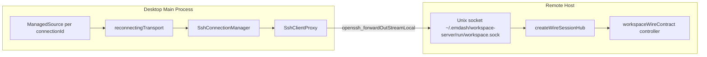

# Workspace Server Client Connection

This document describes the target desktop-to-workspace-server connection model.
Only macOS and Linux remotes are in scope for this design.

## Topology



The workspace server daemon listens on a Unix domain socket. The socket lives in
a user-owned directory with mode `0700`; SSH authentication plus filesystem
permissions form the access boundary. Desktop clients do not connect to a TCP
port on the remote host.

`--socket` is the daemon serving mode. `--stdio` serves the same wire controller
over stdin/stdout and exists as a test and debugging harness.

## Desktop Utility Shape

The desktop should expose a managed source keyed by SSH `connectionId`. Each
lease shares the same underlying workspace connection and keeps it warm for a
short grace window across renderer reloads or transient feature detaches.

```ts
const workspaces = createManagedSource({
  key: (key: { connectionId: string }) => key.connectionId,
  graceMs: 30_000,
  async create({ connectionId }, scope) {
    const transport = reconnectingTransport(async () => {
      const proxy = await sshConnections.connect(connectionId);
      await ensureWorkspaceDaemon(proxy);
      const channel = await proxy.forwardOutStreamLocal(WORKSPACE_SOCKET_PATH);
      return streamTransport(channel, channel);
    });
    scope.add(() => transport.close());

    const connection = connect(transport);
    const workspace = client(workspaceWireContract, connection);
    const initialized = await workspace.initialize({ protocolVersion: PROTOCOL_VERSION });
    if (!initialized.success) {
      throw new WorkspaceProtocolError(initialized.error);
    }
    return { client: workspace, connection };
  },
});
```

`ensureWorkspaceDaemon()` is a future bootstrap step. It should probe the socket,
start the daemon if absent, and leave version upgrades to the wire update flow.
After the daemon exists, each `connectOnce` opens a streamlocal channel with
`SshClientProxy.forwardOutStreamLocal(socketPath)` and adapts it with
`streamTransport(channel, channel)`.

## Failure Semantics

- SSH connection drops: the streamlocal channel closes, `streamTransport` emits
  disconnect, and `reconnectingTransport` retries `connectOnce`.
- SSH reconnects: `SshConnectionManager.connect(connectionId)` reuses or waits
  for the managed SSH connection using the existing credential resolution.
- Workspace daemon restarts: `connectOnce` reopens the Unix socket after the
  daemon starts listening again.
- Live attachments: `connect()` observes `onReconnect` from
  `reconnectingTransport`, re-attaches topics, and replicas resync from fresh
  snapshots.
- Pending calls: in-flight calls reject with `DISCONNECTED`; callers decide
  whether procedure retries are safe. Live model mutations can use mutation IDs
  and retry options.
- Protocol mismatch: `initialize` returns a typed `Result` error with
  `action: 'upgrade-client' | 'upgrade-server'`. The future update flow should
  route `upgrade-server` into workspace-server self-update.

## Server Modes

Socket mode:

```bash
emdash-workspace-server --socket
emdash-workspace-server --socket ~/.emdash/workspace-server/run/workspace.sock
```

The server ensures the socket directory exists, probes before unlinking stale
socket files, and serves each accepted `net.Socket` through
`createWireSessionHub`.

Stdio mode:

```bash
emdash-workspace-server --stdio
```

Stdio mode must not write logs to stdout because stdout is the wire protocol
channel. It is intended for local integration tests and manual debugging, not as
the production SSH transport.

## Related Docs

- `packages/wire/docs/api/serving.md`
- `packages/wire/docs/api/transports.md`
- `packages/wire/docs/runtime/lifecycle.md`
- `packages/wire/docs/runtime/process-runtimes.md`
