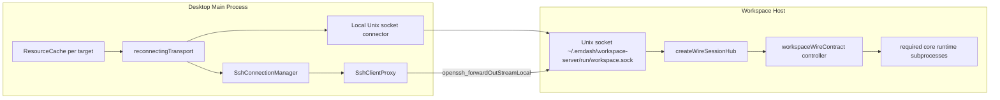

# Workspace Server Client Connection

This document describes the target desktop-to-workspace-server connection model.
Only macOS and Linux remotes are in scope for this design.

## Topology



The workspace server daemon listens on a Unix domain socket. The socket lives in
a user-owned directory with mode `0700`; SSH authentication plus filesystem
permissions form the access boundary. Desktop clients do not connect to a TCP
port on the remote host.

`serve --socket` is the daemon serving mode. `serve --stdio` serves the same
wire controller over stdin/stdout and exists as a test and debugging harness.

The daemon runs every core runtime in a required supervised subprocess in both socket and stdio
modes. Clients reach ACP, agent config, automations, file search, files, Git, terminals, TUI agents,
and workspace through the corresponding aggregate client domains. Live state, jobs, event streams,
mutations, terminal logs, and file blob channels all use the same reconnectable workspace wire
connection.

## Desktop Utility Shape

The desktop should expose a resource cache keyed by the full workspace-server
target. Local sockets are the first implementation; SSH becomes another stream
source without changing handshake or reconnect behavior. Including the socket path
in the key avoids conflating custom daemon sockets on the same host.

```ts
type WorkspaceServerTarget =
  | { kind: 'local-socket'; socketPath: string }
  | { kind: 'ssh'; sshConnectionId: string; socketPath: string };

const workspaces = createResourceCache({
  key: workspaceServerTargetKey,
  idleTtlMs: 30_000,
  async create(target: WorkspaceServerTarget, scope) {
    let negotiated: WireInitializeResult | undefined;
    const transport = reconnectingTransport(
      () =>
        openInitializedWorkspaceTransport(target, (value) => {
          negotiated = value;
        }),
      {
        shouldRetry: (error) => !(error instanceof WorkspaceProtocolError),
      }
    );
    scope.add(() => transport.close());

    const connection = connect(transport);
    scope.add(() => connection.dispose());
    const workspace = client(workspaceWireContract, connection);
    await transport.ready();
    return { client: workspace, connection, negotiated: () => negotiated };
  },
});

async function openInitializedWorkspaceTransport(
  target: WorkspaceServerTarget,
  onInitialized: (value: WireInitializeResult) => void
): Promise<WireTransport> {
  const stream = await openWorkspaceServerStream(target);
  const candidate = ownedStreamTransport(stream);
  const handshakeConnection = connect(candidate);
  const handshakeClient = client(workspaceWireContract, handshakeConnection);

  try {
    const initialized = await handshakeClient.initialize({
      protocolVersion: PROTOCOL_VERSION,
    });
    if (!initialized.success) throw new WorkspaceProtocolError(initialized.error);
    onInitialized(initialized.data);
    return candidate;
  } catch (error) {
    candidate.close?.();
    throw error;
  } finally {
    handshakeConnection.dispose();
  }
}
```

`openWorkspaceServerStream()` initially opens a manually-started local daemon's
Unix socket. The later SSH implementation obtains the stable proxy from
`SshConnectionManager`, ensures the daemon exists, and opens a streamlocal channel
to the same socket path.

`ownedStreamTransport()` wraps `streamTransport(stream, stream)` and destroys the
underlying socket/channel from `close()`. `streamTransport()` itself only releases
its parsing listeners because it does not own the streams passed to it.

`ensureWorkspaceDaemon()` is a future desktop bootstrap step. It should call the
server-side lifecycle CLI to probe the socket, start the daemon if absent, and
leave version upgrades to the wire update flow. After the daemon exists, each
`connectOnce` uses the current ssh2 client exposed by `SshClientProxy` to open an
`openssh_forwardOutStreamLocal` channel and adapts it with
`streamTransport(channel, channel)`. A convenience method may be added to the proxy
when the SSH connector is implemented.

## Handshake and Readiness Invariants

Each `connectOnce` attempt owns one physical stream and performs the `initialize`
handshake before returning it to `reconnectingTransport`. Therefore:

1. `initialize` is the first workspace-server procedure on every candidate stream.
2. A compatible response records the negotiated feature level and daemon identity.
3. Only then can the stable transport flush queued messages and announce reconnect.
4. `connect()` reattaches live topics after that reconnect notification.
5. An incompatible response closes the candidate, rejects `ready()`, and stops retries.

The temporary handshake `Connection` is disposed without closing a successful
candidate. The stable outer `Connection` is the only connection that remains
subscribed after readiness.

## Failure Semantics

- SSH connection drops: the streamlocal channel closes, `streamTransport` emits
  disconnect, and `reconnectingTransport` retries `connectOnce`.
- SSH reconnects: `SshConnectionManager.connect(connectionId)` reuses or waits
  for the managed SSH connection using the existing credential resolution.
- Workspace daemon restarts: `connectOnce` reopens the Unix socket, initializes the
  new daemon generation, and exposes its new `daemonId` only after negotiation.
- Live attachments: `connect()` observes `onReconnect` from
  `reconnectingTransport` after initialization, re-attaches topics, and replicas
  resync from fresh snapshots.
- Pending calls: in-flight calls reject with `DISCONNECTED`; callers decide
  whether procedure retries are safe. Live model mutations can use mutation IDs
  and retry options.
- Calls made while disconnected: `reconnectingTransport` queues non-blob messages
  in a bounded drop-oldest buffer. Features should wait for `ready()` and use
  cancellation/deadlines so an evicted request cannot wait indefinitely.
- Protocol mismatch: `initialize` returns a typed `Result` error with `action:
  'upgrade-client' | 'upgrade-server'`. `shouldRetry` classifies it as permanent;
  the owner surfaces the error and invalidates the cache entry. The future update
  flow should route `upgrade-server` into workspace-server self-update.

## Server Modes

Socket mode:

```bash
emdash-workspace-server serve --socket
emdash-workspace-server serve --socket ~/.emdash/workspace-server/run/workspace.sock
```

The server ensures the socket directory exists, probes before unlinking stale
socket files, and serves each accepted `net.Socket` through
`createWireSessionHub`.

Daemon lifecycle:

```bash
emdash-workspace-server start
emdash-workspace-server status
emdash-workspace-server stop
```

Lifecycle commands use socket mode by default. They derive sidecar files from
the socket path so custom paths remain self-contained:

```text
~/.emdash/workspace-server/run/workspace.sock
~/.emdash/workspace-server/run/workspace.sock.pid
~/.emdash/workspace-server/run/workspace.sock.lock
~/.emdash/workspace-server/run/workspace.sock.log
~/.emdash/workspace-server/state/
```

`start` probes the socket first, acquires the lock, spawns `serve --socket` as a
detached process when needed, and waits for `health` to succeed. `stop` reads the
pid file and sends `SIGTERM`, relying on the daemon signal handlers to dispose
the socket server and unlink the socket file. `status` connects to the socket and
calls `health`.

## ACP Session IDs

ACP `startSession` and `resumeSession` return `{ sessionId }` directly to the
desktop client through the workspace wire connection. The desktop side should
persist the returned session id when remote ACP session resume is wired.

Stdio mode:

```bash
emdash-workspace-server serve --stdio
```

Stdio mode must not write logs to stdout because stdout is the wire protocol
channel. It is intended for local integration tests and manual debugging, not as
the production SSH transport.

## Related Docs

- `apps/workspace-server/docs/daemon.md`
- `packages/wire/docs/api/serving.md`
- `packages/wire/docs/api/transports.md`
- `packages/wire/docs/runtime/lifecycle.md`
- `packages/wire/docs/runtime/workers.md`
