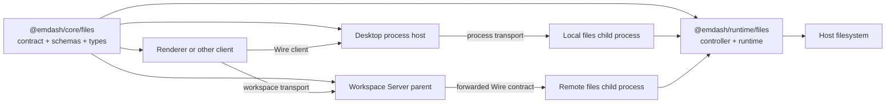
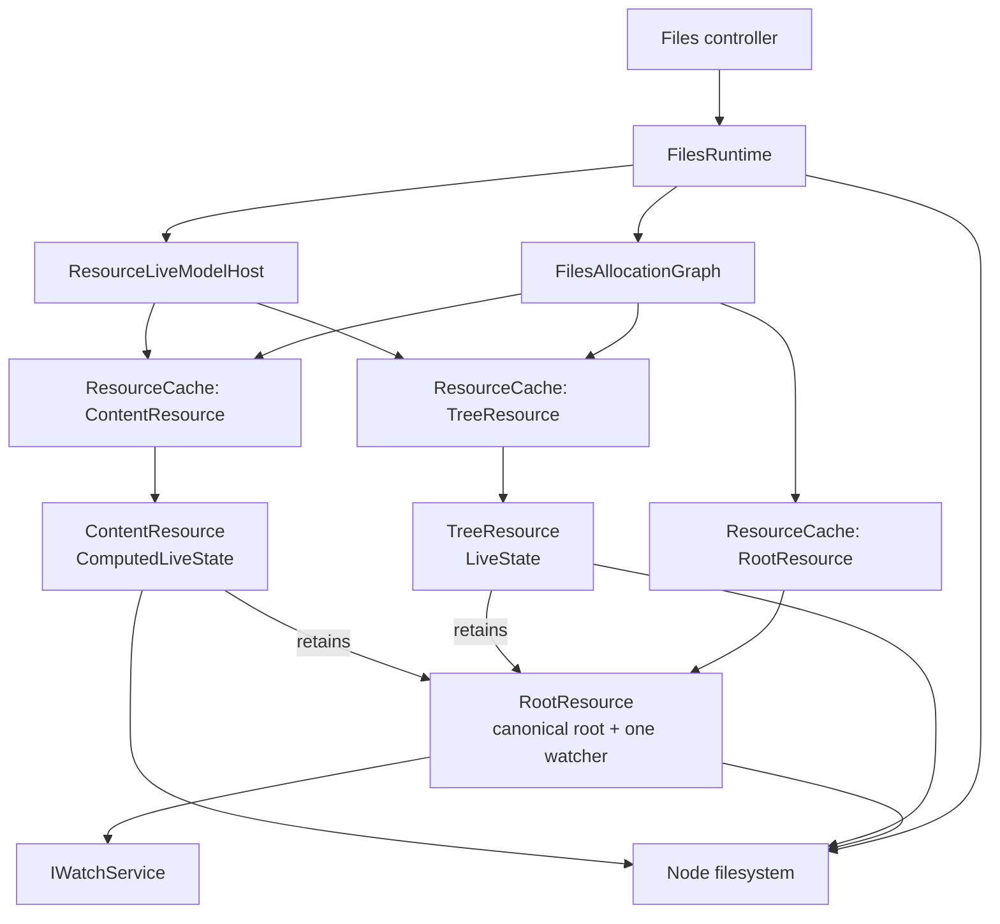
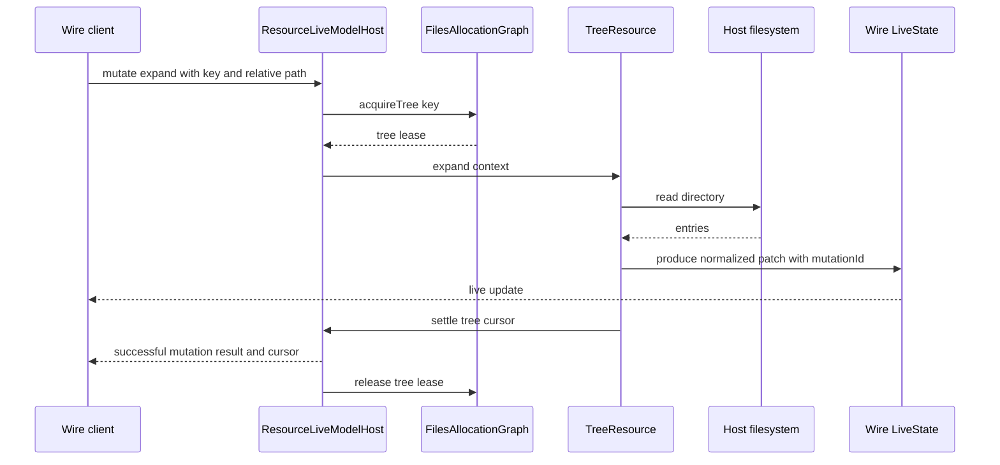

# Files Domain Refactor Design

## Document Status

- Status: Proposed for review
- Scope: `packages/core/src/files` and `packages/runtime/src/files`
- Related reference: `packages/core/src/workspace-server/files/contract.ts`
- Architectural precedent: the `@emdash/core/git` and `@emdash/runtime/git` split

This document is the implementation plan for the files-domain refactor. It must not be updated
during implementation unless a maintainer explicitly asks for a revision.

## Summary

The files domain will be replaced with two modules:

1. `@emdash/core/files` owns the public Wire contract, JSON-safe schemas, inferred types, and
   renderer-safe pure helpers.
2. `@emdash/runtime/files` owns host filesystem access, path enforcement, resource allocation,
   watchers, file-tree state, content state, mutations, controller composition, and Node process
   bootstrapping.

The existing files implementation is not compatible with the intended contract. It uses absolute
paths, numeric node identities, manual leases, and legacy live primitives. The replacement uses
root-relative POSIX paths, path identity, Wire `LiveState` and `ComputedLiveState`, Wire resource
hosts, and Wire managed sources.

No legacy files interfaces or adapters will be preserved for Emdash Desktop. Desktop migration is
separate work and must not influence the new domain interface.

## Goals

- Make `@emdash/core/files` safe to import from a renderer or other non-Node process.
- Make the contract in core the single authoritative files-domain interface.
- Implement the contract once in `@emdash/runtime/files`.
- Allow the same runtime controller to be served through any Wire transport.
- Support a local child process and a workspace-server child process without changing domain code.
- Replace the legacy live collection and live model primitives with `@emdash/wire`.
- Model file trees as normalized, root-relative, per-session live state.
- Share file-content state across sessions.
- Pool one filesystem watcher per canonical workspace root.
- Centralize path validation and symlink-containment policy.
- Keep expected filesystem failures in the declared `FsError` result channel.
- Keep programming errors and broken invariants thrown.

## Non-Goals

- Maintaining `IFilesRuntime`, `IFileSystem`, `IFileTree`, or existing desktop RPC behavior.
- Updating renderer stores or desktop main-process consumers.
- Preserving numeric file-tree node IDs or projection sequence types.
- Preserving directory-compaction preview metadata.
- Preserving the standalone file-change subscription interface.
- Preserving `measureUsage`, which is not in the new contract.
- Wiring the new child process into Emdash Desktop or Workspace Server in this change.
- Changing the shared watch domain beyond what is required to consume it.
- Adding protocol compatibility shims for an undeployed contract.

## Architectural Context

The contract and runtime are separate so every caller uses the same domain interface without
importing host resources.



The child-process location is a composition decision. The files runtime does not import Electron,
SSH, or workspace-server code.

## Design Decisions

### Accepted Direction

| Decision | Consequence |
| --- | --- |
| Core owns only the public contract and JSON-safe data | Renderer imports cannot pull in Node code |
| Runtime owns all host behavior | Filesystem access and watchers stay out of core |
| Paths inside the domain are root-relative POSIX paths | Client state is portable across local, SSH, Windows, and POSIX hosts |
| File-tree entries are keyed by path | Numeric identity and inode tombstone machinery are removed |
| Trees are keyed by root and session | Each view can have independent expansion state |
| Content is keyed by root and path | All sessions observe one authoritative content state |
| Wire owns live publication and resource leases | Legacy core live primitives are deleted |
| One root resource owns one watcher | Tree and content resources share watcher cost |
| No desktop compatibility layer | The replacement interface stays small and coherent |

### Contract Corrections Required Before Freeze

The contract shape is authoritative, but the current file contains assumptions left over from
oRPC. These corrections are part of this design:

1. Move the contract and schemas from `workspace-server/files` into `core/files`.
2. Replace the normal `readBytes` procedure with Wire `downloadFile()`.
3. Replace `Date` fields with Unix millisecond numbers.
4. Define `expand`, `collapse`, and `reveal` as mutations on `tree.model`.
5. Remove `sessionId` from the content model key.
6. Make every non-root path field root-relative and POSIX-normalized.
7. Add an unavailable content variant so deletion and permission changes can be published.
8. Make symlink expandability and target kind explicit.

These are breaking changes to the current draft. No compatibility aliases should be added.

## Public Contract

### Path Model

| Value | Representation | Example |
| --- | --- | --- |
| `rootPath` | Absolute host path, opaque to non-host clients | `/home/user/repo`, `C:\repo` |
| Entry `path` | Root-relative POSIX path | `src/index.ts` |
| Root entry path | Empty string | `''` |
| `parentPath` for root | `null` | `null` |
| `parentPath` below root | Root-relative POSIX path | `src` |
| Glob `cwd` | Root-relative POSIX path | `packages/core` |
| Glob and enumeration result | Root-relative POSIX path | `packages/core/src/index.ts` |
| `realPath` result | Absolute canonical host path | `/private/repo/src/index.ts` |

Path invariants:

- Relative paths never start with `/`, `\`, or a Windows drive prefix.
- Relative paths never contain a NUL byte, path segments equal to `.` or `..`, empty
  interior segments, or backslashes.
- The empty path is allowed only where the root itself is a valid target.
- Runtime resolution must verify lexical containment before touching the filesystem.
- Operations that follow symlinks must also verify canonical containment.
- A symlink itself may be listed or deleted even if its target is outside the root.
- A symlink target outside the root cannot be read or expanded through the files contract.

### Error Interface

```ts
type FsError =
  | { type: 'not-found'; path: string }
  | { type: 'permission-denied'; path: string }
  | { type: 'already-exists'; path: string }
  | { type: 'not-a-directory'; path: string }
  | { type: 'is-a-directory'; path: string }
  | { type: 'invalid-path'; path: string; message: string }
  | { type: 'io'; path: string; message: string };
```

The error `path` is the caller-visible root-relative path. Root acquisition failures use `''`.
Only recognized path-policy failures and Node filesystem failures become `FsError`. Unexpected
exceptions remain thrown so Wire records them as causes.

Suggested Node error mapping:

| Node code | `FsError.type` |
| --- | --- |
| `ENOENT` | `not-found` |
| `EACCES`, `EPERM` | `permission-denied` |
| `EEXIST` | `already-exists` |
| `ENOTDIR` | `not-a-directory` |
| `EISDIR` | `is-a-directory` |
| Known path-policy violation | `invalid-path` |
| Other filesystem error | `io` |

### Data Interfaces

```ts
type FileStat = {
  path: string;
  type: 'file' | 'directory';
  size: number;
  mtimeMs: number;
  ctimeMs: number;
  mode: number;
};

type ReadTextResult = {
  content: string;
  truncated: boolean;
  totalSize: number;
  etag: string;
};

type ReadBytesMeta = {
  name: string;
  mimeType: string;
  size?: number;
  lastModified?: number;
  truncated: boolean;
  totalSize: number;
  etag: string;
};
```

`readBytes` returns Wire's `BlobDownloadHandle<ReadBytesMeta>` through a `downloadFile`
endpoint. Raw bytes never appear in a normal procedure result or live model.

### File-Tree Interface

```ts
type FileEntryKind = 'file' | 'directory' | 'symlink';
type SymlinkTargetKind = 'file' | 'directory' | 'other' | 'missing' | 'outside-root';

type FileEntry = {
  path: string;
  name: string;
  parentPath: string | null;
  kind: FileEntryKind;

  expandable: boolean;
  childrenLoaded: boolean;
  children: string[];
  hasChildren: boolean;

  etag?: string;
  size?: number;
  mtimeMs?: number;

  symlinkTarget?: string | null;
  symlinkTargetKind?: SymlinkTargetKind;
};

type FileTreeModel = {
  root: string;
  entries: Record<string, FileEntry>;
};
```

File-entry invariants:

- `entries[path].path === path`.
- The root entry always exists at `entries['']`.
- The root entry has `parentPath: null` and `kind: 'directory'`.
- `children` contains root-relative paths in server order.
- A child's `parentPath` points back to the directory containing it.
- `expandable: false` implies `childrenLoaded: false` and `children: []`.
- `childrenLoaded: false` implies `children: []`.
- Directories are expandable even when `hasChildren` is false.
- A symlink is expandable only when its target is an in-root directory.
- Files never have children.
- Directory ordering is directories and directory symlinks first, then files, using
  case-insensitive name ordering with an exact-name tie breaker.

The initial tree contains only the root entry. The root is not expanded implicitly.

### Content Interface

```ts
type FileContentModel =
  | {
      kind: 'text';
      path: string;
      etag: string;
      byteSize: number;
      readonly: boolean;
      content: string;
      eol: 'lf' | 'crlf';
      truncated: boolean;
    }
  | {
      kind: 'binary';
      path: string;
      etag: string;
      byteSize: number;
      readonly: boolean;
      mimeType?: string;
    }
  | {
      kind: 'unavailable';
      path: string;
      error: FsError;
    };
```

The unavailable variant lets a live content model transition when a file is deleted, replaced by a
directory, becomes unreadable, or resolves outside the root.

### Contract Shape

The following sketch maps the intended public interface. The exact schema declarations live beside
the contract and are omitted here for brevity.

```ts
const treeKey = z.object({
  rootPath: z.string(),
  sessionId: z.string(),
});

const contentKey = z.object({
  rootPath: z.string(),
  path: z.string(),
});

export const filesContract = defineContract({
  fs: defineContract({
    stat: fallible({ input: pathKey, data: fileStatSchema, error: fsErrorSchema }),
    exists: fallible({ input: pathKey, data: z.boolean(), error: fsErrorSchema }),
    realPath: fallible({ input: pathKey, data: z.string(), error: fsErrorSchema }),
    readText: fallible({
      input: pathKey.extend({ options: readFileOptionsSchema.optional() }),
      data: readTextResultSchema,
      error: fsErrorSchema,
    }),
    readBytes: downloadFile({
      input: pathKey.extend({ options: readFileOptionsSchema.optional() }),
      meta: readBytesMetaSchema,
      error: fsErrorSchema,
    }),
    glob: liveJob({
      input: rootKey.extend({
        patterns: z.array(z.string()),
        options: fileGlobOptionsSchema,
      }),
      progress: pathBatchSchema,
      result: pathListSchema,
      error: fsErrorSchema,
    }),
    enumerate: liveJob({
      input: pathKey.extend({
        options: fileEnumerationOptionsSchema.optional(),
      }),
      progress: pathBatchSchema,
      result: pathListSchema,
      error: fsErrorSchema,
    }),
  }),

  tree: defineContract({
    model: liveModel({
      key: treeKey,
      states: {
        tree: liveState({ data: fileTreeModelSchema }),
      },
      mutations: {
        expand: mutation({
          input: z.object({ path: z.string() }),
          data: z.void(),
          error: fsErrorSchema,
        }),
        collapse: mutation({
          input: z.object({ path: z.string() }),
          data: z.void(),
          error: fsErrorSchema,
        }),
        reveal: mutation({
          input: z.object({ path: z.string() }),
          data: z.void(),
          error: fsErrorSchema,
        }),
      },
    }),
  }),

  content: liveModel({
    key: contentKey,
    states: {
      content: liveState({ data: fileContentModelSchema }),
    },
  }),

  mutations: defineContract({
    createFile: fallible({ input: createFileInputSchema, data: z.void(), error: fsErrorSchema }),
    createDirectory: fallible({
      input: createDirectoryInputSchema,
      data: z.void(),
      error: fsErrorSchema,
    }),
    rename: fallible({ input: renameInputSchema, data: z.void(), error: fsErrorSchema }),
    move: fallible({ input: moveInputSchema, data: z.void(), error: fsErrorSchema }),
    copy: fallible({ input: copyInputSchema, data: z.void(), error: fsErrorSchema }),
    delete: fallible({ input: deleteInputSchema, data: z.void(), error: fsErrorSchema }),
    writeFile: fallible({ input: writeFileInputSchema, data: z.void(), error: fsErrorSchema }),
  }),
});
```

### Procedure Semantics

| Procedure | Required behavior |
| --- | --- |
| `fs.stat` | Follow an in-root symlink and return JSON-safe metadata |
| `fs.exists` | Return false only for absence; other failures remain errors |
| `fs.realPath` | Return the canonical absolute path only when it remains in root |
| `fs.readText` | Read at most the normalized limit and include an etag |
| `fs.readBytes` | Stream at most the normalized limit through Wire's blob channel |
| `fs.glob` | Stream root-relative matches in bounded progress batches |
| `fs.enumerate` | Recursively stream files, skip directory symlink traversal, honor cancellation |
| `tree.model.expand` | Load one directory and settle the resulting tree cursor |
| `tree.model.collapse` | Remove all loaded descendants and settle the resulting tree cursor |
| `tree.model.reveal` | Load every ancestor of the target and settle the final tree cursor |
| `mutations.createFile` | Require an existing parent and reject an existing destination |
| `mutations.createDirectory` | Create one directory, require its parent, reject existing destination |
| `mutations.rename` | Require source and destination to have the same parent |
| `mutations.move` | Permit different parents within the same root |
| `mutations.copy` | Copy files or directories recursively and reject destination overwrite |
| `mutations.delete` | Delete files and symlinks; require `recursive` for non-empty directories |
| `mutations.writeFile` | Require an existing regular file and replace its content |

Both rename and move use native rename semantics. A cross-device failure remains an `io` error.

## Core Module

### Public Exports

`@emdash/core/files` exports:

- `filesContract` and `FilesContract`
- All contract schemas needed by clients, controllers, validation, and tests
- Inferred public contract types
- Pure helpers only when they hide a real contract invariant

It does not export:

- `FilesRuntime`
- `FileSystem`
- Watcher interfaces
- Node path helpers
- Filesystem error classifiers
- Resource types or leases
- Runtime controllers
- Legacy file-tree node or sequence types

The export test must assert that runtime names are absent, following the Git core export test.

### Renderer-Safety Rule

Every transitive import reachable from `packages/core/src/files/index.ts` must be valid in a
browser bundle. In particular, the graph may import only `@emdash/shared`, `@emdash/wire`,
`zod`, and other renderer-safe core modules.

## Runtime Module

### Public Runtime Interface

```ts
export type FilesRuntimeOptions = Readonly<{
  watcher?: IWatchService;
  idleTtlMs?: number;
  onError?: (context: string, error: unknown) => void;
}>;

export class FilesRuntime {
  readonly fs: FileSystemRuntime;
  readonly tree: FileTreeRuntime;
  readonly content: FileContentRuntime;

  constructor(options?: FilesRuntimeOptions);
  dispose(): Promise<void>;
}

export function createFilesProcedures(
  runtime: FilesRuntime,
  contract?: FilesContract
): ContractImpl<FilesContract>;

export function createFilesController(
  runtime: FilesRuntime,
  options?: { validate?: ValidatePolicy }
): Controller;
```

Only `FilesRuntime`, `createFilesProcedures`, and `createFilesController` are exported from
`@emdash/runtime/files`. Resource and filesystem-driver classes remain implementation details.

### Node Process Interface

```ts
export type BootFilesRuntimeProcessOptions = {
  contract?: FilesContract;
  env?: NodeJS.ProcessEnv;
  port?: WorkerParentPort;
  exit?: (code: number) => void;
};

export function bootFilesRuntimeProcess(options?: BootFilesRuntimeProcessOptions): void;
```

`@emdash/runtime/files/node` exports only the boot interface.

The supplied contract must be the exact finalized contract shape used by the parent. A standalone
local child can use `filesContract`; a workspace child can use
`workspaceWireContract.files`. This keeps live-model IDs aligned when the child is forwarded
through a parent contract.

### Runtime Composition



### Allocation Interfaces

```ts
type RootIdentity = {
  rootId: string;
  rootPath: string;
};

type TreeIdentity = {
  treeId: string;
  root: RootIdentity;
  sessionId: string;
};

type ContentIdentity = {
  contentId: string;
  root: RootIdentity;
  path: string;
};

class FilesAllocationGraph {
  acquireTree(key: TreeKey): PendingLease<TreeResource>;
  acquireContent(key: ContentKey): PendingLease<ContentResource>;

  useRoot<T>(
    rootPath: string,
    run: (root: ResolvedRoot) => Promise<T>
  ): Promise<T>;

  notifyActiveRoot(root: RootIdentity, changes: KnownFileChange[]): void;
  dispose(): Promise<void>;
}
```

Allocation invariants:

- Root identity is the canonical real path.
- Alias root paths resolve to the same root resource.
- Tree identity is canonical root plus session ID.
- Content identity is canonical root plus relative path.
- A tree or content resource retains its parent root lease until it is disposed.
- Failed resource creation is evicted so a later request can retry.
- Idle retention defaults to the same 30-second posture used by Git unless review changes it.
- Disposal order is content resources, tree resources, then root resources, then an owned watcher.

### Root Resource Interface

```ts
type RootChange =
  | { kind: 'create' | 'update' | 'delete'; path: string }
  | { kind: 'resync' };

class RootResource {
  readonly identity: RootIdentity;
  readonly paths: RootPathPolicy;

  subscribe(listener: (changes: RootChange[]) => void): Unsubscribe;
  publishKnownChanges(changes: RootChange[]): void;
  dispose(): Promise<void>;
}
```

The root resource adapts absolute watcher events into root-relative changes. It drops events outside
the canonical root. Direct filesystem mutations publish known changes after success; later native
watch events are allowed and should become no-ops after state comparison.

### Path Policy Interface

```ts
class RootPathPolicy {
  readonly rootPath: string;

  resolveEntry(path: string): Result<ResolvedEntryPath, FsError>;
  resolveFollowed(path: string): Promise<Result<ResolvedFollowedPath, FsError>>;
  resolveDestination(path: string): Promise<Result<ResolvedDestinationPath, FsError>>;
  toRelative(absolutePath: string): string | null;
}
```

- `resolveEntry` validates lexical containment and addresses the directory entry itself.
- `resolveFollowed` follows the final target and rejects canonical escape.
- `resolveDestination` validates the nearest existing ancestor before creating a destination.
- Delete and rename-source operations use entry resolution so deleting a symlink never deletes its
  target.
- Read, stat, enumeration, and directory expansion use followed resolution where appropriate.

## File-Tree Runtime

### Tree Resource Interface

```ts
class TreeResource {
  readonly identity: TreeIdentity;

  acquireState(): PendingLease<LiveSource>;

  expand(context: TreeMutationContext<'expand'>): Promise<Result<void, FsError>>;
  collapse(context: TreeMutationContext<'collapse'>): Promise<Result<void, FsError>>;
  reveal(context: TreeMutationContext<'reveal'>): Promise<Result<void, FsError>>;

  onRootChanges(changes: RootChange[]): void;
  dispose(): void;
}
```

All asynchronous tree reads and state changes run through one serialized mutation lane per tree
resource. Watch reconciliation cannot interleave with expand, collapse, or reveal.

### Tree State Transitions

Expand:

1. Validate that the entry exists in the session model.
2. Validate that it is expandable.
3. Read and sort the directory.
4. Build normalized child entries.
5. Remove children that vanished, including their loaded descendants.
6. Insert or replace current children.
7. Set the parent `children`, `childrenLoaded`, and `hasChildren` fields.
8. Produce one Wire update tagged with the mutation ID.
9. Settle the returned cursor through `ResourceMutationContext.settle`.

Collapse:

1. Treat an already collapsed directory as a successful no-op.
2. Delete every loaded descendant from the normalized record.
3. Clear the target's children and mark it unloaded.
4. Produce and settle one cursor.

Reveal:

1. Validate and split the target relative path.
2. Expand the root and every ancestor in order.
3. Stop with `not-found` if a segment cannot be discovered.
4. Do not expand the final target merely because it is a directory.
5. Settle the final cursor produced by the operation.



### Watch Reconciliation

The new model includes etag, size, and modification time, so update events are meaningful and must
not be discarded.

For a normal event batch:

- Refresh each affected loaded parent directory at most once.
- Refresh metadata for an affected loaded file.
- Ignore creates below an unloaded directory.
- Prune loaded descendants when a directory disappears.
- Invalidate matching content resources.

For watcher resync:

- Capture the set of paths whose children are loaded.
- Re-read that loaded frontier in parent-before-child order.
- Rebuild a valid model while preserving expansion only for paths that still exist.
- Replace the state once so clients receive a coherent patch.

Path is the public identity. External rename events do not preserve numeric or inode identity. A
renamed directory appears at its new path collapsed unless a later reveal expands it.

### Symlinks

- All symlinks are visible as entries.
- File symlinks can be opened only when the target remains inside the root.
- Directory symlinks can be expanded only when the target remains inside the root.
- Directory traversal remains under the symlink's logical path.
- Broken and outside-root links are not expandable.
- Enumeration yields symlink files only when `includeSymlinkFiles` permits it.
- Enumeration never recursively follows directory symlinks.
- Periodic revalidation covers target changes that the root watcher cannot observe through a
  logical symlink path.

## Content Runtime

### Content Resource Interface

```ts
class ContentResource {
  readonly identity: ContentIdentity;

  state(): Promise<LiveSource>;
  invalidate(): void;
  refresh(options?: { mutationId?: string }): Promise<LiveCursor>;
  onRootChanges(changes: RootChange[]): void;
  dispose(): void;
}
```

The resource uses `ComputedLiveState<FileContentModel>`:

- Initial preparation reads the current content model.
- Exact-path updates invalidate it.
- Deleting or replacing the path computes an unavailable state.
- A root resync invalidates it.
- Equal etags and equal content suppress no-op updates.
- Revalidation runs only while observed.

### Content Reading

- Use one shared maximum for live text content and default `readText`.
- Retain the current 200 KiB default and 100 MiB absolute cap unless review changes them.
- Determine binary content from a bounded sample rather than extension alone.
- Treat a NUL byte in the sample as binary unless a recognized text encoding marker overrides it.
- MIME detection is best-effort and may remain undefined.
- Determine `lf` or `crlf` from observed newline content; default empty content to `lf`.
- Derive `readonly` from host write access.
- Compute etag from stable stat metadata using the documented mtime-and-size formula.
- Detect a change between pre-read and post-read stat; retry once before publishing.
- Raw binary bytes remain outside the live state.

## Filesystem Runtime

### FileSystem Runtime Interface

```ts
class FileSystemRuntime {
  stat(input: PathKey): Promise<Result<FileStat, FsError>>;
  exists(input: PathKey): Promise<Result<boolean, FsError>>;
  realPath(input: PathKey): Promise<Result<string, FsError>>;
  readText(input: ReadTextInput): Promise<Result<ReadTextResult, FsError>>;
  readBytes(input: ReadBytesInput): Promise<Result<DownloadSource<ReadBytesMeta>, FsError>>;

  glob(input: GlobInput, context: LiveJobContext<PathBatch>): Promise<Result<PathList, FsError>>;
  enumerate(
    input: EnumerateInput,
    context: LiveJobContext<PathBatch>
  ): Promise<Result<PathList, FsError>>;

  createFile(input: CreateFileInput): Promise<Result<void, FsError>>;
  createDirectory(input: CreateDirectoryInput): Promise<Result<void, FsError>>;
  rename(input: RenameInput): Promise<Result<void, FsError>>;
  move(input: MoveInput): Promise<Result<void, FsError>>;
  copy(input: CopyInput): Promise<Result<void, FsError>>;
  delete(input: DeleteInput): Promise<Result<void, FsError>>;
  writeFile(input: WriteFileInput): Promise<Result<void, FsError>>;
}
```

Jobs:

- Check `context.signal.aborted` between filesystem operations.
- Pass the abort signal to libraries that support it.
- Report paths in bounded batches rather than one path per progress update.
- Preserve deterministic traversal order.
- Return the complete path list required by the current contract.
- Rely on Wire's bounded progress retention; do not build a second unbounded progress history.

Binary download:

- Open the file once and stat the open handle.
- Return metadata before streaming.
- Stream no more than the normalized maximum.
- Close the handle in the source iterator's `finally` block.
- Let Wire cancellation call the iterator's return path.

## Concurrency and Ordering

- Each tree resource has one serialized mutation lane.
- Each content `ComputedLiveState` already serializes refresh work.
- Filesystem commands do not share a global mutex.
- Direct command reconciliation happens after the filesystem operation succeeds.
- Watch events may race with direct reconciliation but must converge through no-op suppression.
- Resource disposal waits for watcher release and child-resource cleanup.
- A mutation result is returned only after its directly owned live-state cursor is available.
- Top-level filesystem commands have no universal cursor because they may affect multiple tree
  sessions and content resources.

## File Layout

### Files Added Under Core

| Path | Purpose |
| --- | --- |
| `packages/core/src/files/api/contract.ts` | Authoritative Wire contract |
| `packages/core/src/files/api/contract.test.ts` | Contract IDs, nesting, and endpoint-kind tests |
| `packages/core/src/files/api/errors.ts` | `FsError` schemas and inferred types |
| `packages/core/src/files/api/schemas.ts` | Shared keys, inputs, results, and job schemas |
| `packages/core/src/files/tree/state.ts` | File-entry and tree-model schemas |
| `packages/core/src/files/tree/state.test.ts` | Schema invariants and JSON round-trip coverage |
| `packages/core/src/files/content/state.ts` | Content live-state schema |

The existing `packages/core/src/files/index.ts` and `index.test.ts` are rewritten in place.

### Files Added Under Runtime

| Path | Purpose |
| --- | --- |
| `packages/runtime/src/files/api/controller.ts` | Validated Wire controller composition |
| `packages/runtime/src/files/api/controller.test.ts` | End-to-end contract tests through Wire |
| `packages/runtime/src/files/api/procedures.ts` | Thin contract-to-runtime delegates |
| `packages/runtime/src/files/api/errors.ts` | Expected runtime error conversion |
| `packages/runtime/src/files/allocation/identity.ts` | Canonical root, tree, and content identities |
| `packages/runtime/src/files/allocation/allocation-graph.ts` | Managed root/tree/content resource graph |
| `packages/runtime/src/files/allocation/allocation-graph.test.ts` | Pooling, retry, retention, and disposal tests |
| `packages/runtime/src/files/root/root-resource.ts` | One watcher and event fan-out per canonical root |
| `packages/runtime/src/files/fs/file-system.ts` | Contract filesystem operations and mutations |
| `packages/runtime/src/files/fs/file-system.test.ts` | Filesystem behavior and error tests |
| `packages/runtime/src/files/fs/enumerate.ts` | Cancellable deterministic enumeration |
| `packages/runtime/src/files/fs/path-policy.ts` | Root-relative validation and symlink containment |
| `packages/runtime/src/files/fs/path-policy.test.ts` | Escape, platform, and symlink policy tests |
| `packages/runtime/src/files/tree/tree-resource.ts` | Per-session Wire file-tree state |
| `packages/runtime/src/files/tree/tree-resource.test.ts` | Expand, collapse, reveal, and reconciliation tests |
| `packages/runtime/src/files/tree/directory-reader.ts` | Directory-to-contract entry adapter |
| `packages/runtime/src/files/tree/directory-reader.test.ts` | Ordering, metadata, and symlink tests |
| `packages/runtime/src/files/tree/watch-classifier.ts` | Event batches to affected loaded paths |
| `packages/runtime/src/files/tree/watch-classifier.test.ts` | Create, update, delete, and resync classification |
| `packages/runtime/src/files/content/content-reader.ts` | Text/binary classification and content model creation |
| `packages/runtime/src/files/content/content-resource.ts` | Shared computed content state |
| `packages/runtime/src/files/content/content-resource.test.ts` | Sharing, invalidation, deletion, and etag tests |
| `packages/runtime/src/files/files-runtime.ts` | Host-scoped composition root |
| `packages/runtime/src/files/files-runtime.test.ts` | Ownership and lifecycle tests |
| `packages/runtime/src/files/index.ts` | Restricted runtime exports |
| `packages/runtime/src/files/index.test.ts` | Public export test |
| `packages/runtime/src/files/node/boot.ts` | Wire process-runtime bootstrap |
| `packages/runtime/src/files/node/boot.test.ts` | Actual subprocess smoke test |
| `packages/runtime/src/files/node/index.ts` | Restricted Node exports |

### Files Moved or Rewritten

| Current path | Target or action |
| --- | --- |
| `packages/core/src/workspace-server/files/contract.ts` | Rewritten as `packages/core/src/files/api/contract.ts` |
| `packages/core/src/workspace-server/files/schemas.ts` | Split across core files schemas and state modules |
| `packages/core/src/files/fs/file-system.ts` | Rewritten under runtime files |
| `packages/core/src/files/enumerate.ts` | Rewritten as runtime cancellable enumeration |
| `packages/core/src/files/path-policy.ts` | Rewritten as root-relative runtime path policy |
| `packages/core/src/files/tree/directory-reader.ts` | Rewritten against `FileEntry` |
| `packages/core/src/files/tree/watch/classifier.ts` | Rewritten for path-keyed model reconciliation |
| `packages/core/src/files/files-runtime.ts` | Replaced by runtime composition root |

Tests move with the implementation they cover, but are rewritten against the new interface rather
than copied mechanically.

### Files Deleted

| Path or group | Reason |
| --- | --- |
| `packages/core/src/files/changes/` | Standalone change-feed interface is not in the contract |
| `packages/core/src/files/fs/` | Host implementation moves to runtime |
| `packages/core/src/files/tree/file-tree.ts` | Replaced by Wire-backed `TreeResource` |
| `packages/core/src/files/tree/list.ts` | Directory preview compaction is removed |
| `packages/core/src/files/tree/models/` | Numeric legacy model is removed |
| `packages/core/src/files/tree/node-id.ts` | Path is now identity |
| `packages/core/src/files/tree/tree-store.ts` | Normalized Wire state is authoritative |
| `packages/core/src/files/tree/types.ts` | Leases and sequence interfaces are removed |
| `packages/core/src/files/tree/errors.ts` | Tree failures use public `FsError` |
| `packages/core/src/files/fs/measure-usage.ts` | Not part of the new contract |
| `packages/core/src/files/exclusions.ts` | Function predicates are not serializable contract input |
| `packages/core/src/files/paths.ts` | Node path behavior moves to runtime |
| `packages/core/src/files/symlinks.ts` | Public symlink data moves into core schemas |
| `packages/core/src/files/types.ts` | Legacy runtime interfaces are removed |
| `packages/core/src/lib/live-model.ts` | Superseded by Wire |
| `packages/core/src/lib/live-collection.ts` | Superseded by Wire |
| `packages/core/src/lib/reconcile.ts` | Legacy live helper with no remaining owner |
| Matching legacy tests | Test surface is replaced with the new interface |

`KeyedMutex` and unrelated `@emdash/core/lib` exports are not deleted by this
change. Keyed resource ownership uses `ResourceCache` from `@emdash/wire/util`.

### Existing Files Modified

| Path | Change |
| --- | --- |
| `packages/core/src/files/index.ts` | Export contract, schemas, and public types only |
| `packages/core/src/files/index.test.ts` | Assert renderer-safe exports and absent runtime names |
| `packages/core/src/workspace-server/wire/contract.ts` | Import `filesContract` from core files |
| `packages/core/src/workspace-server/index.ts` | Stop re-exporting the old workspace files directory |
| `packages/core/src/lib/index.ts` | Remove legacy live exports |
| `packages/core/src/workspace-server/shared/schemas.ts` | Remove the unused legacy `liveValue` helper |
| `packages/core/src/agents/plugins/helpers/local-plugin-fs.ts` | Stop importing Node errno logic from core files |
| `packages/core/package.json` | Remove `glob` after the runtime move |
| `packages/runtime/package.json` | Add files exports and the `glob` dependency |
| `packages/runtime/tsdown.config.ts` | Add `files` and `files-node` entries |
| `packages/runtime/tsconfig.json` | Add core files and required Wire path aliases |
| `pnpm-lock.yaml` | Reflect dependency ownership changes |

No files under `apps/emdash-desktop` are modified for compatibility.

## Controller and Transport Composition

`createFilesProcedures` accepts a contract argument for the same reason Git does: nested contracts
receive different live endpoint IDs when finalized under a parent.

Standalone:

```ts
const runtime = new FilesRuntime();
const controller = createFilesController(runtime);
```

Nested in another controller:

```ts
const procedures = createFilesProcedures(runtime, workspaceWireContract.files);
const controller = createController(workspaceWireContract, {
  files: procedures,
});
```

Forwarded from a child:

```ts
const worker = host.define({
  name: 'files',
  contract: workspaceWireContract.files,
  process: () => ({ entry: filesWorkerPath }),
});
await worker.ready();

const controller = createController(workspaceWireContract, {
  files: worker.client,
});
```

The child boot function and the parent host must use structurally identical finalized contracts so
live state IDs match.

## Verification Strategy

### Core Contract Tests

- Contract endpoint kinds and nested IDs.
- Schemas survive `JSON.stringify` and `JSON.parse`.
- No `Date`, `Blob`, `Map`, `Set`, class instance, or host path object in live state.
- File-entry invariants.
- Content unavailable variant.
- Public exports contain no runtime implementations.
- Import graph from `@emdash/core/files` contains no `node:` modules.

### Runtime Unit Tests

- POSIX, Windows, NUL, absolute, and parent-segment path rejection.
- Canonical root alias pooling.
- Symlink escape rejection and safe deletion of the link itself.
- Typed Node error conversion.
- Read limits, truncation, etags, EOL classification, and binary detection.
- Mutation overwrite and parent-existence rules.
- Enumeration order, symlink policy, progress batching, and cancellation.
- Tree expand, collapse, reveal, no-op behavior, and mutation settlement.
- File metadata changes on update events.
- Loaded-subtree pruning after deletion.
- Watcher resync rebuild.
- Per-session tree isolation.
- Shared content identity across clients.
- Unavailable content transitions.
- Failed acquisition eviction and retry.
- Watcher refcount and disposal ordering.

### Wire Integration Tests

- Exercise every contract procedure through a real Wire client.
- Subscribe to tree and content live states and assert Immer patches arrive.
- Assert tree mutations return cursors for the tree state.
- Exercise jobs through `createLiveJobReplica`.
- Exercise `readBytes` through the blob channel.
- Run full validation in tests.
- Run at least one round trip through `streamTransport` to catch JSON-only transport failures.
- Mount the files contract under a parent contract and verify live endpoint IDs.

### Worker Process Test

Spawn a real Node child with `WireWorkerHost` and `childProcessSpawner()`, then:

1. Read a text file.
2. Subscribe to a tree.
3. Expand the root.
4. Mutate a file externally.
5. Observe the live update.
6. Download bytes.
7. Dispose the runtime and verify clean child exit.

### Package Gates

```bash
pnpm --filter @emdash/core run format:check
pnpm --filter @emdash/core run lint
pnpm --filter @emdash/core run typecheck
pnpm --filter @emdash/core run test

pnpm --filter @emdash/runtime run format:check
pnpm --filter @emdash/runtime run lint
pnpm --filter @emdash/runtime run typecheck
pnpm --filter @emdash/runtime run test
```

Root desktop type checking is not an acceptance gate for this domain-only change because legacy
desktop imports are intentionally not preserved. The domain packages themselves must build, type
check, lint, and test cleanly.

## Implementation Sequence

### Phase 1: Establish the Core Interface

1. Add the new core contract and state schemas.
2. Apply the required contract corrections.
3. Rewrite the core files barrel and export test.
4. Point the workspace contract at the new core contract.
5. Add JSON and nested-contract tests.

Exit condition: `@emdash/core/files` is renderer-safe and contains no host implementation.

### Phase 2: Implement Filesystem Operations

1. Add root-relative path policy and error conversion.
2. Implement stat, exists, real path, and text reads.
3. Implement blob-channel byte reads.
4. Implement glob and enumeration jobs.
5. Implement create, rename, move, copy, delete, and write commands.

Exit condition: all non-live contract procedures pass through a Wire controller.

### Phase 3: Implement Resource Allocation and Content

1. Add canonical identities and the allocation graph.
2. Add root watcher ownership and event fan-out.
3. Add content reader and content resource.
4. Bind the content resource through `createResourceLiveModelHost`.
5. Add direct mutation reconciliation.

Exit condition: content state is shared, live, retryable, and disposable.

### Phase 4: Replace the File Tree

1. Add the directory reader for contract entries.
2. Add the per-session tree resource.
3. Implement expand, collapse, and reveal mutations.
4. Implement watcher reconciliation and resync.
5. Bind the tree through `createResourceLiveModelHost`.

Exit condition: the new path-keyed tree passes Wire integration tests without legacy collection
types.

### Phase 5: Add Process Composition

1. Add the Node boot interface.
2. Add runtime package exports and build entries.
3. Add standalone, nested, stream, and subprocess tests.

Exit condition: the same runtime works through memory, stream, and process transports.

### Phase 6: Delete Legacy Implementation

1. Delete the old core files runtime and its tests.
2. Delete legacy core live primitives and exports.
3. Remove the obsolete workspace-server files directory.
4. Move `glob` dependency ownership to runtime.
5. Run focused core and runtime gates.

Exit condition: no new files-domain code imports `LiveCollection`, legacy `LiveModel`,
`LiveValue`, or removed core keyed-resource helpers.

## Risks and Mitigations

| Risk | Mitigation |
| --- | --- |
| Path traversal through symlink ancestors | Operation-specific path resolution and dedicated tests |
| Watch gaps leave stale state | Root resync plus periodic observed-resource revalidation |
| Watch and explicit mutation race | Per-tree serialization and state equality suppression |
| Large byte reads overload JSON transport | Wire `downloadFile` blob channel |
| Non-JSON state causes replica resync loops | JSON round-trip tests and full Wire validation |
| Child and parent live IDs differ | Pass the exact finalized mounted contract to both sides |
| File deletion leaves stale editor content | Publish the unavailable content variant |
| Resource leak after disconnect | Wire state leases plus resource-cache idle disposal tests |
| Tree patches become too large | Normalized entries and targeted parent refreshes |
| Rename logic regains inode complexity | Treat path as identity and collapse renamed subtrees |

## Review Checklist

The following decisions should be confirmed before implementation begins:

- [ ] Tree operations are Wire model mutations rather than sibling procedures.
- [ ] Content keys contain only `rootPath` and `path`.
- [ ] Root entries begin unexpanded.
- [ ] All non-root paths and results are root-relative POSIX paths.
- [ ] Canonical symlink escape is rejected.
- [ ] Content includes an unavailable variant.
- [ ] Symlink target kind and expandability are explicit.
- [ ] Rename is same-parent only; move permits parent changes.
- [ ] Create and write operations require existing parents.
- [ ] Copy rejects overwrite and recursively copies directories.
- [ ] The current 200 KiB default and 100 MiB maximum read limits remain.
- [ ] Desktop compatibility is explicitly out of scope.
- [ ] Legacy core live primitives are deleted without aliases.
