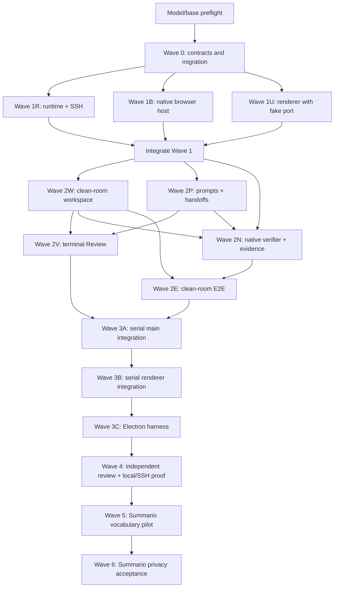

# ACP Loops v2: concise Codex orchestrator handoff

Give this file to the lead Codex agent. It is the short execution entrypoint; the linked ExecPlan is
the authoritative implementation contract and living progress record.

## Copy-paste prompt

> Orchestrate ACP Loops v2 from `docs/plans/acp-loops-v2-codex-handoff.md`. Before editing, read
> the complete `docs/plans/acp-loops-v2-codex-orchestration.md`, root `AGENTS.md`, and the routed
> agent docs it names. Use the Codex ACP provider and the caller-verified GPT-5.6 Sol catalog model
> for the root, every worker, every reviewer, every integration agent, and every Emdash dogfood
> session—even simple tasks. Stop if that provider/model pair cannot be enforced; never downgrade.
> Create one branch and worktree per lane, assign files exclusively, write failing tests first, and
> merge only through the lead integration worktree. Prefer the smallest adapters around existing
> Emdash services. Use Emdash's native browser preview, not Agent Browser. Keep the detailed plan's
> Progress, Discoveries, Decisions, and Outcomes current. Do not touch dirty source worktrees, push,
> publish, open a PR, release, deploy user/production artifacts, or target production. The only
> deployment in scope is the detailed plan's disposable non-production Summario verification
> backend. Finish only after independent review and a fresh green clean-room replay.

## Read these sources

| Purpose | Source |
| --- | --- |
| Full executable plan, contracts, ownership, tests, and dogfood | [`acp-loops-v2-codex-orchestration.md`](./acp-loops-v2-codex-orchestration.md) |
| Historical context only; do not execute | [`acp-loops.md`](./acp-loops.md) |
| UX journey only; rebuild with native components | [Loops v2 Gist](https://gist.github.com/luisKisters/24c72963acc96c4011dd1afed95646a4) |
| Repository rules and command map | [`../../AGENTS.md`](../../AGENTS.md) |
| Testing | [`../../agents/workflows/testing.md`](../../agents/workflows/testing.md) |
| Worktrees and remote execution | [`../../agents/workflows/worktrees.md`](../../agents/workflows/worktrees.md), [`../../agents/workflows/remote-development.md`](../../agents/workflows/remote-development.md) |
| Main/renderer/UI conventions | [`../../agents/conventions/main-patterns.md`](../../agents/conventions/main-patterns.md), [`../../agents/conventions/renderer-patterns.md`](../../agents/conventions/renderer-patterns.md), [`../../agents/conventions/ui-styling.md`](../../agents/conventions/ui-styling.md) |
| High-risk areas | [`../../agents/risky-areas/database.md`](../../agents/risky-areas/database.md), [`../../agents/risky-areas/ssh.md`](../../agents/risky-areas/ssh.md), [`../../agents/risky-areas/pty.md`](../../agents/risky-areas/pty.md) |

The inspected Emdash base was `loops/acp-loops` at
`b35f0a42b2c2001b867d7c537b2a3781a3bee268`; the lead must fetch and record the actual approved
base before branching.

## Resolved product shape

- Loops stays modular, default-off behind the existing `experiments.loops` setting, and inert when
  disabled.
- Loop authoring lives in native Create Task UI; status and controls live in the task tab. Match
  existing width, padding, theme, accessibility, and loading/error conventions.
- A task automatically inherits its canonical local, SSH, or repository-instance workspace. Never
  add a second environment picker or drop `workspaceId`, `path`, or `machine`.
- Deterministic parsing creates editable work phases before task creation. Each stage uses a fresh
  ACP conversation plus persisted handoff artifacts, not prior chat history.
- The execution provider/model pair is Codex plus the resolved GPT-5.6 Sol ID. Change the new-Loop
  default from Claude while preserving historical v1 behavior through migration.
- Native preview verification uses the existing preview server, Browser `WebContents`, and a small
  structured action/lease protocol. No Agent Browser, MCP bridge, reverse tunnel, or parallel
  browser subsystem.
- Review and independent E2E are optional terminal phases. If both are enabled: work phases →
  Review → E2E.
- E2E recreates a disposable same-machine worktree at the frozen pre-change base, replays reviewed
  commits, applies strict preserved-file/environment parity, runs tests and native preview, fixes
  bugs, destroys the attempt, and repeats fresh before reporting success.
- The final dogfood tasks are Summario custom-vocabulary placement, then a separate privacy and
  truthful consent/notice implementation. Both use Emdash-created clean worktrees and isolated
  disposable Convex state; the dirty discovery checkout is read-only.

## Parallel execution graph

## Ownership and merge rules

| Lane | Exclusive scope | Parallel with |
| --- | --- | --- |
| Lead | plan logs, branch/worktree creation, merge order, shared runtime/backend leases | all read-only coordination |
| Wave 0 | Loop schemas, DB schema, generated migration, shared events/contracts | none |
| Runtime | execution context, canonical workspace target, local/SSH command adapter | Browser, UI |
| Browser | preview lease, context-free Browser host, structured action service | Runtime, UI |
| UI foundation | native authoring/status components behind a fake `LoopAuthoringPort` | Runtime, Browser |
| Clean room | exact-base worktree, replay, strict preserve, lifecycle readiness, cleanup | Prompts after foundations |
| Prompts | work/Review/E2E prompts and persisted handoff builder | Clean room |
| Review / verifier | terminal Review gate; native verifier/evidence in separate files | each other |
| E2E gate | consumes merged clean-room and verifier contracts | none until dependencies merge |
| Main integration | orchestration hotspots, RPC, ACP targeting/env, hydration guard | serialized |
| Renderer integration | final RPC/store/registry wiring; renderer owner only | serialized |
| Electron harness | real Electron smoke command and artifacts | serialized |

Each child starts from the lead-recorded integration SHA and returns one focused commit, changed
files, tests run, red/green evidence, assumptions, and requested seams. If it needs an unowned
shared file, it stops and asks the lead to reassign ownership. The lead rebases and merges one lane
at a time, runs focused gates, updates the living plan, and only then cuts dependent lanes.
Wave 0 is additive and must pass the full app typecheck with existing v1 consumers before any
parallel branch is cut.

## Required proof

1. For every behavior, record the failing test before implementation and the focused green result
   afterward. Use temporary repositories and fake local/SSH providers for runtime work.
2. After each merge wave, run format-check, lint, typecheck, and affected/focused tests. Before
   dogfood, run the repository-wide merge gate plus the new real-Electron `test:loops-electron`.
3. Independently review the complete base-to-head diff for correctness, overengineering,
   duplication, repo style, security, docs, experimental isolation, and local/SSH parity.
4. Prove experiment-off inertness; local and Docker-SSH execution; pause/cancel/restart cleanup;
   all Review/E2E combinations; strict preserved-file failures; native preview; and historical E2E
   conversation hydration rejection. Nested verifier sessions retain the clean-room target/env,
   and an SSH forwarded-origin change rotates rather than mutates the browser lease.
5. Run the Summario vocabulary pilot through a real Loop. Then run the privacy task through another
   Loop using an Emdash worktree, fresh disposable browser profile, secret-safe `/auth/agent-login`,
   and a fresh local Convex backend per clean-room attempt (or an explicitly authorized expiring
   cloud backend when remote forwarding cannot prove parity). Each fresh profile pauses for
   mandatory human password entry before ACP/evidence begins; do not call this step autonomous.
6. Success means the last attempt was destroyed and recreated from the frozen base, all feature
   commits replayed, all required gates passed, no production/shared backend was touched, evidence
   contains no secret, and only the final working outcome is reported.

## Stop conditions

Stop with an actionable blocker instead of weakening the result when GPT-5.6 Sol cannot be
enforced, the project base is ambiguous, a dirty source worktree would be mutated, remote
same-machine worktrees are unsupported, required preserved files cannot be copied strictly,
secret-safe authentication is unavailable, a fresh non-production backend cannot be created, or an
independent clean-room replay cannot be proven.

## 2026-08-01 authoritative checkpoint: Wave 3C integrated

Resume from `/home/devuser/emdash/worktrees/emdash/acp-loops-v2/integration` on
`codex/loops-v2-integration` at `3d5a9a013bedb78f3d377d42a6638a6af2b75833` before the
documentation checkpoint commit. Wave 3C is complete and integrated from clean source lane
`codex/loops-v2-electron-harness` at `5ff485605c1fa1aa373b7e88718c586ced5bf4da`.

The mandatory `pnpm run test:loops-electron` command passed from both source and integration. It
builds and launches the real Electron app with isolated user data, proves native host request,
lease/session registration, partition configuration, renderer/WebContents readiness attestation,
scoped native action execution, cancellation, partition cleanup, and cancelled discovery. Its
second target uses production SSH connection and preview-forwarding services, proves forwarded
HTTP content, forces local-port collision, pauses the lease, detects tunnel failure, restarts the
remote preview on a changed local origin, rotates the lease, and tears down the preview, SSH
connection, browser session, and disposable profile. The harness uses its isolated Docker Compose
SSH target on ordinary hosts; because this runner is itself an unprivileged Docker container, the
green run automatically used that container's real OpenSSH service after nested Docker mounts were
proven unavailable. Production builds remain free of the test bridge through the double
mode/environment guard. The next authorized slice is Wave 4 independent review and Emdash proof.
Nothing was pushed, released, or deployed.

## 2026-08-01 authoritative checkpoint: Wave 3B integrated

Resume from `/home/devuser/emdash/worktrees/emdash/acp-loops-v2/integration` on
`codex/loops-v2-integration` at `7fa0956ba9a2db4eb06f6bcf81d637ade88be082` before the
documentation checkpoint commit. Wave 3B is complete and integrated. Its source lane is clean at
`4fe0ecdb1b`.

Proof: the focused renderer matrix passed 10 files and 48/48 tests; the remediated lazy IPC adapter
passed 4/4; app/release typechecks, the production build, focused lint, and full workspace
lint/typecheck passed. The full workspace test command exposed only baseline failures reproduced in
the pre-Wave-3B worktree: built chat UI `document` imports in three Node suites, renderer IPC
`window` import in one feature-flag suite, plus contention-only timeouts whose exact serial reruns
passed 16/16 core tests and 17/17 browser tests. The next authorized slice is Wave 3C: the automated
real-Electron local and Docker-SSH harness. Nothing was pushed, released, or deployed.

## 2026-08-01 authoritative checkpoint: Wave 3A integrated

Resume from `/home/devuser/emdash/worktrees/emdash/acp-loops-v2/integration` on
`codex/loops-v2-integration` at `9ace2c391445a30be5f4f3bba2cd19b9fa2b277e` before the
documentation checkpoint commit. Wave 3A is complete and integrated. Its source lane is clean at
`1f06027b7e`; the integrated Loop matrix passed 751/751, the DB E2E-progress CAS test passed,
app/release typechecks and the production build passed, and focused lint/format/diff checks passed.
The next slice is serialized Wave 3B renderer integration from the existing UI foundation. Do not
start the Electron harness until Wave 3B is integrated and green. Nothing was pushed, released, or
deployed.

## 2026-08-01 authoritative checkpoint: Wave 2C integrated

Resume from `/home/devuser/emdash/worktrees/emdash/acp-loops-v2/integration` on
`codex/loops-v2-integration` at `76a13b150f4f74ed6cf7fd19387a211ee661acaa`. Wave 2C Lane E is
complete and integrated. Its independently audited source is
`cea5d9ad73bab5723d05ccf54f5a30fce81b2d93` on `codex/loops-v2-e2e-gate`; both exact-range gates
approved `38323ebc2045c0ff1fb988d422029d2ac66184fd..cea5d9ad73bab5723d05ccf54f5a30fce81b2d93`
with no P0/P1/P2 findings. The integrated 21-file matrix passed 717/717 and both app/release
typechecks passed. The next authorized slice is serialized Wave 3A main-engine integration. Do not
repeat or re-merge Lane E, start renderer work before Wave 3A is green, or push/release/deploy.

## 2026-07-12 70–79 checkpoint: persistent resumer

> Superseded by the 2026-08-01 authoritative checkpoint above.

Resume only Wave 2C independent review. Do not integrate Lane E or start Wave 3 until a fresh exact
range audit approves `e5c1bece0..cc1e848dc` with no P0/P1/P2 findings.

- Lane E is clean at `cc1e848dc` on `codex/loops-v2-e2e-gate`; integration source remains
  unmerged. Source commits after the integration base are `f541c4f8b`, `06242559d`, `7a22377e4`,
  `a43c1f501`, `ab38b4f9b`, and `cc1e848dc`.
- Exact proof: focused E2E tests passed 95/95; the 13-file compatibility matrix passed 478/478
  with one worker; desktop/release typecheck, focused lint/format, and `git diff --check` passed.
- Two fresh read-only audits were started after `cc1e848dc` but interrupted before producing a
  verdict when the 70–79 governor correction prohibited fresh audit work. They are not approval
  evidence and must be rerun after a proven reset.
- The original dirty checkout at `/home/devuser/projects/emdash` remains user-owned and untouched.
  Nothing was pushed, merged, released, or deployed. No ACP session or later wave was started.

The default persistent Emdash worktree root is `/home/devuser/emdash/worktrees`. Git's worktree
registry and a before/after status audit prove that all eleven ACP execution worktrees remained on
the same branches and SHAs and were clean on both sides of the move:

| Old path | Persistent path | Branch | SHA |
| --- | --- | --- | --- |
| `/tmp/emdash-acp-loops` | `/home/devuser/emdash/worktrees/emdash/acp-loops-v2/acp-loops-base` | `loops/acp-loops` | `9345a707521583a02e778718c0e94ebe863ec67d` |
| `/tmp/emdash-loops-v2-clean-room` | `/home/devuser/emdash/worktrees/emdash/acp-loops-v2/clean-room` | `codex/loops-v2-clean-room` | `9ad2a9695d73fa5a6b142ba9dc049fcd20c1da30` |
| `/tmp/emdash-loops-v2-contracts` | `/home/devuser/emdash/worktrees/emdash/acp-loops-v2/contracts` | `codex/loops-v2-contracts` | `ff672baf64cf76ef8e90fab5c8ff24cbd7e474c3` |
| `/tmp/emdash-loops-v2-e2e-gate` | `/home/devuser/emdash/worktrees/emdash/acp-loops-v2/e2e-gate` | `codex/loops-v2-e2e-gate` | `cc1e848dc7178e6fce12f9476ea220d148d59413` |
| `/tmp/emdash-loops-v2-integration` | `/home/devuser/emdash/worktrees/emdash/acp-loops-v2/integration` | `codex/loops-v2-integration` | `c10a9c2dde08ab616bb2937f69e99a8e5471b91b` before this handoff-only commit |
| `/tmp/emdash-loops-v2-native-browser` | `/home/devuser/emdash/worktrees/emdash/acp-loops-v2/native-browser` | `codex/loops-v2-native-browser` | `42653b0e1f1341f359ce9e789528e5906613f62a` |
| `/tmp/emdash-loops-v2-native-verifier` | `/home/devuser/emdash/worktrees/emdash/acp-loops-v2/native-verifier` | `codex/loops-v2-native-verifier` | `5cad306c95a1c3ca76c34873c01ccd7f75c4458b` |
| `/tmp/emdash-loops-v2-prompts` | `/home/devuser/emdash/worktrees/emdash/acp-loops-v2/prompts` | `codex/loops-v2-prompts` | `ecdc8cd2983cec65c210e7a4a1136452b0abb3b7` |
| `/tmp/emdash-loops-v2-review-gate` | `/home/devuser/emdash/worktrees/emdash/acp-loops-v2/review-gate` | `codex/loops-v2-review-gate` | `53800cb8dfcd613475a67d8b5345910570edbea6` |
| `/tmp/emdash-loops-v2-runtime` | `/home/devuser/emdash/worktrees/emdash/acp-loops-v2/runtime` | `codex/loops-v2-runtime` | `af7bff1d239b74e8e10bb3d5cc3101dfa328bf94` |
| `/tmp/emdash-loops-v2-ui` | `/home/devuser/emdash/worktrees/emdash/acp-loops-v2/ui` | `codex/loops-v2-ui` | `34890dd7d6b62e5fb7667778f7b968ac5467921a` |

`git worktree move` updated Git routing atomically. No repository contents or caller/provider
configuration changed, so the enforced Codex plus `gpt-5.6-sol` contract is intact. The unrelated
`/tmp/emdash-settings-search-port` worktree and non-worktree Gist reference were intentionally left
alone.

Exact resume order:

1. Work from `/home/devuser/emdash/worktrees/emdash/acp-loops-v2/e2e-gate` and rerun two fresh
   independent exact-range audits of `e5c1bece0..cc1e848dc`; do not reuse an interrupted verdict.
2. Fix any finding and repeat the focused/compatibility/typecheck/lint/format gates plus exact-range
   review until approved. The current lane is a green checkpoint, not an approved lane.
3. Only then cherry-pick the Lane E commits into the persistent integration worktree, update the
   living plan, and begin the next serialized wave.
