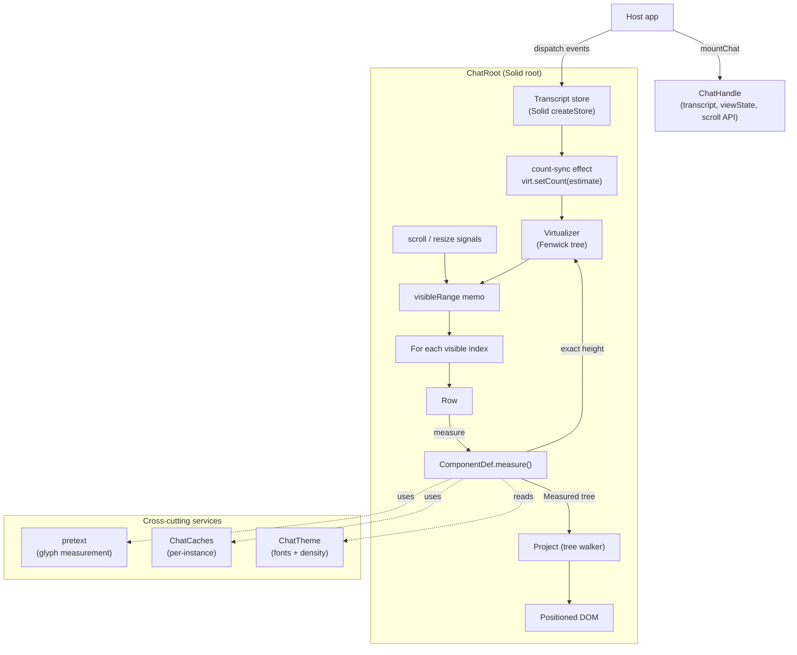
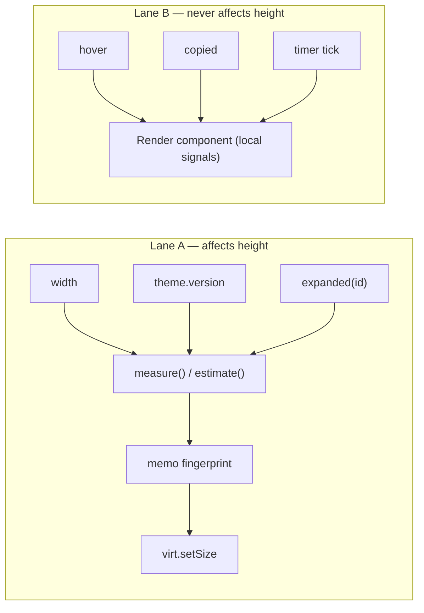
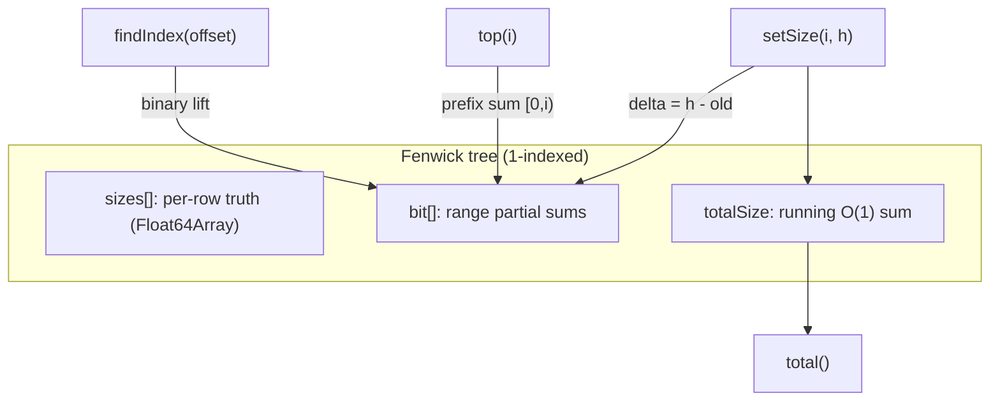
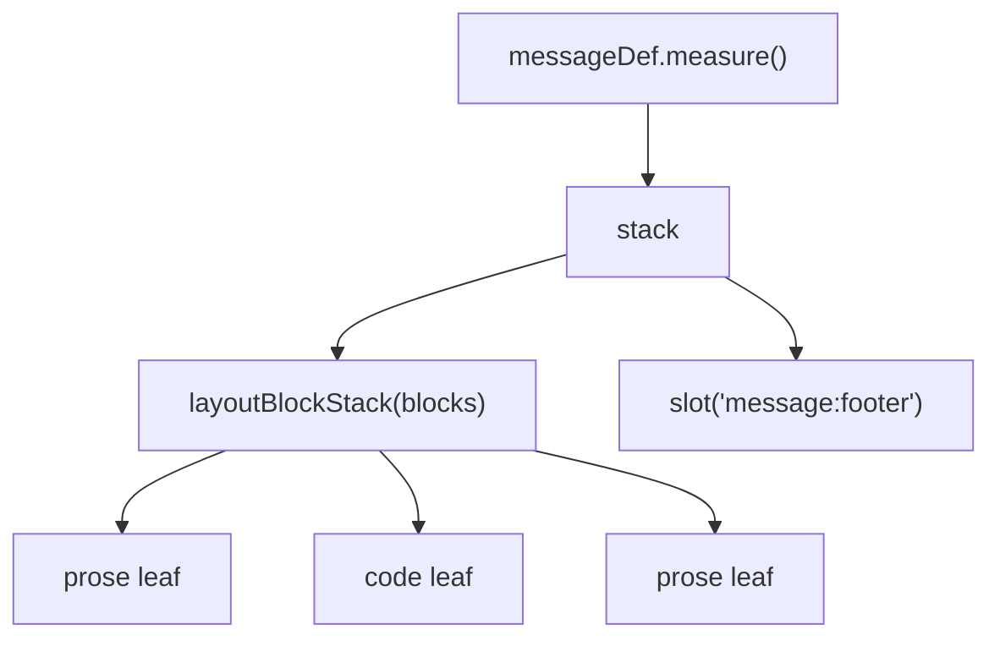
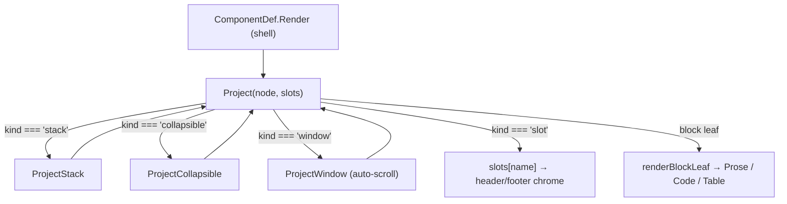
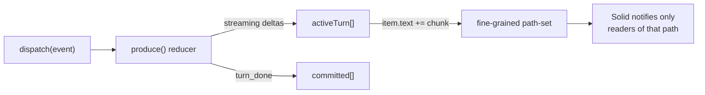
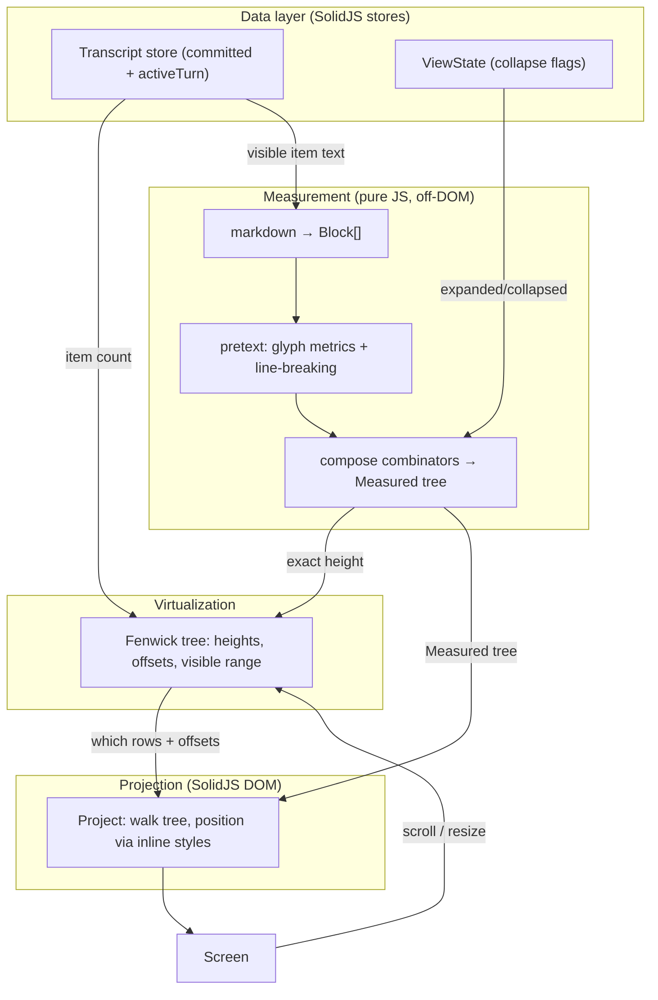

# chat-ui — Technical Architecture

`@emdash/chat-ui` is a framework-agnostic, high-performance chat transcript
renderer built on **SolidJS**. It is designed to render very long, continuously
streaming AI conversations (10k+ rows) at 60fps without layout thrash.

It achieves this by separating three concerns that most chat UIs entangle:

1. **Measurement** — computing the exact pixel height/geometry of every row in
   pure JavaScript _before_ touching the DOM (using [`pretext`](#3-pretext--off-dom-text-measurement) for text shaping).
2. **Virtualization** — only mounting the handful of rows currently on screen,
   using a [Fenwick tree](#4-the-fenwick-tree-virtualizer) for O(log n) scroll math.
3. **Projection** — rendering each visible row by walking a precomputed
   [layout tree](#5-the-measurecomposeproject-rendering-pipeline) and applying
   geometry via inline styles (no CSS-driven reflow).

The result is a renderer where adding a token to a streaming message, or
scrolling through thousands of rows, costs `O(log n)` rather than `O(n)`, and
where the browser never re-flows content it has already laid out.

---

## Table of contents

- [1. High-level architecture](#1-high-level-architecture)
- [2. SolidJS — the reactive substrate](#2-solidjs--the-reactive-substrate)
- [3. pretext — off-DOM text measurement](#3-pretext--off-dom-text-measurement)
- [4. The Fenwick tree virtualizer](#4-the-fenwick-tree-virtualizer)
- [5. The measure/compose/project rendering pipeline](#5-the-measurecomposeproject-rendering-pipeline)
- [6. The data model & transcript store](#6-the-data-model--transcript-store)
- [7. End-to-end flow: a streaming token](#7-end-to-end-flow-a-streaming-token)
- [8. Scroll virtualization in motion](#8-scroll-virtualization-in-motion)
- [9. Caching strategy](#9-caching-strategy)
- [10. How the concepts interact](#10-how-the-concepts-interact)

---

## 1. High-level architecture

The package exposes a single imperative entry point, `mountChat(container, opts)`
(`src/index.tsx`), which renders a Solid root (`ChatRoot`) and returns a
`ChatHandle` for feeding data and controlling scroll. Everything else is internal.



The key architectural inversion: **layout is computed first, in JS, and the DOM
is a pure projection of that layout.** The browser is never asked to measure or
wrap text — `pretext` does that off-DOM, and every element is positioned with an
explicit `top`/`left`/`height`.

---

## 2. SolidJS — the reactive substrate

The renderer is built on Solid because Solid's **fine-grained reactivity** maps
perfectly onto "only re-run the computation whose specific input changed."

Unlike React's re-render-the-component-tree model, Solid components run **once**;
afterward, only the individual reactive computations (`createMemo`,
`createEffect`, JSX expressions) that read a changed signal re-execute.

### Primitives in use

| Primitive | Where | Purpose |
| --- | --- | --- |
| `createSignal` | `ChatRoot` (`scrollTop`, `viewHeight`, `totalHeight`, `containerWidth`) | Scalar reactive state driving the visible range. |
| `createStore` | `state/transcript.ts`, `state/view-state.ts` | Fine-grained nested reactivity: mutating one item's `text` only notifies readers of that path. |
| `createMemo` | `ChatRoot` (`visibleRange`, `visibleIndexes`), `Row` (`layout`) | Cached derived values; recompute only when dependencies change. |
| `createEffect` | `Row` (height bridge), `ChatRoot` (count-sync, width flush) | Side effects synchronizing JS state into the virtualizer / DOM. |
| `createContext` / `useContext` | `ThemeContext`, `CachesContext`, `CommandsContext` | Dependency injection without prop drilling. |
| `<For>` | `ChatRoot` (visible rows), `Project` (placed children) | Keyed list rendering — reuses DOM nodes by key. |
| `<Switch>/<Match>` | `Project` | Dispatch a layout node to the right sub-renderer by `layout.kind`. |

### The "Lane A / Lane B" state split

A core discipline (documented in `src/core/define.ts`) divides state into two lanes:

- **Lane A — layout-affecting state.** Only `width`, `theme.version`, and
  resolved `expanded` state may flow into `measure()`/`estimate()`. These are the
  _only_ inputs allowed in the memo fingerprint and the _only_ things that can
  trigger `virt.setSize`.
- **Lane B — presentational/ephemeral state.** Copy-button "copied" flags, hover,
  shimmer, timer ticks — these live as local signals inside `Render` components
  and **never** enter measurement.

This separation is what guarantees that a hover or a copy-click can never
invalidate a height and cause a scroll jump.



---

## 3. pretext — off-DOM text measurement

**The problem:** to virtualize, you must know each row's height _before_ you
render it. For text, height depends on line-wrapping, which depends on glyph
widths — normally only the browser knows these, and only after layout.

**The solution:** `@chenglou/pretext` measures glyph widths and computes
line-breaking entirely off-DOM (via `OffscreenCanvas` text metrics), so the
engine can compute exact prose height in pure JS.

### The measurement contract

Because measurement happens off-DOM, the rendered DOM must reproduce pretext's
metrics _exactly_. This is enforced by:

- **Font shorthands** in `FontConfig` (`src/core/measure/fonts.ts`) that exactly
  match the CSS `font` applied to each fragment variant (body/bold/italic/code/…).
- **Geometry-coupled CSS** in `prose.module.css` (`font-size`, `font-family`,
  `white-space: pre`, `line-height: 1`, inline-code chip padding) that pretext
  also accounts for via `extraWidth`.
- **Browser contract tests** (`*.contract.test.tsx`) that mount the real
  component and assert `def.measure(...).height === element.offsetHeight`.

### The pipeline for one prose block

```mermaid
flowchart LR
  MD["markdown string"] -->|"remark parse"| Blocks["Block[]<br/>(document model)"]
  Blocks -->|"ProseBlock.runs"| R2R["runsToRichItems()"]
  R2R -->|"RichInlineItem[]<br/>(text + font + extraWidth)"| Prep["prepareRichInline()"]
  Prep -->|"PreparedRichInline"| Walk["walkRichInlineLineRanges(width)"]
  Walk -->|"per-line ranges"| Mat["materializeRichInlineLineRange()"]
  Mat -->|"fragments + x offsets"| Laid["ProseLaidOut<br/>(lines, fragments, height)"]
```



`layoutProse` (`src/components/prose/layout.ts`) drives this:

1. Splits `runs` at `{ kind: 'break' }` markers into independently-shaped segments.
2. For each segment, converts runs → `RichInlineItem[]` (mapping bold/italic/
   code/mention to the matching font shorthand + extra width).
3. Calls `prepareRichInline` (memoized — see [§9](#9-caching-strategy)).
4. `walkRichInlineLineRanges(prepared, effectiveWidth, …)` yields each wrapped
   line; `materializeRichInlineLineRange` gives the fragments and their x offsets.
5. Produces a `ProseLaidOut` with absolute per-line `top` and per-fragment `x` —
   pure geometry, no DOM.

`measureProseNaturalWidth` runs the same shaping with an unbounded width to get
the intrinsic content width — used by the user-bubble hug algorithm.

The `Prose` renderer (`src/components/prose/Prose.tsx`) then just emits absolutely
positioned `<span>`s at the precomputed `(x, top)` — no wrapping, no reflow.

---

## 4. The Fenwick tree virtualizer

`src/core/virtualizer.ts` is the heart of scroll performance. It maintains every
row's pixel height in a **Fenwick tree** (Binary Indexed Tree) so the operations
the scroll loop needs are all `O(log n)`:

| Operation | Meaning | Complexity |
| --- | --- | --- |
| `setSize(i, h)` | a row was measured; update its height | `O(log n)` |
| `top(i)` | prefix sum — pixel offset of row `i` | `O(log n)` |
| `total()` | total canvas height | `O(1)` (running sum) |
| `findIndex(offset)` | binary-lift: which row is at pixel `offset` | `O(log n)` |
| `range(scrollTop, viewH)` | inclusive visible `{start, end}` | `O(log n)` |

### Why a Fenwick tree?

A naive virtualizer recomputes cumulative offsets in `O(n)` whenever any row's
height changes — catastrophic when a streaming row's height changes every token.
The BIT makes both the update (`setSize`) and the reverse lookup (`findIndex` via
**binary lifting** over the tree) logarithmic.



### Growth strategy

Streaming appends one message per turn, so `setCount` is tuned for the
append-at-tail case: growing keeps existing BIT entries valid and builds only the
new high-index nodes from their children — `O(log n)` per appended row.
`prepend` (history pagination) shifts sizes and rebuilds the BIT in one `O(n)`
pass, which is acceptable for user-paced "load older" actions.

### Scroll-anchor correction

`setSize` returns the signed pixel delta `(newH - oldH)`. When a row _above_ the
viewport changes height (e.g. a collapsed thinking row expands off-screen, or an
estimated row settles to its real height), `ChatRoot.onHeightChanged` adds that
delta to `scrollTop` so the content the user is looking at doesn't jump.

---

## 5. The measure/compose/project rendering pipeline

Every row kind (message, thinking, diff, tool, file-op, execute) and every block
tier (prose, code, table) is described by a **`ComponentDef`** (`src/core/define.ts`):

```ts
type ComponentDef<TNode, L> = {
  kind: string;
  padY?: number;
  collapse?: CollapseDecl;
  estimate(node, ctx: MeasureCtx): number;          // O(1) heuristic
  measure(node, ctx: MeasureCtx): Measured<L>;       // exact geometry
  Render: Component<{ item; layout: Measured<L>; ctx }>;
};
```

All defs are gathered in a single `REGISTRY` (`src/components/registry.ts`) keyed
by node kind. `Row.tsx` dispatches through it; composite rows dispatch their
block children through the same map.

### Step 1 — `estimate`: cheap height for every row

When the item count changes, `ChatRoot` seeds the virtualizer with an `O(1)`
character-count heuristic for **every** row (visible or not). This gives a
plausible total canvas height instantly without measuring off-screen content.

### Step 2 — `measure`: exact geometry for visible rows only

`measure` runs only for rows in the visible range. It returns a `Measured<L>`:

```ts
type Measured<L> = { height: number; width: number; layout: L };
```

Rather than each def hand-rolling its geometry, layout is assembled from **pure
combinators** in `src/core/compose.ts`. Each returns a `Measured` whose
`layout.kind` discriminates its payload:

| Combinator | Builds |
| --- | --- |
| `stack(children, {padY, gap})` | vertical sequence; accumulates child heights |
| `pad(child, {padX, padY, border})` | uniform padding + border |
| `bubble(child, {padX, variantClass, width})` | hug-width user message bubble |
| `collapsible({headerH, headerSlot, expanded, body})` | header + optional body |
| `scrollWindow(child, maxH, {overlay, autoScrollBottom})` | clip tall content to a viewport |
| `slot(name, height)` | named placeholder for non-generic chrome (headers/footers) |

> **Width flows down, height flows up.** Callers narrow the width budget before
> calling `measure`; combinators sum child heights upward. This is the
> single invariant that keeps the whole tree consistent.

For example, an assistant message's `measure` produces:



### Step 3 — `Project`: render the tree

`src/components/Project.tsx` is a generic tree-walker. Given the `Measured` tree,
it recurses by `layout.kind` through a Solid `<Switch>`:

- **Combinator nodes** (stack/pad/bubble/collapsible/window) → positioned `<div>`s
  with explicit geometry, recursing into children.
- **Slot nodes** → resolved from the `slots` map the Render shell supplies
  (this is how non-generic chrome like a diff header or message footer is injected
  into the otherwise-generic walk).
- **Block leaves** (prose/code/table) → `renderBlockLeaf`, which uses the `raw`
  back-reference on each leaf to construct `Prose`/`Code`/`Table` without a
  second lookup.

So a `Render` component is a thin shell: it sets the row height, supplies slots,
and delegates the entire body to `<Project>`.



### The height bridge (`Row.tsx`)

`Row` ties measurement to the virtualizer:

```ts
const layout = createMemo(() => cachedMeasure(item, isActiveTurn, measureCtx()));
const reserved = () => layout().height + 2 * padY();
createEffect(() => {
  const delta = virt.setSize(index, reserved());
  if (delta !== 0) onHeightChanged(index, delta);
});
```

When measurement yields a new height, the effect writes it into the Fenwick tree
and triggers scroll-anchor correction if needed — closing the loop.

---

## 6. The data model & transcript store

`src/state/transcript.ts` is a Solid `createStore` with a **two-tier** structure:

- `committed: readonly ChatItem[]` — finalized rows; never mutated.
- `activeTurn: ChatItem[] | null` — the in-flight turn; accumulates streaming
  deltas.

Writes go through a single `dispatch(event)` reducer. Events are deltas
(`message_chunk`, `thinking_chunk`, `diff_update`, …); `turn_done` migrates the
active turn into `committed`.



The two-tier split is a **performance boundary**: committed items are stable
object references, which lets the identity-based memo (`nodeMemo`, a `WeakMap`
keyed by the item object) skip re-measuring them entirely. Only `activeTurn` rows
— the ones actually changing — bypass that cache and re-measure each tick.

`ViewState` (`src/state/view-state.ts`) is a separate per-key store holding
collapse flags, so toggling one row's collapse only notifies that row.

---

## 7. End-to-end flow: a streaming token

This sequence shows what happens when the host appends one token to a streaming
assistant message — the hot path that must stay cheap.

```mermaid
sequenceDiagram
  participant Host
  participant Store as Transcript store
  participant Root as ChatRoot
  participant Row
  participant Def as messageDef
  participant Pretext
  participant Virt as Virtualizer
  participant DOM

  Host->>Store: dispatch(message_chunk)
  Store->>Store: activeTurn item.text += chunk (path-set)
  Store-->>Row: reactive: item.text changed
  Row->>Def: measure(item, ctx)  (activeTurn → bypass nodeMemo)
  Def->>Def: parseBlocks(id, text) (cached; reuses old Block refs)
  Def->>Pretext: prepareRichInline(last block only)
  Note over Def,Pretext: earlier blocks hit blockMemo (WeakMap by Block identity)
  Pretext-->>Def: line geometry
  Def-->>Row: Measured tree (new height)
  Row->>Virt: setSize(index, height) → delta
  alt row above viewport
    Virt-->>Root: onHeightChanged → adjust scrollTop
  end
  Row->>DOM: Project walks tree → positioned spans
  alt stuck to bottom
    Root->>DOM: scroll to bottom
  end
```

The reason this is cheap despite firing on every token:

- **`parseBlocks`** reuses Block object references for unchanged content, so only
  the last (growing) block is new.
- **`blockMemo`** (a `WeakMap` keyed by Block identity) means every earlier block
  is a measurement cache hit; only the last block is reshaped by pretext.
- **`setSize`** is `O(log n)` regardless of transcript length.

---

## 8. Scroll virtualization in motion

When the user scrolls, only signals change — no data is touched.

```mermaid
sequenceDiagram
  participant User
  participant Scroll as scroll listener (rAF)
  participant Root as ChatRoot
  participant Virt as Virtualizer
  participant For as For (visible rows)
  participant Row

  User->>Scroll: scroll event
  Scroll->>Root: setScrollTop / setScrollVelocity (rAF-batched)
  Root->>Virt: range(scrollTop, viewH, before, after)
  Note over Root,Virt: direction-aware overscan<br/>(more buffer ahead of travel)
  Virt-->>Root: { start, end } (binary lift, O(log n))
  Root->>For: visibleIndexes memo updates
  For->>Row: mount entering rows / unmount leaving rows
  Row->>Row: measure on first appearance
  Row->>Virt: setSize (estimate → exact); settle scroll
```

Key details:

- The scroll handler is **rAF-batched** and writes only signals; the visible
  range is a `createMemo` so it recomputes only when `scrollTop`/`velocity`/
  `totalHeight` change.
- **Direction-aware overscan**: a larger leading buffer in the direction of
  travel (`OVERSCAN_LEADING = 12`) and a small trailing one (`OVERSCAN_TRAILING = 3`)
  pre-mount rows just before they enter, avoiding blank flashes.
- Rows are positioned with `transform: translateY(top)` against an absolutely
  sized canvas (`totalHeight + padTop + padBottom`), and carry
  `contain: layout paint style` to isolate their reflow.

---

## 9. Caching strategy

Caching is layered, and **all mutable data caches are per-instance** (owned by a
`ChatCaches` bundle created in `ChatRoot`, `src/core/caches.ts`) so two mounted
chats never share state and teardown is a single `caches.clear()`.

```mermaid
flowchart TD
  subgraph PerInstance["ChatCaches (per ChatRoot)"]
    PB["parseBlocks — markdown→Block[] by id"]
    RI["prepareRichInline — pretext shaping by content"]
    HL["highlight — Shiki tokens (LRU 200)"]
    DF["computeDiff — Myers rows (LRU 100)"]
  end

  subgraph Identity["Identity memos (WeakMap, GC'd)"]
    NM["nodeMemo — by ChatItem (Row.tsx)"]
    BM["blockMemo — by Block (block-stack.ts)"]
  end

  subgraph Global["Shared global (stateless / immutable)"]
    Engine["Shiki highlighter engine"]
    Consts["fonts, lang tables, metrics"]
  end

  Measure["measure path"] -->|ctx.caches| PerInstance
  Render["render leaves (Code, Diff)"] -->|useCaches()| PerInstance
  Row --> NM
  BlockStack["layoutBlockStack"] --> BM
  PerInstance -.token engine.-> Engine
```

| Layer | Key | Bound | Reach |
| --- | --- | --- | --- |
| `nodeMemo` | `ChatItem` identity | `WeakMap` (auto-GC) | skips whole-row re-measure for committed rows |
| `blockMemo` | `Block` identity | `WeakMap` (auto-GC) | skips per-block re-measure inside streaming rows |
| `parseBlocks` | `messageId` + text | per-instance Map | identity-stable Block refs across re-renders |
| `prepareRichInline` | shaped content | per-instance Map | reuse pretext shaping; flushed on width/font change |
| `highlight` | `lang + code` | per-instance LRU(200) | Shiki tokenisation |
| `computeDiff` | `oldText + newText` | per-instance LRU(100) | Myers diff rows |

Two reach channels exist because caches are touched in two execution contexts:

- **Measure path** has a `MeasureCtx` → reached via `ctx.caches`.
- **Render leaves** (`Code`, `Diff`) live deep in `Project` with no `MeasureCtx`
  → reached via a Solid `CachesContext` + `useCaches()`.

**Invalidation:** on container-width or font-load change, `caches.clearTextMeasure()`
drops the rich-inline cache _and_ flushes pretext's internal global metrics (which
are keyed only by font string and would otherwise hold stale fallback-font widths
from before the webfont loaded). The identity memos self-invalidate via their
fingerprint (`theme.version | width | collapsed | expanded`).

The **Shiki highlighter engine** stays a global singleton — it is stateless and
expensive to initialize (grammar/theme construction); only its token _results_
are cached per-instance.

---

## 10. How the concepts interact

Putting it together, the four pillars compose into one tight loop:



1. **SolidJS** stores hold the conversation and view state, and notify exactly the
   computations that read changed paths.
2. **pretext** turns text into exact geometry _before_ the DOM exists, satisfying
   the precondition for virtualization.
3. The **Fenwick tree** uses those heights to answer "what's on screen?" and
   "where does row _i_ sit?" in `O(log n)`, and absorbs height changes without
   `O(n)` recomputation.
4. **Projection** renders only the visible rows by walking the precomputed
   `Measured` tree and applying geometry as inline styles — so the browser never
   re-wraps or re-flows content the engine already laid out.

The discipline that makes it hold together is the **Lane A / Lane B** split and
the **width-down / height-up** invariant: measurement depends only on layout
inputs, geometry is computed purely, and the DOM is a faithful projection of that
geometry — never a source of truth.

---

## File map

| Concern | Files |
| --- | --- |
| Entry / mount | `src/index.tsx`, `src/ChatRoot.tsx` |
| Data model | `src/model.ts`, `src/state/transcript.ts`, `src/state/view-state.ts` |
| Markdown | `src/core/markdown/{document,parse,plain-text}.ts` |
| Measurement | `src/core/measure/*`, `src/components/prose/layout.ts` (pretext) |
| Virtualization | `src/core/virtualizer.ts`, `src/core/stick-to-bottom.ts` |
| Layout system | `src/core/define.ts`, `src/core/compose.ts`, `src/core/layout/*` |
| Rendering | `src/components/Project.tsx`, `src/components/Row.tsx`, `src/components/*/` |
| Registry | `src/components/registry.ts` |
| Caching | `src/core/caches.ts`, `src/components/CachesContext.ts` |
| Theme | `src/core/theme.ts`, `src/core/metrics.ts`, `src/core/measure/fonts.ts` |
| Contexts | `src/components/{ThemeContext,CachesContext,CommandsContext}.ts` |
```
