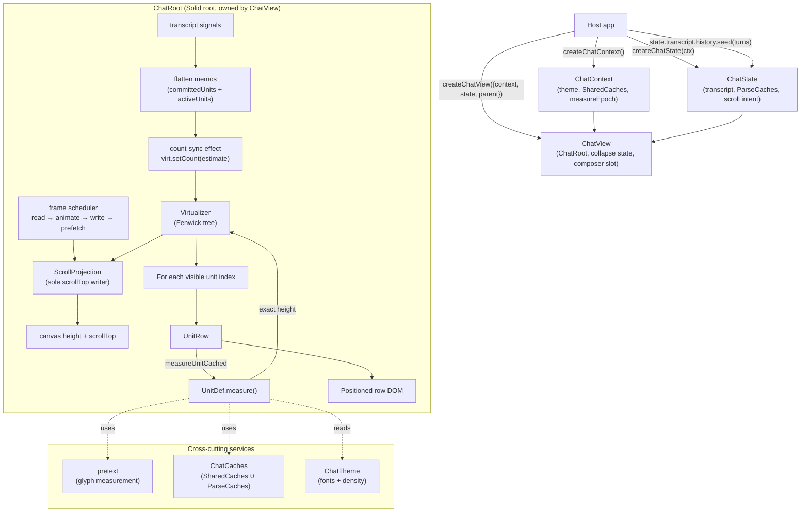
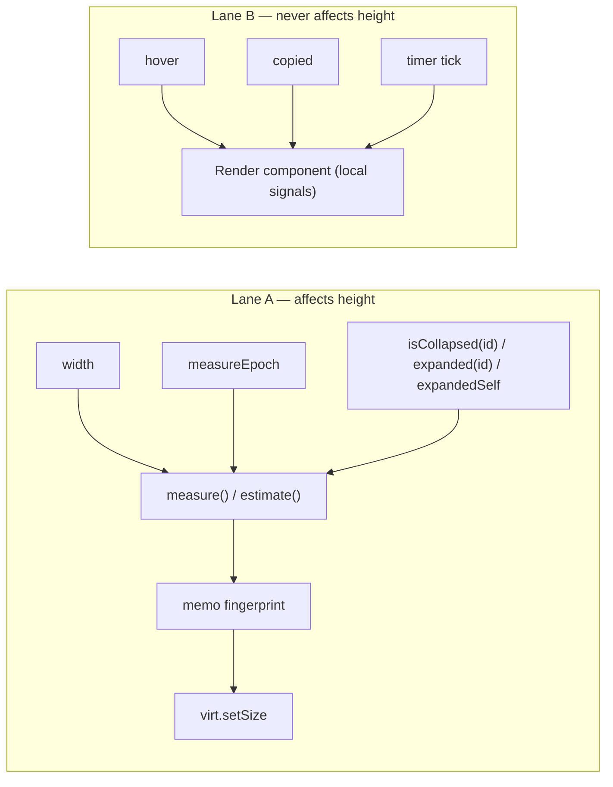
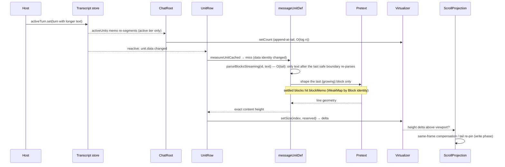

# chat-ui — Technical Architecture

`@emdash/chat-ui` is a framework-agnostic, high-performance chat transcript
renderer built on **SolidJS**. It is designed to render very long, continuously
streaming AI conversations (10k+ rows) at 60fps without layout thrash.

It achieves this by separating four concerns that most chat UIs entangle:

1. **Measurement** — computing the exact pixel height of every row in pure
   JavaScript _before_ touching the DOM (using
   [`pretext`](#3-pretext--off-dom-text-measurement) for text shaping).
2. **Virtualization** — only mounting the handful of rows currently on screen,
   using a [Fenwick tree](#4-the-fenwick-tree-virtualizer) for O(log n) scroll math.
3. **Scroll projection** — an [event-sourced scroll intent](#6-scroll-intent-and-the-projection-module)
   (`tail` / `anchor`) projected onto `scrollTop` by exactly one writer, inside
   a [phased frame scheduler](#7-the-frame-scheduler).
4. **Rendering** — each visible row is a flat [render unit](#5-the-flat-unit-model)
   whose DOM is a pure projection of precomputed geometry (inline `top`/`height`,
   no CSS-driven reflow).

The result is a renderer where adding a token to a streaming message, or
scrolling through thousands of rows, costs `O(log n)` rather than `O(n)`, and
where the browser never re-flows content the engine already laid out.

---

## Table of contents

- [1. High-level architecture](#1-high-level-architecture)
- [2. SolidJS — the reactive substrate](#2-solidjs--the-reactive-substrate)
- [3. pretext — off-DOM text measurement](#3-pretext--off-dom-text-measurement)
- [4. The Fenwick tree virtualizer](#4-the-fenwick-tree-virtualizer)
- [5. The flat unit model](#5-the-flat-unit-model)
- [6. Scroll intent and the projection module](#6-scroll-intent-and-the-projection-module)
- [7. The frame scheduler](#7-the-frame-scheduler)
- [8. The data model & transcript store](#8-the-data-model--transcript-store)
- [9. End-to-end flow: a streaming token](#9-end-to-end-flow-a-streaming-token)
- [10. Caching strategy](#10-caching-strategy)
- [Adding a new row kind](#adding-a-new-row-kind)
- [File map](#file-map)

---

## 1. High-level architecture

The package exposes three primitives modeled on the CodeMirror
`EditorState`/`EditorView` split (`src/index.tsx`). Everything else is internal.

```
ChatContext (global singleton, process-long)
  theme, highlighter, SharedCaches (content-addressed), measureEpoch

ChatState (per conversation, survives view mounts)
  transcript (history + active turn), ParseCaches (messageId-keyed),
  scroll intent (ScrollMode), collapse view-state, persisted geometry
  (heightmap snapshot)

ChatView (per mount, DOM-scoped)
  Solid root (ChatRoot), virtualizer, scroll projection, frame scheduler,
  composer slot
```


```mermaid
flowchart TD
  Host["Host app"]
  Host -->|"createChatContext()"| Ctx["ChatContext<br/>(theme, SharedCaches, measureEpoch)"]
  Host -->|"createChatState(ctx)"| State["ChatState<br/>(transcript, ParseCaches, scroll intent)"]
  Host -->|"createChatView({context, state, parent})"| View["ChatView<br/>(ChatRoot, collapse state, composer slot)"]
  Host -->|"state.transcript.history.seed(turns)"| State
  Ctx --> View
  State --> View

  subgraph Engine["ChatRoot (Solid root, owned by ChatView)"]
    Transcript["transcript signals"] --> Flatten["flatten memos<br/>(committedUnits + activeUnits)"]
    Flatten --> CountEffect["count-sync effect<br/>virt.setCount(estimate)"]
    CountEffect --> Virt["Virtualizer<br/>(Fenwick tree)"]
    Sched["frame scheduler<br/>read → animate → write → prefetch"] --> Proj["ScrollProjection<br/>(sole scrollTop writer)"]
    Virt --> Proj
    Proj --> DOM["canvas height + scrollTop"]
    Virt --> For["For each visible unit index"]
    For --> Row["UnitRow"]
    Row -->|"measureUnitCached"| Measure["UnitDef.measure()"]
    Measure -->|"exact height"| Virt
    Row --> RDOM["Positioned row DOM"]
  end

  subgraph Support["Cross-cutting services"]
    Pretext["pretext<br/>(glyph measurement)"]
    Caches["ChatCaches<br/>(SharedCaches ∪ ParseCaches)"]
    Theme["ChatTheme<br/>(fonts + density)"]
  end

  Measure -.uses.-> Pretext
  Measure -.uses.-> Caches
  Measure -.reads.-> Theme
```

The key architectural inversion: **layout is computed first, in JS, and the DOM
is a pure projection of that layout.** The browser is never asked to measure or
wrap text — `pretext` does that off-DOM, and every row is positioned with an
explicit `top`/`height`.

### State-view separation

`ChatState` outlives `ChatView`. A view can be disposed and re-created (e.g.
when a tab is shown/hidden) without losing the transcript. Block object
identities are stable across view cycles, so WeakMap measurement caches
continue to hit on re-mount. On dispose, ChatRoot snapshots measured row
heights and the scroll anchor into `ChatState` (`state/geometry.ts` types) so
the next mount restores position without scrollbar drift.

Collapse state (`state/view-state.ts`, a per-id map with inverted semantics for
default-collapsed kinds: stored `true` = expanded) also lives on `ChatState`,
so disposing a view and re-creating one against the same state — a tab switch —
restores collapse positions with no explicit snapshot API.

### Cache split

| Cache type | Owner | Key | Lifetime |
| --- | --- | --- | --- |
| `SharedCaches` | `ChatContext` | Content hash | Process-long |
| `ParseCaches` | `ChatState` | messageId | Conversation lifetime |

`SharedCaches` (highlight, diff, mermaid, rich-inline shaping) are safe to
share across conversations because they are keyed by content — a different
conversation with the same code block reuses the highlight result.
`ParseCaches` are messageId-keyed and provide object-stable `Block` identities
so WeakMap measurement caches hit across streaming updates. ChatRoot composes
the two into one `ChatCaches` bundle (`type ChatCaches = SharedCaches &
ParseCaches`) that flows to measure code via `ctx.caches` and to render leaves
via `CachesContext` / `useCaches()`.

---

## 2. SolidJS — the reactive substrate

The renderer is built on Solid because Solid's **fine-grained reactivity** maps
perfectly onto "only re-run the computation whose specific input changed."

Unlike React's re-render-the-component-tree model, Solid components run
**once**; afterward, only the individual reactive computations (`createMemo`,
`createEffect`, JSX expressions) that read a changed signal re-execute.

### Primitives in use

| Primitive | Where | Purpose |
| --- | --- | --- |
| `createSignal` | `ChatRoot` (`totalHeight`, `viewHeight`, `containerWidth`, `scrollVelocity`) | Scalar reactive state driving the visible range. |
| `createStore` | `state/transcript.ts` | Fine-grained nested reactivity: mutating one item's `text` only notifies readers of that path. |
| `createMemo` | `ChatRoot` (`committedUnits`, `activeUnits`, visible indexes), `UnitRow` (`contentH`, `rowExpandedSelf`) | Cached derived values; recompute only when dependencies change. |
| `createEffect` | `UnitRow` (height bridge into the virtualizer), `ChatRoot` (count-sync) | Side effects synchronizing JS state into the virtualizer / DOM. |
| `createContext` / `useContext` | `ThemeContext`, `CachesContext`, `StreamContext` | Dependency injection without prop drilling. |
| `createRoot` | `createChatContext`, `createChatState` | Owner-scoped reactive roots; `dispose()` cleans up all signals and effects. |
| `<For>` | `ChatRoot` (visible unit indexes), `BlockStackView` (block ids) | Keyed list rendering — reuses DOM nodes by key. |
| `<Dynamic>` | `UnitRow` | Dispatch a unit to its `UnitDef.Render` by `unit.kind`. |

### The "Lane A / Lane B" state split

A core discipline (documented in `src/core/define.ts`) divides state into two lanes:

- **Lane A — layout-affecting state.** Only `width`, `measureEpoch`, and
  resolved collapse/expand state may flow into `measure()`/`estimate()`. These
  are the _only_ inputs allowed in memo fingerprints and the _only_ things that
  can trigger `virt.setSize`.
- **Lane B — presentational/ephemeral state.** Copy-button "copied" flags,
  hover, shimmer, timer ticks — these live as local signals inside `Render`
  components and **never** enter measurement.

This separation is what guarantees that a hover or a copy-click can never
invalidate a height and cause a scroll jump.


```mermaid
flowchart LR
  subgraph LaneA["Lane A — affects height"]
    W[width] --> Measure
    ME[measureEpoch] --> Measure
    EX["isCollapsed(id) / expanded(id) / expandedSelf"] --> Measure
    Measure["measure() / estimate()"] --> Fingerprint["memo fingerprint"]
    Fingerprint --> Virt["virt.setSize"]
  end
  subgraph LaneB["Lane B — never affects height"]
    Hover[hover] --> Render
    Copied[copied] --> Render
    Tick[timer tick] --> Render
    Render["Render component (local signals)"]
  end
```

One subtlety worth naming: `expandedSelf` is scoped **per unit** by the ctx
builder — the globally-expanded card id never appears in `MeasureCtx`. Expanding
one message card therefore cannot change any other row's fingerprint, so no
other row re-measures or rebuilds DOM (a regression test in
`src/tests/regression/render-isolation.contract.test.tsx` guards this).

---

## 3. pretext — off-DOM text measurement

**The problem:** to virtualize, you must know each row's height _before_ you
render it. For text, height depends on line-wrapping, which depends on glyph
widths — normally only the browser knows these, and only after layout.

**The solution:** `@chenglou/pretext` measures glyph widths and computes
line-breaking entirely off-DOM (via `OffscreenCanvas` text metrics), so the
engine can compute exact prose height in pure JS.

### The measurement contract

Because measurement happens off-DOM, the rendered DOM must reproduce pretext's
metrics _exactly_. This is enforced by:

- **Font shorthands** in `FontConfig` (`src/core/measure/fonts.ts`) that
  exactly match the CSS `font` applied to each fragment variant
  (body/bold/italic/code/…).
- **Geometry-coupled CSS variables** emitted by `buildChatTheme`
  (`src/core/config.ts`) and applied inline at the scroll-container root, so
  measured metrics and rendered CSS come from one source.
- **Browser contract tests** (`*.contract.test.tsx`, harness in
  `src/tests/contract.tsx`) that mount the real `UnitDef.Render` and assert
  `def.measure(data, ctx) === element.offsetHeight` at exact integer px.

### The pipeline for one prose block


```mermaid
flowchart LR
  MD["markdown string"] -->|"remark parse"| Blocks["Block[]<br/>(document model)"]
  Blocks -->|"ProseBlock.runs"| R2R["runsToRichItems()"]
  R2R -->|"RichInlineItem[]<br/>(text + font + extraWidth)"| Prep["prepareRichInline()"]
  Prep -->|"PreparedRichInline"| Walk["walkRichInlineLineRanges(width)"]
  Walk -->|"per-line ranges"| Mat["materializeRichInlineLineRange()"]
  Mat -->|"fragments + x offsets"| Laid["ProseLaidOut<br/>(lines, fragments, height)"]
```

`layoutProse` (`src/components/rows/markdown/prose/layout.ts`) drives this and
produces absolute per-line `top` and per-fragment `x` — pure geometry, no DOM.
The `Prose` renderer then just emits absolutely positioned `<span>`s at the
precomputed `(x, top)` — no wrapping, no reflow.

Pretext heights are still treated as _measurements to verify_, not gospel: the
contract tests and the debug overlay (dashed outline, red on mismatch) are the
divergence detectors.

---

## 4. The Fenwick tree virtualizer

`src/core/virtualizer.ts` is the heart of scroll performance. It maintains every
row's pixel height in a **Fenwick tree** (Binary Indexed Tree) so the operations
the scroll loop needs are all `O(log n)`:

| Operation | Meaning | Complexity |
| --- | --- | --- |
| `setSize(i, h)` | a row was measured; update its height | `O(log n)` |
| `top(i)` | prefix sum — pixel offset of row `i` | `O(log n)` |
| `total()` | total canvas height | `O(1)` (running sum) |
| `findIndex(offset)` | binary-lift: which row is at pixel `offset` | `O(log n)` |
| `range(scrollTop, viewH, before?, after?)` | inclusive visible `{start, end}` | `O(log n)` |

### Why a Fenwick tree?

A naive virtualizer recomputes cumulative offsets in `O(n)` whenever any row's
height changes — catastrophic when a streaming row's height changes every token.
The BIT makes both the update (`setSize`) and the reverse lookup (`findIndex`
via **binary lifting** over the tree) logarithmic.

### Growth strategy

Streaming appends one unit per turn item, so `setCount` is tuned for the
append-at-tail case: growing keeps existing BIT entries valid and builds only
the new high-index nodes from their children — `O(log n)` per appended row.
`prepend(count, estimate)` (history pagination) shifts sizes and rebuilds the
BIT in one `O(n)` pass, acceptable for user-paced "load older" actions.

### Estimates seed the tree; measures correct it

When the unit count changes, ChatRoot's count-sync effect seeds every new row
with a cheap estimate (see [§10](#10-caching-strategy) for the estimator
model). Visible rows are corrected to exact heights by `UnitRow`'s measure
bridge; near-viewport rows are corrected by the scheduler's **prefetch** phase
before they enter the window. `setSize` returns the signed pixel delta, which
flows into the scroll-projection module for same-frame compensation (see §6) —
an estimate settling above the viewport can never visibly jump the content.

---

## 5. The flat unit model

The engine virtualizes over a flat **`RenderUnit[]`** produced by
`state/flatten.ts`. A `RenderUnit` is one independently mounted, measured, and
rendered row:

```ts
type RenderUnit<D = unknown> = {
  id: string;        // `${itemId}#${segmentKey}` — stable across ticks
  itemId: string;    // source ChatItem id (scrollToItem, grouping)
  groupId: string;   // units from one item share a group
  kind: string;      // dispatches to UNIT_REGISTRY
  data: D;           // typed per-kind segment payload
  groupRole: GroupRole;   // solo | first | middle | last (per-unit chrome)
  gapBefore: number;      // seam gap above, resolved via margin-collapse
  chrome?: GroupChrome;   // e.g. user-bubble insetX for multi-unit groups
};
```

Two registries drive the model (`src/components/engine/unit-registry.ts`):

- **`SEGMENTERS`** — `ChatItem.kind → ItemSegmenter`: how a transcript item is
  split into units. Message items segment per markdown block; composites
  (diff / plan / thinking / file-op / subagent) are single-unit segmenters.
- **`UNIT_REGISTRY`** — `unit.kind → UnitDef`: how each unit kind is measured
  and rendered.

A `UnitDef` (`src/core/units.ts`) is deliberately small — measure returns a
**number**, not a layout tree:

```ts
defineUnit<D, Vars>({
  kind: string,
  margin: Margin,                     // seam margins, collapsed at flatten time
  vars?: Vars,                        // px constants shared by measure + Render
  estimate?(data, ctx, vars): number, // O(1) heuristic for off-screen rows
  measure(data, ctx, vars): number,   // exact content height
  Render(props: { data, ctx, vars }), // Solid component
});
```

### Two-tier flatten

`flatten.ts` segments the transcript in two tier-scoped memos:

- **`committedUnits`** — recomputes only when the committed array identity
  changes (`turn_done` / `prepend` / `seed`). Stable across streaming ticks.
- **`activeUnits`** — recomputes per streaming tick, but only over the small
  `activeTurn` array. No `O(total)` work during streaming.

The two tiers join into a `UnitsView` (virtual concat: `.length` / `.at(i)`)
that never allocates a full array per tick. Seam gaps between units are
resolved once at flatten time via margin-collapse (max of adjacent `UnitDef`
margins) and stamped onto `gapBefore` — inter-row spacing lives inside each
row's reserved slot, never in CSS margins the measurer can't see.

### UnitRow — the height bridge

`src/components/engine/UnitRow.tsx` renders one visible unit and ties
measurement to the virtualizer:

- `contentH` memo calls `measureUnitCached(unit, ctx, def)` (see §10).
- Reserved height = `gapBefore + contentH`. An effect writes it into the
  Fenwick tree via `virt.setSize(index, reserved)`; the returned delta feeds
  scroll compensation.
- Collapse/expand transitions run through `createHeightTween` registered in a
  `TweenRegistry`: the virtualizer is driven from the animated value so rows
  below reposition in lockstep, while a display-lagged collapse state keeps the
  expanded DOM mounted and clipped during the tween.
- `UnitDef.Render` is mounted via `<Dynamic>`; markdown-bearing units render a
  `BlockStackView` whose `<For>` is keyed by stable block id, so a streaming
  re-layout of one block never remounts its siblings.

### Markdown blocks

Inside message-like units, markdown is a first-class sub-model: `Block[]`
(prose / code / table / rule / mermaid) with per-kind `BlockDef`s in
`BLOCK_REGISTRY` (`src/components/rows/markdown/block-registry.ts`). Blocks are
measured by `measureBlockCached` (WeakMap by `Block` identity, fingerprint
`measureEpoch|width|collapsed`) and stacked by `layoutBlockStack`, which
resolves inter-block gaps by margin-collapse of per-block margins.

> **Width flows down, height flows up.** Callers narrow the width budget before
> measuring children; stacks sum child heights upward. This is the single
> invariant that keeps the whole tree consistent.

---

## 6. Scroll intent and the projection module

Scroll behavior is split into **intent** (what the viewport should show) and
**projection** (how scrollTop gets there).

### Event-sourced intent: `ScrollMode`

`state/scroll-mode.ts` defines the declarative intent owned by `ChatState`:

```ts
type ScrollMode =
  | { kind: 'tail' }   // follow newest content
  | { kind: 'anchor'; itemId: string; edge: 'top' | 'bottom'; offset: number };
```

Intent is **event-sourced**: it changes only on discrete user gestures or host
calls, never derived from geometry. Geometry (scrollTop, reserve heights) can
therefore never feed back into intent and cause scroll jumps. "Pinned to
bottom" is `tail`; a user-parked position is an `anchor` on the unit at the
viewport top; pin-to-top-on-send is an `anchor` with `edge:'top', offset:0`.

### The projection module

`src/core/scroll-projection.ts` is the single owner of scroll application,
extracted from ChatRoot behind an injected dependency port
(`ScrollProjectionDeps`) so the whole state machine is unit-testable in node
(`scroll-projection.test.ts`). Its behavior contract:

- **Exactly one scrollTop writer.** Every write goes through
  `writeScrollTop()`, which records `expectedScrollTop`. Scroll events are
  classified against it: deltas within `USER_SCROLL_EPSILON` (0.5px) are
  self-write echoes; anything larger is a real user gesture.
- **Smooth scrolls are scheduler tweens.** `scrollToTop/Bottom/Item` animate
  via eased tweens advanced in the scheduler's write phase — there is no native
  `scrollTo({behavior:'smooth'})` and no suppression flag; tween frames are
  ordinary self-writes.
- **Settle window.** After a user gesture, anchor projection is suppressed
  until the gesture has been quiet for `SCROLL_SETTLE_MS` (120ms). The settle
  window gates intent re-derivation only — **height compensation stays
  same-frame** (an estimate settling above the viewport compensates scrollTop
  in the same write, inside or outside the window).
- **Coalescing.** N geometry invalidations per frame collapse into at most one
  projection (`needsProject`), and `project()` flushes canvas height before
  writing scrollTop so the browser never clamps against a stale canvas.
- **Prepend compensation.** History prepends commit canvas height and
  scrollTop together, mode-aware: `tail` stays glued to the bottom; `anchor`
  keeps the anchored unit fixed on screen.

Stickiness constants: `STICK_THRESHOLD_PX = 48` (distance from the bottom
within which the viewport counts as "at bottom" for tail re-derivation).

---

## 7. The frame scheduler

`src/components/engine/frame-scheduler.ts` runs a demand-driven, phased rAF
loop. It re-arms only while a phase reports pending work, so the loop sleeps
completely when the UI is idle.

```
read     — DOM geometry reads (scrollTop, clientHeight) into signals; once per frame
animate  — advance height tweens + scroll tweens; true while any remain active
write    — commit coalesced canvas height, at most one scrollTop write (projection)
prefetch — budgeted background measurement of off-screen rows (optional phase)
```

Hardened invariants (aligned with CodeMirror's measure cycle):

1. **Liveness through failure** — phases run in try/catch; the re-arm decision
   executes in `finally`, so a throwing phase cannot stall the loop.
2. **Bounded converge** — if `write` keeps requesting more work for
   `MAX_CONVERGE` (6) consecutive frames, the loop halts re-arming and logs in
   development, preventing spin loops.
3. **Force reconcile** — `forceReconcile()` marks work dirty and re-arms; called
   on view reattach and visibility regain to self-heal missed wakes.

### The prefetch phase

Prefetch replaces what used to be a standalone `requestIdleCallback` loop. Each
frame after `write`, it walks the window around the last committed visible
range — `PREFETCH_AHEAD = 40` units ahead of travel first, then
`PREFETCH_BEHIND = 20` behind — measuring rows exactly and writing corrections
into the virtualizer, under a `PREFETCH_FRAME_BUDGET_MS = 3` per-frame budget.
Rows whose height is already exact at the current fingerprint are skipped via
the unit measure memo. Prefetch's re-arm is deliberately exempt from the write
converge guard: a long prefetch walk across many frames is normal, not a spin.

The effect: by the time a row scrolls into view it is usually already measured,
so estimate→exact settling (and its compensation) happens off-screen.

---

## 8. The data model & transcript store

`state/transcript.ts` is a Solid `createStore` with a **two-tier** structure:

- `committed: readonly TranscriptTurn[]` — finalized turns; never mutated.
- `activeTurn` — the in-flight turn; accumulates streaming deltas.

The host writes through a small imperative surface:

- `history.seed(turns)` — initial load.
- `history.prepend(turns)` — older pages; **dedupes by turn id** (an
  already-present turn is dropped with a dev warning) so an at-least-once host
  seam cannot double-insert.
- `history.append(turns)` / `activeTurn.set(turn)` — streaming path;
  `turn_done` migrates the active turn into `committed`.

The two-tier split is a **performance boundary**: committed turns are stable
object references, so `committedUnits` (flatten memo) and the identity-keyed
measure memos skip them entirely. Only `activeTurn` — the data actually
changing — is re-segmented and re-measured per tick.

Collapse flags live in `ChatState.viewState` (`state/view-state.ts`, keyed by
item/block id) and survive view remounts along with the rest of the state; the
view exposes `toggleCollapsed(id)` for programmatic toggles.

---

## 9. End-to-end flow: a streaming token

This sequence shows what happens when the host appends one chunk to a streaming
assistant message — the hot path that must stay cheap.


```mermaid
sequenceDiagram
  participant Host
  participant Store as Transcript store
  participant Root as ChatRoot
  participant Row as UnitRow
  participant Def as messageUnitDef
  participant Pretext
  participant Virt as Virtualizer
  participant Proj as ScrollProjection

  Host->>Store: activeTurn.set(turn with longer text)
  Store-->>Root: activeUnits memo re-segments (active tier only)
  Root->>Virt: setCount (append-at-tail, O(log n))
  Store-->>Row: reactive: unit.data changed
  Row->>Def: measureUnitCached → miss (data identity changed)
  Def->>Def: parseBlocksStreaming(id, text) — O(tail): only text after the last safe boundary re-parses
  Def->>Pretext: shape the last (growing) block only
  Note over Def,Pretext: settled blocks hit blockMemo (WeakMap by Block identity)
  Pretext-->>Def: line geometry
  Def-->>Row: exact content height
  Row->>Virt: setSize(index, reserved) → delta
  Virt-->>Proj: height delta above viewport?
  Proj->>Proj: same-frame compensation / tail re-pin (write phase)
```

Why this stays cheap at any transcript length:

- **`parseBlocksStreaming`** re-parses only the growing tail after the last
  safe boundary (closed code fence, or blank line outside a fence); the settled
  prefix keeps its `Block` object identities.
- **`blockMemo`** (WeakMap by Block identity) makes every settled block a
  measurement cache hit; only the last block is reshaped by pretext.
- **Settled-block DOM never rebuilds**: `BlockStackView` keys by block id, and
  leaf components read layout reactively — a streaming chunk updates the last
  block's DOM in place (regression-tested by node-identity sampling).
- **`setSize`** is `O(log n)` regardless of transcript length, and tail re-pin
  is one projection in the same frame's write phase.

Syntax highlighting never blocks this path: `Code.tsx` defers Shiki until a
block is **settled** (crossed a safe parse boundary), then tokenizes it in
idle-budgeted slices (see §10).

---

## 10. Caching strategy

Caching is layered. Content-addressed caches live on `ChatContext`
(`SharedCaches`), parse caches on `ChatState` (`ParseCaches`), and identity
memos are module-level WeakMaps (GC'd with their keys).

| Layer | Key | Bound | Reach |
| --- | --- | --- | --- |
| unit memo (`measureUnitCached`) | `unit.data` identity | WeakMap (auto-GC) | skips whole-unit re-measure for committed units |
| `blockMemo` (`measureBlockCached`) | `Block` identity | WeakMap (auto-GC) | skips per-block re-measure inside streaming rows |
| `parseBlocks` / `parseBlocksStreaming` | messageId + text | `ParseCaches` Map | identity-stable Block refs across ticks |
| `prepareRichInline` | shaped content | `SharedCaches` Map | reuse pretext shaping across rows/conversations |
| `highlight` / `highlightIncremental` | lang + code | `SharedCaches` LRU (200) | Shiki tokenization |
| `computeDiff` | oldText + newText | `SharedCaches` LRU (100) | diff rows |
| `renderMermaid` | source | `SharedCaches` LRU (100) | Mermaid SVG (CSS-var themed, light/dark reuse) |

### The unit measure memo

`src/core/unit-measure.ts` is the row-level memo. Its entry stores:

- a **base fingerprint** — `kind|measureEpoch|width|expandedSelf` (note:
  `expandedSelf` is per-unit; the global expanded id never enters the
  fingerprint), and
- **recorded collapse reads** — every `ctx.isCollapsed(id)` / `ctx.expanded(id)`
  call made during measure, with its value. A lookup re-reads the recorded ids
  and misses when any changed. Re-reading on hits also preserves Solid
  dependency tracking: a memo that hits the cache still subscribes to exactly
  the collapse signals that affect its height.

Committed units keep their `data` object identity across ticks, so UnitRow
re-runs and prefetch sweeps hit this memo; streaming units rebuild `data` each
tick and correctly miss.

### Estimators

Off-screen rows are seeded with `estimate()` — accuracy matters because it
shapes scrollbar proportion and the size of settle corrections.
`src/core/layout/estimate-text.ts` provides a width-aware markdown model
(fenced code at code line-height plus box chrome; headings/lists/quotes at
their prose variants' line heights and margins; margin-collapse between blocks;
chars-per-line derived from column width and body font size). Measured against
the rendering-audit harness this holds p50 abs error ≈ 11% (was ~34% under the
old fixed chars-per-line model). ChatRoot probes column geometry before the
first estimate pass so estimators see the real width.

### Incremental highlighting

`ChatCaches.highlightIncremental` tokenizes on a time budget via
`@shikijs/stream` (`src/core/highlight/incremental.ts`): one line per enqueue
with TextMate grammar state carried across slices, ~6ms of synchronous work per
slice, yielding to `requestIdleCallback` between slices. Output is
byte-identical to the synchronous path (equivalence-tested). `Code.tsx` and
`Diff.tsx` drive it after their content settles; the LRU serves re-mounts
synchronously via `peekHighlight`.

**Invalidation:** font load bumps `measureEpoch` (invalidating all geometry
memos and flushing pretext's internal metrics via `clearTextMeasure()` — they
are keyed only by font string and would otherwise keep stale fallback-font
widths). Width changes need no flush: the fingerprints carry `width`, and
rich-inline shaping is width-independent (intrinsic glyph widths).

The **Shiki engine** stays a global singleton — stateless and expensive to
initialize; only its token _results_ are cached.

---

## Adding a new row kind

This recipe adds a hypothetical `'status'` row kind. Replace `status` /
`ChatStatus` with your actual names.

### 1. Define the model type

Add your item shape to `src/model.ts` and include it in the `ChatItem` union:

```ts
export type ChatStatus = {
  kind: 'status';
  id: string;
  text: string;
};
```

### 2. Implement the `UnitDef`

Create `src/components/rows/status/status.def.tsx`:

```tsx
import { defineUnit } from '@core/units';
import type { ChatStatus } from '@/model';

export const statusUnitDef = defineUnit<ChatStatus>({
  kind: 'status',
  margin: { top: 2, bottom: 2 },

  estimate(_item, ctx): number {
    return ctx.theme.fonts.body.lineHeight;
  },

  measure(_item, ctx): number {
    return ctx.theme.fonts.body.lineHeight;
  },

  Render(props) {
    const height = () => {
      const ctx = props.ctx.measureCtx?.();
      return ctx ? ctx.theme.fonts.body.lineHeight : 20;
    };
    return <div style={{ height: `${height()}px` }}>{props.data.text}</div>;
  },
});
```

Keep Lane A discipline: only `ctx.width`, theme metrics, and collapse state may
influence `measure`. Anything the row renders at a height not derived from
those inputs will trip the debug overlay and the contract test.

### 3. Register it

In `src/components/engine/unit-registry.ts`:

- add the `UnitDef` to `UNIT_REGISTRY` under its `kind`;
- add an `ItemSegmenter` to `SEGMENTERS` (for a single-row kind, segment to
  exactly one unit whose `data` is the item itself, id `${item.id}#0`).

### 4. Add a measurement contract test

Extend `src/components/rows/rows-measure.contract.test.tsx` (or add a sibling
file) using the shared harness:

```tsx
import { makeContractCtx, renderAndMeasureUnit } from '@/tests/contract';

it('status row measures exactly', async () => {
  const ctx = makeContractCtx({ width: 640 });
  const item: ChatStatus = { kind: 'status', id: 's1', text: 'Indexing…' };
  const { computed, dom } = await renderAndMeasureUnit(statusUnitDef, item, ctx);
  expect(computed).toBe(dom);
});
```

Run it with `pnpm exec vitest run --project browser <file>`. A failing test
means the rendered chrome (padding, border, line-height) disagrees with
`measure` — fix the def, not the test.

### 5. Add fixtures

Add representative items to `src/mock-transcript.ts` (used by stories and
perf/regression harnesses) so the new kind participates in streaming and
scroll sweeps.

---

## File map

| Concern | Files |
| --- | --- |
| Public API | `src/index.tsx` |
| Global context | `src/chat-context.ts` |
| Per-conversation state | `src/state/chat-state.ts`, `src/state/transcript.ts` |
| Per-mount view | `src/chat-view.tsx`, `src/ChatRoot.tsx` |
| Data model | `src/model.ts` |
| Unit model | `src/core/units.ts`, `src/state/flatten.ts`, `src/components/engine/unit-registry.ts` |
| Row rendering | `src/components/engine/UnitRow.tsx`, `src/components/primitives/BlockStackView.tsx` |
| Measurement memos | `src/core/unit-measure.ts`, `src/components/rows/markdown/block-stack.ts` |
| Estimators | `src/core/layout/estimate-text.ts`, `src/core/layout/generic-estimate.ts` |
| Virtualization | `src/core/virtualizer.ts` |
| Scroll intent | `src/state/scroll-mode.ts` (`ScrollMode`), `src/state/chat-state.ts` |
| Scroll projection | `src/core/scroll-projection.ts` (+ node tests) |
| Frame scheduler | `src/components/engine/frame-scheduler.ts`, `src/components/engine/tween-registry.ts`, `src/components/engine/create-height-tween.ts` |
| Geometry snapshots | `src/state/geometry.ts` |
| Markdown | `src/core/markdown/*`, `src/components/rows/markdown/*` |
| Text measurement | `src/core/measure/*`, `src/components/rows/markdown/prose/layout.ts` |
| Highlighting | `src/core/highlight/{highlighter,incremental,apply-tokens}.ts` |
| Caching | `src/core/caches.ts`, `src/components/contexts/CachesContext.ts` |
| Theme | `src/core/config.ts`, `src/core/theme.ts` |
| View state | `src/state/view-state.ts`, `src/state/tool-header-state.ts` |
| Contract test harness | `src/tests/contract.tsx`, `src/tests/regression/*` |
