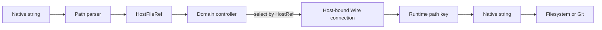

# Boundaries

The path module owns pure identity and lexical path math. It does not own host
lifecycle, filesystem I/O, authorization, or persistence migrations.

## Conversion Points

Convert at these boundaries:

- User input, picker output, SSH responses, and Git roots become structured refs
  at ingress.
- Renderer and persistence payloads use `ResourceUri`, `HostFileRef`, or
  `ScopedPath`, not raw native strings.
- Domain controllers use `HostRef` to select or relay to a host-bound Wire
  connection. They do not inject host routing identity into the runtime.
- Host-bound Wire payloads use `HostAbsolutePath` roots and
  `PortableRelativePath` coordinates.
- Host runtimes convert structured paths back to native strings immediately before
  filesystem, Git, watcher, or process-spawn calls.
- Watcher and Git events should become `ScopedPath` values before crossing to
  renderer-facing models.

## Contract Validation

Contracts should import schemas from `@emdash/core/path` instead of introducing
new `z.string()` path fields once they migrate to structured resources.

Recommended boundary shapes:

- `hostFileRefSchema` for one-off global file resources.
- `scopedPathSchema` for a single file under a known root.
- `{ root: hostAbsolutePathSchema, path: portableRelativePathSchema }` for
  host-bound runtime APIs, tree keys, watcher events, and Git paths.
- `{ root: hostFileRefSchema, path: portableRelativePathSchema }` while a payload
  still needs host routing.
- `resourceUriSchema` for persisted string identity.
- `absolutePathInputSchema(profile)` for native/user/host input only.

The schemas delegate to the same parsers as internal code, so contract
validation and local validation enforce the same invariants.

## Lexical Versus Physical Containment

`containsAbsolute()` and `relativizeHostFileRef()` are lexical. They do not
follow symlinks.

Use lexical containment for identity, tree projection, deduplication, batching,
and root-relative path conversion.

Use realpath-based containment for security-sensitive writes, deletes, and
filesystem mutation policies. That logic belongs in runtime or app services with
access to a filesystem implementation.

## Not Owned Here

This module intentionally does not implement:

- host connection ownership or mapping from `HostRef` to a live runtime;
- SSH connection management;
- workspace mount persistence;
- `realpath()` or canonical inode checks;
- renderer tab migrations;
- Monaco model migration;
- Wire contract migrations;
- filesystem authorization.

## Future Adoption Map

Existing consumers can migrate incrementally:

- Files contracts use `HostAbsolutePath` roots and `PortableRelativePath`
  coordinates; runtime policy adds realpath-based mutation safety.
- Desktop `RuntimePath` can become a thin native-format adapter around
  `PathSemantics`.
- SSH path helpers can use POSIX parsing explicitly instead of app-local string
  utilities.
- Git models use repository/worktree `HostAbsolutePath` roots and keep file paths
  as `PortableRelativePath`.
- fs-watch can emit root-scoped portable paths, then batch using `ResourceKey`.
- workspace-server schemas can validate structured refs instead of documenting
  string conventions only.
- Renderer tabs, tree nodes, Monaco models, comments, and view-state snapshots
  can store `ResourceUri` while deriving display paths from workspace mounts.
