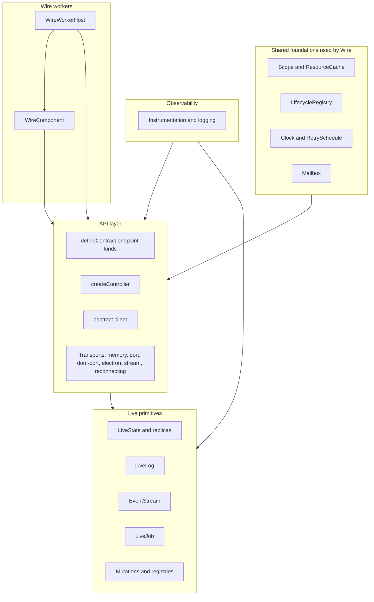

# @emdash/wire Docs

`@emdash/wire` is the transport-agnostic runtime layer for typed API calls,
live model subscriptions, live logs, event streams, jobs, mutations, workers, and
the small utilities that sit at the API boundary.

Wire builds on Shared foundations for generic lifecycle, scheduling,
concurrency, testing, and stable utility behavior:



The live layer owns the stateful primitives: `LiveState`, `LiveLog`,
`EventStreamSource`, `LiveJob`, `LiveModelHost`, and consumer-instantiated
replicas. Low-level `*Client` followers track cursors and resync, while
materializers (`StateStore`, `LogSink`, `JobStore`) own values. Most consumers use
client handles directly or wrap them in replicas. The API layer turns those
primitives into a contract with typed procedure calls and live topic client
handles. `WireComponent` is the reusable contract implementation pattern: it
declares explicit typed requirements, validates config at the creation boundary,
and can be created in-process or hosted in a worker. Worker hosting is Wire-specific because it
serves components across processes. Generic lifecycle, scheduling, concurrency, testing, and stable
utility primitives live in `@emdash/shared` and are documented here where Wire
uses them. Observability hooks are cross-cutting and can be attached to API,
live, and worker surfaces.

## Pages

- API:
  - [Contracts](./api/contracts.md): `defineContract()`, endpoint kinds, nested
    composition, and live model groups.
  - [Serving and clients](./api/serving.md): `createController()`, `serve()`,
    `connect()`, cancellation, controller composition, session hubs, and
    server-side call helpers.
  - [Composable middleware](./api/middleware.md): target-first `compose()`,
    handler middleware, controller middleware, timeout, retry, and
    deduplication.
  - [Typed clients](./api/clients.md): `ContractClient` handles,
    `forwardController()`, and selective forwarding through `createController()`.
  - [File endpoints](./api/files.md): `downloadFile()`, `uploadFile()`, blob
    channels, and binary stream transport framing.
  - [Wire errors](./api/errors.md): error planes, `WireErrorCode` meanings,
    origins, and retry guidance.
  - [Transports](./api/transports.md): memory, ports, Electron, streams,
    reconnecting, and logging transports.
- Live:
  - [Live models and protocol](./live/live-state.md): snapshots, updates,
    cursors, `LiveState`, replicas, and `BatchedLiveState`.
  - [Live logs](./live/live-log.md): retained terminal-style logs and client
    callbacks.
  - [Event streams](./live/event-stream.md): keyed fire-and-forget events with
    explicit gap callbacks after reattach.
  - [Live jobs](./live/live-job.md): progress, cancellation, terminal state,
    retention, and contract job handles.
  - [Machine bindings](./live/machine-binding.md): projecting Shared machines into
    Wire `LiveState` without creating a second observation protocol.
  - [Mutations](./live/mutations.md): mutation ids, host contexts, cursor settling,
    idempotency cache, and retry behavior.
  - [Replicas](./live/replicas.md): `LiveModelReplica`, `LiveLogReplica`,
    `LiveJobReplica`, pluggable stores, ref counting, and serving cached state.
  - [Optimistic live model groups](./live/optimistic-group.md): MobX-backed
    optimistic previews for live model contract mutations.
- Runtime:
  - [Lifecycle utilities](./runtime/lifecycle.md): Shared `Scope`,
    `LifecycleRegistry`, scope loggers, `describeScope()`, and resource
    ownership.
  - [Structured concurrency](./runtime/structured-concurrency.md): `Scope.run()`,
    run cancellation, lifecycle invariants, and diagnostics.
  - [Scheduling](./runtime/scheduling.md): Shared `Clock`, `TimerHandle`,
    `ManualClock`, retry schedules, abortable sleeps, and timer ownership.
  - [Resource caches](./runtime/resource-cache.md): Shared `ResourceCache`,
    `SharedResource`, `AsyncCache`, identity rules, and lease behavior.
  - [Mailbox and Broadcast](./runtime/mailbox-and-broadcast.md): Shared bounded
    local async handoff, overflow policy, guarantees, and the deferred Broadcast
    contract.
  - [Components](./runtime/components.md): `defineWireComponent()`, explicit
    requirements, in-process creation, worker deployment, and non-DI composition
    rules.
  - [Workers](./runtime/workers.md): `WireWorkerHost`, `WorkerSlot`,
    one-generation spawners, `runWireComponentWorker()`, and process-hosted
    components.
- [Observability](./observability.md): ambient logger context, instrumentation
  hooks, controller logging, transport debug logging, and scope loggers.

Runnable examples live under [../examples](../examples). Most snippets in these
docs are shortened versions of those files.

## Package Exports

Use the broad `@emdash/wire` export when building examples or package-local
features that need both API and live primitives:

```ts
import { createController, LiveState, defineContract } from '@emdash/wire';
```

Use narrower subpath exports at app boundaries:

- `@emdash/wire/live`: live primitives, live model hosts, and mutation settling.
- `@emdash/wire/api`: contract definition, controller creation, client creation, and transports.
- `@emdash/wire/component`: `defineWireComponent()`, requirement helpers, component
  instance types, and explicit component composition types.
- `@emdash/wire/observability`: instrumentation hooks, logger adapters, and
  controller logging middleware.
- `@emdash/wire/testing`: Wire test helpers such as `createTestWire()` and fake
  worker process support.
- `@emdash/wire/util`: Wire API-boundary utilities: `compose()` and
  `deduplicate()`.
- `@emdash/wire/util/mobx`: MobX-backed replica stores
  (`createImmutableMobxStore`, `createReactiveMobxStore`, `createMobxLogStore`)
  and optimistic group utilities.
- `@emdash/wire/worker`: `WireWorkerHost`, `WorkerSlot`,
  `runWireComponentWorker()`, worker signal types, supervision types, and process
  contracts.
- `@emdash/wire/worker/node`: Node `childProcessSpawner()`.
- `@emdash/wire/worker/electron`: Electron utility-process spawners.

Use Shared subpaths directly for generic foundations:

- `@emdash/shared/concurrency`: `Scope`, `Run`, `LifecycleRegistry`, `Mailbox`,
  `ResourceCache`, `SharedResource`, `AsyncCache`, bounded buffers, and disposable
  helpers.
- `@emdash/shared/scheduling`: `Clock`, `systemClock`, `TimerHandle`,
  `TimeoutError`, `runWithTimeout()`, `RetrySchedule`, retry schedule builders,
  and `retry()`.
- `@emdash/shared/testing`: `ManualClock`, `createDeferred()`, `waitFor()`, and
  stub logger helpers.
- `@emdash/shared/util`: stable utility helpers such as `stableStringify()`.

MobX-backed utilities intentionally live in their own export because they have a
`mobx` peer dependency. Server-only code can import `@emdash/wire`,
`@emdash/wire/api`, `@emdash/wire/live`, `@emdash/wire/worker`, and Shared
foundation subpaths without pulling in MobX.

## Typical Flow

1. Define a contract with `defineContract({ ... })`.
2. Create server-side `LiveState`, `LiveLog`, `EventStreamSource`, `LiveJob`, or
   `createLiveModelHost()` instances.
3. Create and dispose keyed host instances as domain resources appear.
4. Create a controller with `createController(contract, impl)`.
5. Optionally wrap the controller with `withValidation(contract, controller, policy)`.
6. Serve the controller over a `WireTransport`.
7. Connect from the client and create a typed `client()`.
8. Use client handles directly for streaming, or create replicas when local state,
   ref counting, or downstream serving is needed.

For a complete example in one file, see [../examples/contract/client.ts](../examples/contract/client.ts).
