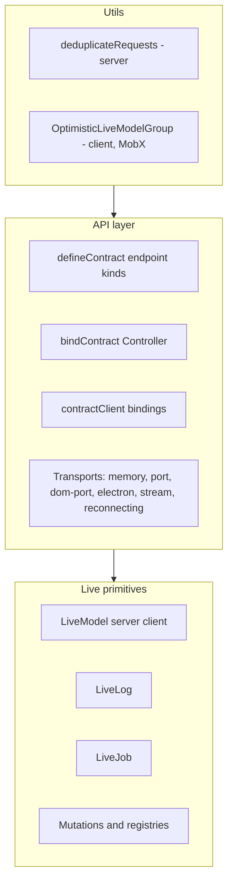

# @emdash/wire Docs

`@emdash/wire` is the transport-agnostic runtime layer for typed API calls,
live model subscriptions, live logs, jobs, mutations, and a small set of utilities
that sit at the API boundary.

The package has three layers:



The live layer owns the stateful primitives: `LiveModelServer` and
`LiveModelClient`, `LiveLogServer` and `LiveLogClient`, `LiveJobServer` and
`LiveJobClient`, plus mutation registries and settling. The API layer turns those
primitives into a contract with typed procedure calls and live topic bindings.
The utility layer adds focused behavior around the API boundary, such as
server-side request deduplication and client-side optimistic group previews.

## Pages

- [Live models and protocol](./live-model.md): snapshots, updates, cursors,
  `LiveModelServer`, `LiveModelClient`, and `BatchedLiveModel`.
- [Live logs](./live-log.md): retained terminal-style logs and client callbacks.
- [Live jobs](./live-job.md): progress, cancellation, terminal state, and results.
- [Mutations](./mutations.md): mutation ids, registries, cursor settling, and
  multi-model updates.
- [Contracts](./contracts.md): `defineContract()`, endpoint kinds, nested
  composition, and live model groups.
- [Serving and clients](./serving-and-clients.md): `bindContract()`,
  `serve()`, `connect()`, `contractClient()`, and transports.
- [Utils](./utils.md): `deduplicateRequests()` and `OptimisticLiveModelGroup`.

Runnable examples live under [../examples](../examples). Most snippets in these
docs are shortened versions of those files.

## Package Exports

Use the broad `@emdash/wire` export when building examples or package-local
features that need both API and live primitives:

```ts
import { bindContract, LiveModelServer, defineContract } from '@emdash/wire';
```

Use narrower subpath exports at app boundaries:

- `@emdash/wire/live`: live primitives and mutation registries.
- `@emdash/wire/api`: contract definition, binding, client creation, and transports.
- `@emdash/wire/util`: dependency-free utilities, currently `deduplicateRequests`.
- `@emdash/wire/util/optimistic`: MobX-backed optimistic group utilities.

The optimistic utility intentionally lives in its own export because it has a
`mobx` peer dependency. Server-only code can import `@emdash/wire` or
`@emdash/wire/util` without pulling in MobX.

## Typical Flow

1. Define a contract with `defineContract({ ... })`.
2. Create server-side `LiveModelServer`, `LiveLogServer`, or `LiveJobServer`
   instances.
3. Register live model instances in `LiveModelRegistry` when mutations or
   `fromRegistry()` should resolve them.
4. Bind the contract with `bindContract(contract, { impl, registry })`.
5. Serve the controller over a `WireTransport`.
6. Connect from the client and create a typed `contractClient`.
7. Bind live endpoints, call procedures/mutations, and dispose bindings when
   the view or session goes away.

For a complete example in one file, see [../examples/contract/client.ts](../examples/contract/client.ts).
