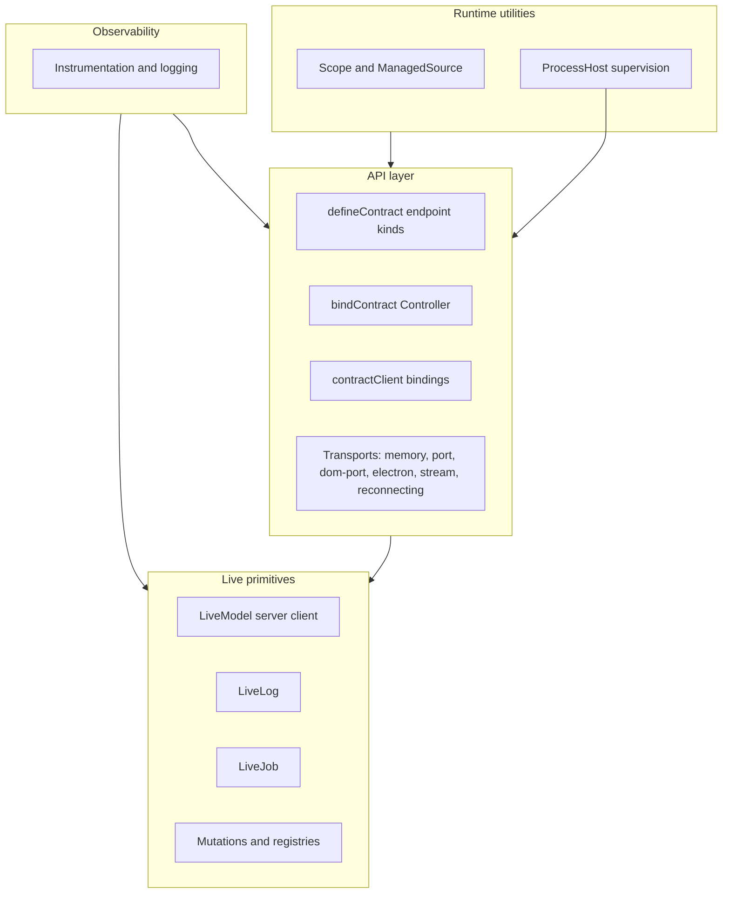

# @emdash/wire Docs

`@emdash/wire` is the transport-agnostic runtime layer for typed API calls,
live model subscriptions, live logs, jobs, mutations, and a small set of utilities
that sit at the API boundary.

The package has four layers:



The live layer owns the stateful primitives: `LiveModelServer` and
`LiveModelClient`, `LiveLogServer` and `LiveLogClient`, `LiveJobServer` and
`LiveJobClient`, plus mutation registries and settling. The API layer turns those
primitives into a contract with typed procedure calls and live topic bindings.
The runtime layer owns lifecycle utilities and process supervision. Observability
hooks are cross-cutting and can be attached to API, live, and runtime surfaces.

## Pages

- API:
  - [Contracts](./api/contracts.md): `defineContract()`, endpoint kinds, nested
    composition, and live model groups.
  - [Serving and clients](./api/serving.md): `bindContract()`, `serve()`,
    `connect()`, `contractClient()`, cancellation, relays, session hubs, and
    server-side call helpers.
  - [Transports](./api/transports.md): memory, ports, Electron, streams,
    reconnecting, process, and logging transports.
- Live:
  - [Live models and protocol](./live/live-model.md): snapshots, updates,
    cursors, `LiveModelServer`, `LiveModelClient`, and `BatchedLiveModel`.
  - [Live logs](./live/live-log.md): retained terminal-style logs and client
    callbacks.
  - [Live jobs](./live/live-job.md): progress, cancellation, terminal state,
    retention, and contract job handles.
  - [Mutations](./live/mutations.md): mutation ids, registries, cursor settling,
    idempotency cache, and retry behavior.
  - [Optimistic live model groups](./live/optimistic-group.md): MobX-backed
    optimistic previews for `liveModelGroup`.
- Runtime:
  - [Lifecycle utilities](./runtime/lifecycle.md): `Scope`, scope loggers,
    `describeScope()`, and `ManagedSource`.
  - [ProcessHost](./runtime/process-host.md): supervised child/utility processes
    and process-backed wire transports.
- [Observability](./observability.md): ambient logger context, instrumentation
  hooks, controller logging, transport debug logging, and scope loggers.

Runnable examples live under [../examples](../examples). Most snippets in these
docs are shortened versions of those files.

## Package Exports

Use the broad `@emdash/wire` export when building examples or package-local
features that need both API and live primitives:

```ts
import { bindContract, LiveModelServer, defineContract } from '@emdash/wire';
```

Use narrower subpath exports at app boundaries:

- `@emdash/wire/live`: live primitives and mutation registries.
- `@emdash/wire/api`: contract definition, binding, client creation, and transports.
- `@emdash/wire/observability`: instrumentation hooks, logger adapters, and
  controller logging middleware.
- `@emdash/wire/util`: dependency-free utilities: `Scope`, `ManagedSource`,
  and `deduplicateRequests`.
- `@emdash/wire/util/optimistic`: MobX-backed optimistic group utilities.
- `@emdash/wire/process`: process supervision types, `utilityProcessHost()`,
  and `processTransport()`.
- `@emdash/wire/process/node`: Node `childProcessHost()`.

The optimistic utility intentionally lives in its own export because it has a
`mobx` peer dependency. Server-only code can import `@emdash/wire` or
`@emdash/wire/util` without pulling in MobX.

## Typical Flow

1. Define a contract with `defineContract({ ... })`.
2. Create server-side `LiveModelServer`, `LiveLogServer`, or `LiveJobServer`
   instances.
3. Register live model instances in `LiveModelRegistry` when mutations or
   `fromRegistry()` should resolve them.
4. Bind the contract with `bindContract(contract, { impl, registry })`.
5. Serve the controller over a `WireTransport`.
6. Connect from the client and create a typed `contractClient`.
7. Bind live endpoints, call procedures/mutations, and dispose bindings when
   the view or session goes away.

For a complete example in one file, see [../examples/contract/client.ts](../examples/contract/client.ts).
