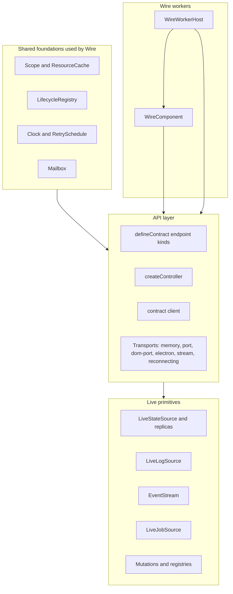

# @emdash/wire Docs

`@emdash/wire` is the transport-agnostic runtime layer for typed API calls,
live model subscriptions, live logs, event streams, jobs, mutations, workers, and
the small utilities that sit at the API boundary.

Wire builds on Shared foundations for generic lifecycle, scheduling,
concurrency, testing, and stable utility behavior:


```mermaid
flowchart TB
  subgraph shared [Shared foundations used by Wire]
    scope[Scope and ResourceCache]
    registry[LifecycleRegistry]
    scheduling[Clock and RetrySchedule]
    mailbox[Mailbox]
  end
  subgraph api [API layer]
    contracts[defineContract endpoint kinds]
    controller[createController]
    client[contract client]
    transports[Transports: memory, port, dom-port, electron, stream, reconnecting]
  end
  subgraph live [Live primitives]
    model[LiveStateSource and replicas]
    log[LiveLogSource]
    eventStream[EventStream]
    job[LiveJobSource]
    mutations[Mutations and registries]
  end
  subgraph workers [Wire workers]
    component[WireComponent]
    workerHost[WireWorkerHost]
  end
  shared --> api --> live
  component --> api
  workerHost --> api
  workerHost --> component
```

The live layer owns the stateful primitives: `LiveStateSource`, `LiveLogSource`,
`EventStreamSource`, `LiveJobSource`, and consumer-instantiated replicas; live
models are served by providers, usually `expose()` over kernel state. Low-level `*Client` followers track cursors and resync, while
materializers (`StateStore`, `LogSink`, `JobStore`) own values. Most consumers use
client handles directly or wrap them in replicas. The API layer turns those
primitives into a contract with typed procedure calls and live topic client
handles. `WireComponent` is the reusable contract implementation pattern: it
declares explicit typed requirements, validates config at the creation boundary,
and can be created in-process or hosted in a worker. Worker hosting is Wire-specific because it
serves components across processes. Generic lifecycle, scheduling, concurrency, testing, and stable
utility primitives live in `@emdash/shared` and are documented here where Wire
uses them. The `WireInstrumentation` seam is cross-cutting and can be attached
to API, live, and worker surfaces through their options.

## Pages

- API:
  - [Contracts](./api/contracts.md): `defineContract()`, endpoint kinds, nested
    composition, and live model groups.
  - [Serving and clients](./api/serving.md): `createController()`, `serve()`,
    `connect()`, cancellation, controller composition, session hubs, and
    server-side call helpers.
  - [Composable middleware](./api/middleware.md): target-first `compose()`,
    handler middleware, controller middleware, timeout, retry, and
    deduplication.
  - [Typed clients](./api/clients.md): `ContractClient` handles,
    `forwardController()`, and selective forwarding through `createController()`.
  - [File endpoints](./api/files.md): `downloadFile()`, `uploadFile()`, blob
    channels, and binary stream transport framing.
  - [Wire errors](./api/errors.md): error planes, `WireErrorCode` meanings,
    origins, and retry guidance.
  - [Transports](./api/transports.md): memory, ports, Electron, streams, and
    reconnecting transports.
- Live:
  - [Live models and protocol](./live/live-model.md): snapshots, updates,
    cursors, `LiveStateSource`, and replicas.
  - [Live logs](./live/live-log.md): retained terminal-style logs and client
    callbacks.
  - [Event streams](./live/event-stream.md): keyed fire-and-forget events with
    explicit gap callbacks after reattach.
  - [Live jobs](./live/live-job.md): progress, cancellation, terminal state,
    retention, and contract job handles.
  - [Mutations](./live/mutations.md): mutation ids, host contexts, cursor settling,
    idempotency cache, and retry behavior.
  - [Replicas](./live/replicas.md): `LiveModelReplicaCache`, `LiveLogReplicaCache`,
    `LiveJobReplicaCache`, pluggable stores, ref counting, and serving cached state.
- Runtime:
  - [Lifecycle utilities](./runtime/lifecycle.md): Shared `Scope`,
    `LifecycleRegistry`, scope loggers, `describeScope()`, and resource
    ownership.
  - [Structured concurrency](./runtime/structured-concurrency.md): `Scope.run()`,
    run cancellation, lifecycle invariants, and diagnostics.
  - [Scheduling](./runtime/scheduling.md): Shared `Clock`, `TimerHandle`,
    `ManualClock`, retry schedules, abortable sleeps, and timer ownership.
  - [Resource caches](./runtime/resource-cache.md): Shared `ResourceCache`,
    `SharedResource`, `AsyncCache`, identity rules, and lease behavior.
  - [Mailbox and Broadcast](./runtime/mailbox-and-broadcast.md): Shared bounded
    local async handoff, overflow policy, guarantees, and the deferred Broadcast
    contract.
  - [Components](./runtime/components.md): `defineWireComponent()`, explicit
    requirements, in-process creation, worker deployment, and non-DI composition
    rules.
  - [Workers](./runtime/workers.md): `WireWorkerHost`, one-generation spawners,
    `runWireComponentWorker()`, and process-hosted components.
- [Observability](./observability.md): ambient logger context, the
  `WireInstrumentation` seam, and scope loggers.

Runnable examples live under [../examples](../examples). Most snippets in these
docs are shortened versions of those files.

## Package Exports

There is no root export: every symbol has exactly one home in a hand-curated
subpath entrypoint.

```ts
import { createController, defineContract } from '@emdash/wire/rpc';
import { cell, expose } from '@emdash/wire/state';
```

- `@emdash/wire/rpc`: contract definition (`defineContract()`, endpoint
  factories), controller creation, clients, `connect()`/`serve()`, transports,
  protocol vocabulary (`WireMessage`, `WireTransport`, `WireError`,
  `LiveSource`, `LiveUpdate`, cursors), provider seam types
  (`LiveModelProvider`, `LeasedLiveModelProvider`,
  `LiveModelMutationEnvelope`), the blob/file surface, validation, and the
  `WireInstrumentation` seam types. Retry schedules come from
  `@emdash/shared/scheduling`.
- `@emdash/wire/live`: the server-side reactivity sources (`LiveLogSource`,
  `LiveJobSource`, `EventStreamSource`, `createEventStreamHost()`), the keyed
  replica caches (`createLiveLogReplicaCache()`, `createLiveJobReplicaCache()`,
  `ReplicaLog`), and resync failure policies (`resyncRetry()`,
  `resyncMarkStale()`).
- `@emdash/wire/state`: state kernel primitives and Wire bridges (`cell`,
  `query`, `family`, `optimistic`, `observe`, `expose`, `remote`).
- `@emdash/wire/mobx`: MobX-backed log/store helpers
  (`createImmutableMobxStore`, `createReactiveMobxStore`, `createMobxLogStore`).
- `@emdash/wire/testing`: Wire test helpers such as `createTestWire()` and fake
  worker process support.
- `@emdash/wire/worker`: `WireWorkerHost`, `runWireComponentWorker()`,
  `defineWireComponent()` and component requirement helpers, worker signal
  types, supervision types, process contracts, and worker log forwarding.
- `@emdash/wire/worker/node`: Node `childProcessSpawner()`.

Use Shared subpaths directly for generic foundations:

- `@emdash/shared/concurrency`: `Scope`, `Run`, `LifecycleRegistry`, `Mailbox`,
  `ResourceCache`, `SharedResource`, `AsyncCache`, bounded buffers, and disposable
  helpers.
- `@emdash/shared/scheduling`: `Clock`, `systemClock`, `TimerHandle`,
  `TimeoutError`, `runWithTimeout()`, `RetrySchedule`, retry schedule builders,
  and `retry()`.
- `@emdash/shared/requests`: request handler composition, timeout, retry,
  in-flight deduplication, and request scheduling.
- `@emdash/shared/testing`: `createManualClock()`, `deferred()`, `waitFor()`, and
  stub logger helpers.
- `@emdash/shared/util`: stable utility helpers such as `stableStringify()`.

MobX-backed utilities intentionally live in their own export because they have a
`mobx` peer dependency. Server-only code can import `@emdash/wire/rpc`,
`@emdash/wire/live`, `@emdash/wire/state`, `@emdash/wire/worker`, and Shared
foundation subpaths without pulling in MobX.

## Typical Flow

1. Define a contract with `defineContract({ ... })`.
2. Create server-side `cell`, `query`, `LiveLogSource`, `EventStreamSource`, or `LiveJobSource`
   instances and publish live models with `expose()`.
3. Use `family()` or explicit domain indexes for keyed live model resources.
4. Create a controller with `createController(contract, impl)`. Validation is
   applied by default (`'full'` outside production, `'inputs'` in production);
   pass `{ validate }` to override.
5. Serve the controller over a `WireTransport`.
6. Connect from the client and create a typed `client()`.
7. Use client handles directly for streaming, or use `remote()` for local state,
   ref counting, and downstream observation.

For a complete state kernel example (`cell` + `expose` on the server,
`remote()` on the client), see [../examples/state-kernel](../examples/state-kernel).

## Event Stream Attachment Law

Event streams retain no events, and a connection deduplicates attachments to the same topic.
Anything a late attacher must learn therefore has to live in a retained snapshot or in the attach
acknowledgment, never in an event-stream message. A one-shot `ready` event is not a valid readiness
barrier: a consumer joining an already-attached topic will not cause the server to emit it again.

Use `resourcedStream()` when a successful attach must guarantee that an underlying resource is
ready. Its host must be created with `createEventStreamHost(def, { activate })`, where `activate`
resolves to the activation-owned disposer only after the resource is ready. The source registers
the subscriber before activation begins, shares and retains the activation promise for all
subscribers to the key, and invokes the disposer when the final subscriber leaves. Failed
activation is not retained, so a later attach makes a fresh attempt.

This guarantee is enforced when a controller binds the endpoint: a resourced definition accepts
its matching host or a forwarded client handle, but rejects a bare resolver. Forwarding preserves
the barrier because the downstream attach is acknowledged only after the upstream attach is
acknowledged.
