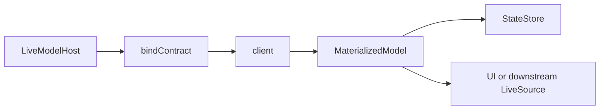
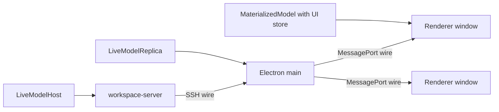

# Materialization

Wire keeps typed protocol access and live state materialization separate.

- `client()` is thin and stateless.
- `MaterializedModel` follows one thin live handle and stores current state.
- `materializeInstance()` creates one materialized model per group member and
  exposes locally-settled mutation methods.
- `createLiveModelReplica()` materializes upstream state in a serving process and
  exposes it again as a group provider.



The important boundary is that protocol correctness lives in the materializer, not
in the store. A store can be plain immutable state, MobX observables, or another
environment-specific representation; it only needs to reset, apply patches, and
return the current value.

## State Stores

`MaterializedModel` accepts a pluggable store:

```ts
interface StateStore<T> {
  reset(data: T): void;
  apply(patches: Patch[]): T;
  current(): T;
}
```

`createPlainStore()` is the default store for Node, Electron main, and tests. UI
framework adapters can provide their own stores, such as a MobX-backed store in the
renderer, without reimplementing protocol handling.

## MaterializedModel

`MaterializedModel` follows one `ThinLiveHandle`:

```ts
const thin = client(api, connect(transport));
const state = new MaterializedModel(thin.conversation.model(key, 'state'), {
  schema: stateSchema,
  onChange: (value, meta) => {
    console.log(meta.kind, value);
  },
});

await state.ready;
console.log(state.current());
await state.dispose();
```

It owns the live protocol lifecycle:

- fetch the initial snapshot and seed the store.
- attach to updates and apply patch deltas in sequence.
- detect generation changes, sequence gaps, and patch failures.
- refetch snapshots on resync and transport reattach.
- validate patched state in development when a schema is supplied.
- expose `waitForCursor()` and `waitForMutation()` for mutation settling.

`MaterializedModel` also implements `LiveSource`. That means a materialized model
can be served downstream by `bindContract()` through a group provider, which is what
`createLiveModelReplica()` uses internally.

Materialized models have their own local cursor space. Upstream cursors are valid
only against the upstream source. When a materialized model re-emits patches
downstream, it emits them with local generation and sequence numbers while
preserving `mutationIds`.

## Manual Group Materialization

```ts
const thin = client(api, connect(transport));

const conversation = materializeInstance(thin.conversation, key, {
  onChange: {
    state: (state, meta) => {
      console.log(state, meta.kind);
    },
  },
});

await conversation.ready;
const updated = await conversation.mutations.setTitle({ title: 'New title' });
await updated.settled;
console.log(conversation.models.state.current());
await conversation.dispose();
```

The materializer owns snapshot, attach, reattach refresh, sequence gap resync,
schema validation in development, mutation-id settling, and cursor waits. Store
implementations only manage local state.

### Mutation Settling

Group mutations return `{ result, settled }` from `materializeInstance()`:

```ts
const invocation = await conversation.mutations.setTitle(
  { title: 'New title' },
  { mutationId: 'ui-set-title' }
);

await invocation.settled;
console.log(conversation.models.state.current());
```

The mutation call is sent through the thin group with a `mutationId`. When the
server responds with cursor entries, the materialized instance waits for each local
member model to prove it has caught up. A model is settled when either:

- it applies an update tagged with the mutation id, or
- it reaches the returned cursor.

This keeps UI reads simple: after `await settled`, the materialized models reflect
the authoritative mutation result.

## Replicas

`createLiveModelReplica(contract, thinGroup, { retentionMs })` is a cached hop. It
is useful in Electron main, where renderer windows can reload or close while the
main process keeps recent state warm.

```ts
const upstream = client(workspaceApi, connect(sshTransport));

const controller = bindContract(workspaceApi, {
  conversation: createLiveModelReplica(
    workspaceApi.conversation,
    upstream.conversation,
    { retentionMs: 10 * 60_000 }
  ),
});
```

The typical Electron shape is:



The replica uses `ManagedSource` per key. First downstream demand creates
materialized member models and attaches upstream; last downstream detach starts the
retention timer. Reattaching before the timer expires reuses the warm state.

Mutations pass through to the upstream group with the same `mutationId`. The replica
waits until its materialized models include the upstream result cursors, then returns
equivalent local cursors so downstream settling works without special cases.

Replicas cache one upstream. If a process needs to merge multiple writers or own
domain behavior, use `createLiveModelHost()` instead.

### Replica Local Access

Replicas are also the right shape when a serving process needs to inspect the same
state it forwards. Electron main can keep a replica warm for renderer windows and
also acquire the materialized instance for local reads:

```ts
const upstream = client(workspaceApi, connect(sshTransport));
const conversations = createLiveModelReplica(workspaceApi.conversation, upstream.conversation, {
  retentionMs: 10 * 60_000,
});

const controller = bindContract(workspaceApi, {
  git: upstream.git, // pure forward
  conversation: conversations, // cached and locally readable
});

async function summarizeConversation(conversationId: string) {
  const lease = conversations.acquire({ conversationId });
  try {
    const conversation = await lease.ready();
    return summarize(conversation.models.transcript.current());
  } finally {
    await lease.release();
  }
}
```

`acquire()` creates or reuses the managed replica instance and holds it active until
`release()`. `peek()` returns an already-warm instance without creating a new one:

```ts
const warm = conversations.peek({ conversationId });
const transcript = warm?.models.transcript.current();
```

Long-lived desktop responsibilities, such as badges or notifications, should hold a
lease in their own scope:

```ts
const lease = conversations.acquire({ conversationId });
const conversation = await lease.ready();
const unsubscribe = conversation.models.transcript.subscribe(() => {
  updateDockBadge(conversation.models.transcript.current());
});

scope.add(async () => {
  unsubscribe();
  await lease.release();
});
```

Renderer subscriptions and desktop leases share the same `ManagedSource` ref count.
When all leases release, `retentionMs` keeps the instance warm for reloads; after the
retention window, the replica disposes its upstream subscriptions.

### Replica Mutation Flow

For a group mutation through a replica:

1. The downstream materialized instance sends a mutation with a `mutationId`.
2. The replica forwards the same mutation id upstream.
3. The authoritative host runs the mutation and returns upstream cursor entries.
4. The replica waits for its materialized member models to apply those upstream
   updates.
5. The replica translates the upstream cursors to its local cursor space and returns
   those local cursors downstream.
6. The downstream materialized instance settles using the normal rules.

This cursor re-anchoring is why renderer windows can talk to Electron main exactly
as if it owned the state, even though main is only caching one upstream source.

### Choosing Host, Forward, or Replica

- Use `createLiveModelHost()` when this process owns the domain state and mutation
  behavior.
- Use thin-client forwarding when this process should not keep state.
- Use `createLiveModelReplica()` when this process should keep a cached copy of one
  upstream, serve it to downstream clients, or inspect it locally.

Replicas are not merge points. If two upstreams can write the same key, put domain
logic behind a host instead of a replica.
