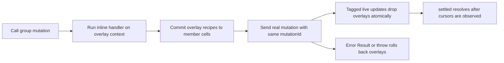

# Optimistic Live Model Groups

`OptimisticLiveModelGroup` is a MobX-backed client utility for
`liveModelGroup` endpoints. It derives local previews from the same inline group
mutation handlers that the server uses, then rolls those previews forward or
back as authoritative live updates arrive.

Import it from the MobX subpath:

```ts
import { OptimisticLiveModelGroup } from '@emdash/wire/util/optimistic';
```

## Contract Requirements

`OptimisticLiveModelGroup` works only with `liveModelGroup` definitions. The
group has all information needed for a safe preview: member models, shared key,
and inline group mutation handlers.

```ts
const api = defineContract({
  conversation: liveModelGroup({
    key: conversationKeySchema,
    models: {
      state: liveModel({ data: stateSchema }),
      usage: liveModel({ data: usageSchema }),
    },
    mutations: {
      setTitle: mutation(
        { input: z.object({ title: z.string() }), data: stateSchema, error: z.string() },
        (ctx, input) => {
          ctx.produce('state', (draft) => {
            (draft as { title: string }).title = input.title;
          });
          ctx.produce('usage', (draft) => {
            (draft as { tokens: number }).tokens += input.title.length;
          });
          return ok({ title: input.title });
        }
      ),
    },
  }),
});
```

## Client Usage

Create the normal server registry and typed client, then wrap the group endpoint:

```ts
const instance = createGroupInstance(api.conversation, key, {
  state: { title: 'Initial' },
  usage: { tokens: 0 },
});
registry.registerGroup(api.conversation, key, instance);

const client = contractClient(api, connect(pair.left));
const conversation = new OptimisticLiveModelGroup(api.conversation, key, client.conversation);
await conversation.ready;
```

The public surface separates observable values from mutation methods:

```ts
console.log(conversation.values.state); // { title: 'Initial' }

const setTitle = conversation.mutations.setTitle({ title: 'Optimistic wire' });
console.log(conversation.values.state); // optimistic value immediately
console.log(conversation.isPending); // true

const result = await setTitle;
await result.settled;
console.log(conversation.isPending); // false

await conversation.dispose();
```

## Lifecycle



Details:

- The local handler run is used only for its `ctx.produce()` side effects. The
  server result is authoritative.
- The wire call uses the same generated mutation id as the overlay. When a live
  model update arrives with that id, the relevant member overlay is removed in
  the same MobX action as the authoritative base update.
- If the server returns an error result or throws, all overlays for that mutation
  id are removed.
- If a seed/resync lands, all pending overlays for that member are cleared
  because the snapshot is authoritative.
- `settled.finally` also clears overlays as a safety net after cursor settling.

## Handler Purity

Group mutation handlers may run on both server and client. Keep them pure:

- OK: derive values from input and current member drafts.
- OK: call `ctx.produce()` on one or more group members.
- Avoid: network calls, filesystem access, time, randomness, and server-only
  stores in the inline handler.

If a workflow needs server-only work, keep that work outside the inline group
handler and model it as a `procedure()` or `job()` that updates domain state.

`@emdash/wire/util/optimistic` intentionally has a separate subpath export
because it depends on MobX. Server-only code should import lifecycle utilities
from `@emdash/wire/util`.

See [../../examples/optimistic-group/client.ts](../../examples/optimistic-group/client.ts).
