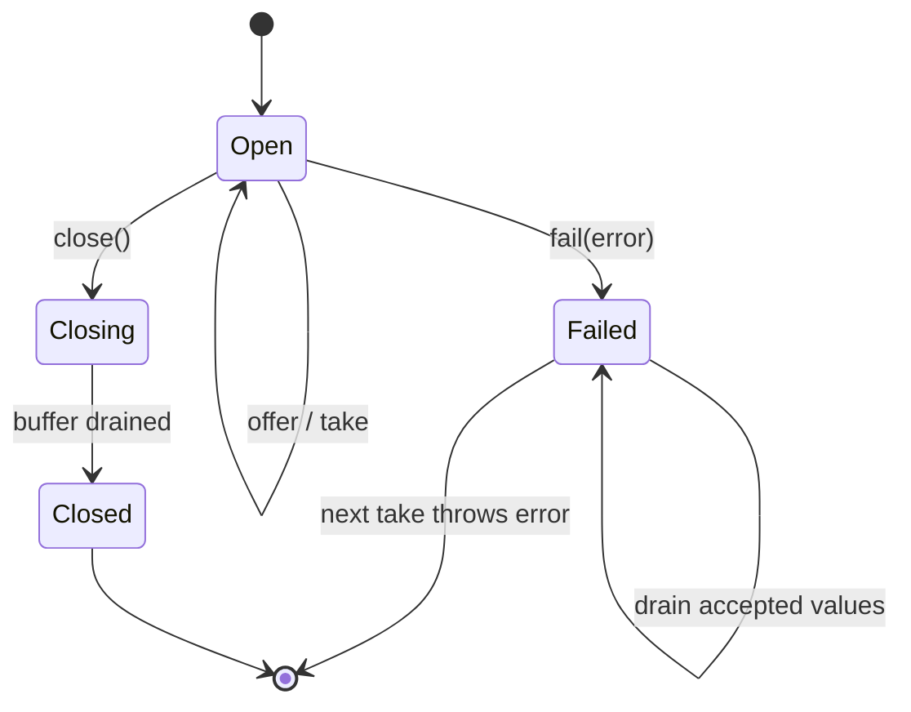
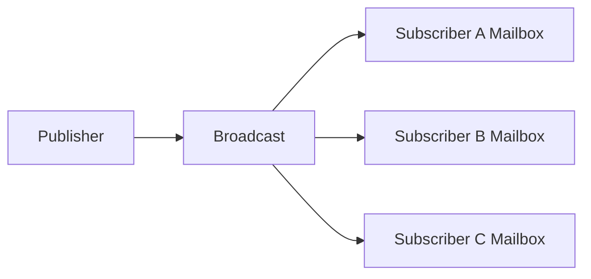

# Mailbox and Broadcast

`Mailbox<T>` is a bounded, asynchronous handoff primitive exported from
`@emdash/wire/util`. Use it when one logical consumer needs to drain values from
one or more producers without hand-writing arrays, waiter lists, terminal flags,
and overflow policy.

```ts
import { createMailbox, createScope } from '@emdash/wire/util';

const scope = createScope({ label: 'download' });
const chunks = scope.use(createMailbox<Uint8Array>({ capacity: 64 }));

const consumer = scope.run('drain', async () => {
  for await (const chunk of chunks) {
    await writeChunk(chunk);
  }
});

await chunks.offer(new Uint8Array([1, 2, 3]));
chunks.close();
await consumer.value();
```

## Mailbox

A mailbox has many producers and one logical consumer. Values accepted into the
mailbox are delivered in FIFO order. The consumer can use `take()` for one value
at a time or `for await` for a draining loop.

```ts
const mailbox = createMailbox<Job>({
  capacity: 128,
  overflow: 'suspend',
});

await mailbox.offer(job, { signal });
const next = await mailbox.take({ signal });
```

### State Machine



`close()` is graceful: accepted values drain before consumers see the end of the
stream. `fail(error)` is also ordered: accepted values drain first, then the next
take or iterator step throws the failure. `dispose()` is immediate: it clears
buffered values and unblocks pending producers and consumers.

### Guarantees

- Accepted values are delivered in FIFO order.
- A value is delivered to at most one consumer.
- Only one pending `take()` or active async iterator is allowed at a time.
- Capacity is explicit and always finite.
- Overflow is explicit: `suspend`, `reject`, `drop-oldest`, or `drop-newest`.
- `tryOffer()` never waits.
- `offer()` waits only when overflow is `suspend`.
- `offer()` and `take()` can observe an `AbortSignal`; aborting one operation does
  not close the mailbox.
- Terminal operations are idempotent.
- `scope.use(mailbox)` ties disposal to the owning scope, but consumer loops should
  still run under `scope.run()` when they must not outlive the feature.

### Overflow Policies

Use `suspend` when every accepted value matters and producers can wait. Use
`reject` when overflow is a protocol or invariant violation. Use `drop-oldest` for
best-effort queues where freshness matters more than history. Use `drop-newest`
when existing queued work should be preserved and incoming work can be ignored.

Blob channels use `reject` internally because dropping bytes would corrupt the
stream. The reconnecting transport uses a shared bounded buffer with
`drop-oldest`, preserving the existing policy that old non-blob frames are less
valuable than recent ones while disconnected.

### Non-Goals

Mailbox is not:

- a durable queue;
- a multi-consumer work queue;
- a replay log;
- an acknowledgement or retry protocol;
- a mutex;
- a domain error channel.

Expected domain failures should still be represented as `Result<T, E>`. Mailbox
failure means the local handoff itself was terminated by lifecycle, protocol, or
transport failure.

## Broadcast Contract

`Broadcast<T>` is the reserved name for a future local asynchronous fan-out
primitive. It should not be called `Topic<T>` because Wire already uses “topic” for
remote live subscription addresses.

The intended shape is one mailbox per subscriber:



The intended guarantees are:

- `publish(value)` never runs subscriber application code directly.
- Each subscriber receives values through its own mailbox.
- Slow subscribers apply only their own overflow policy.
- Per-subscriber delivery is FIFO for accepted values.
- New subscribers do not receive replay.
- Closing or failing the broadcast propagates to every subscription.
- Publish results report subscriber count, delivered count, and dropped count.

Do not implement or migrate to `Broadcast<T>` until a source has at least two
genuinely asynchronous consumers that need independent buffering or overflow
policies. Current Wire sources do not meet that bar: process stdio has one
production subscriber, and observability hooks already isolate synchronous
failures.

## Where Not To Use These

Do not replace `LiveState`, `LiveLog`, `EventStreamSource`, replicas, live
followers, or reconnect attachment logic with Mailbox or Broadcast. Those
primitives carry generation, sequence, snapshot, resync, reconnect, retention, or
gap semantics that Mailbox deliberately does not provide.

Do not replace condition waiters such as live cursor waiters or renderer version
waiters. They wait for a predicate over monotonic state; they do not queue values.

See also [Structured concurrency](./structured-concurrency.md) and
[Lifecycle utilities](./lifecycle.md).
