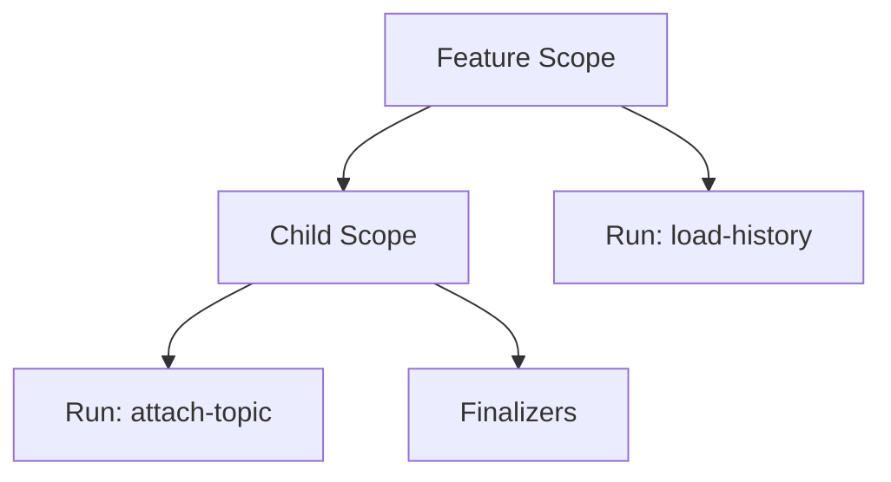

# Structured Concurrency

`Scope.run()` tracks asynchronous work under the same owner as subscriptions,
processes, timers, and other resources. Use it when work must not outlive the
feature that started it.

```ts
const scope = createScope({ label: 'session:abc', logger });

const run = scope.run('load-history', async (signal) => {
  const history = await loadHistory({ signal });
  return history;
});

const history = await run.value();
await scope.dispose();
```

## Concepts

- `Scope` owns a lifecycle tree. Parent disposal closes children.
- `Run<A>` is one async operation owned by a scope.
- `Run.exit` never rejects. It resolves to `success`, `failure`, or `cancelled`.
- `Run.value()` converts the exit back to normal promise semantics.
- `Lease<A>` is temporary use of a shared resource, usually from `ResourceCache`
  or `SharedResource`.



## Lifecycle

Disposal is idempotent and ordered:

1. The scope moves from `open` to `closing`.
2. `scope.signal` aborts synchronously.
3. Existing child scopes begin closing.
4. Active runs are cancelled.
5. The scope waits for child scopes and runs.
6. Cleanups run in reverse registration order.
7. Cleanup errors are logged and later cleanups still run.
8. The scope moves to `closed`.

Starting a run after closing has begun does not invoke the operation. The returned
run is already cancelled. Adding a cleanup after a scope is closed runs it
immediately as best-effort cleanup.

## Invariants

- Every child scope has one parent.
- Every run belongs to one scope.
- `dispose()` returns the same promise for every caller.
- `scope.signal` aborts before the first `await` in disposal.
- Parent cancellation propagates to children.
- Sibling runs do not cancel each other.
- `Run.exit` never rejects.
- A cancelled run is reported as `cancelled` even if the operation later returns.
- A failed run is logged through the scope logger.
- A scope is not closed until owned runs and children have settled.

JavaScript cancellation is cooperative. A run that ignores its signal can keep
`dispose()` pending. Pass the run signal into network calls, sleeps, process
waits, and any helper that can observe cancellation.

## When To Use It

Use `run()` for:

- background jobs and progress sources;
- pending replica attachment or snapshot work;
- process spawn, restart backoff, and exit handling;
- renderer bindings with fire-and-forget RPCs;
- async setup that must be cleaned up if later setup fails.

Use `add()` or `use()` for:

- subscriptions;
- timers and observers;
- resource finalizers;
- objects with `dispose()`.

Use child scopes for:

- per-session resources under a runtime;
- per-job resources under a job source;
- per-consumer resources under a shared cache;
- modal or view-local lifetimes.

Use `ResourceCache` for keyed, ref-counted resources. Its creation runs under
the entry scope, so invalidating an entry or disposing the parent scope cancels
and joins in-flight creation before finalizers run.

Do not use `run()` as:

- a mutex or serialization primitive;
- a retry policy;
- a cache;
- a domain error channel.

Expected domain failures should still be returned as `Result<T, E>`. A run
failure means the operation itself threw unexpectedly.

## Diagnostics

`describeScope(scope)` includes the lifecycle state, active child scopes, and
active runs:

```ts
console.log(describeScope(scope));
```

Each run description includes its label, start time, and whether cancellation has
started. This is useful for finding retained sessions, stuck process transitions,
or long-running renderer bindings during tests and debugging.
