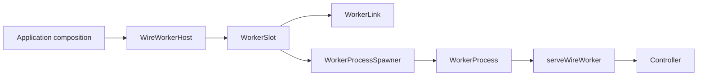

# Workers

A worker is a named, process-hosted wire contract owned by a `WireWorkerHost`.
The host registers logical workers, while each worker has one `WorkerSlot` that
owns readiness, supervision, reconnects, graceful shutdown, and the stable typed
client. Low-level spawners create exactly one process generation.

## Layers



- `WireWorkerHost` is a registry and ownership boundary. Composition roots inject
  a `WorkerProcessSpawner`, logger, clock, and defaults.
- `WorkerSlot` is the only multi-generation state machine. It keeps one stable
  connection/client while child processes restart underneath it.
- `WorkerProcessSpawner` is platform-specific and creates one generation. Use
  `@emdash/wire/worker/node` for Node child processes or
  `@emdash/wire/worker/electron` for Electron utility processes.
- `serveWireWorker()` is the child-side IPC bridge. Controller middleware such as
  validation and logging is passed explicitly by the child boot file.

## Parent Side

```ts
import { createWireWorkerHost } from '@emdash/wire/worker';
import { childProcessSpawner } from '@emdash/wire/worker/node';
import { createScope } from '@emdash/shared/concurrency';
import { api } from './contract';
import { workerPath } from './worker-manifest';

const scope = createScope({ label: 'main' });
const host = createWireWorkerHost({
  scope,
  processSpawner: childProcessSpawner(),
});

const worker = host.define({
  name: 'counter',
  contract: api,
  process: () => ({
    entry: workerPath('counter'),
    env: process.env,
  }),
});

await worker.ready();
const client = worker.client;
await client.increment(undefined);
await host.dispose();
```

`worker.client` is available immediately and keeps the same identity across
process restarts. `worker.ready()` starts the process and waits for the child
ready signal. Calls fail fast while the worker is unavailable; Wire does not
buffer requests during downtime.

Startup and exposure are explicit composition-site decisions. For eager startup,
run `worker.ready()` under an owning scope. For Electron windows, compose a
forwarding controller and use `exposeWireToWindows()` with a `beforeOpen` hook
that awaits `worker.ready()`.

## Child Side

```ts
import { initProcessLogging } from '@emdash/shared/logger/node';
import { createController, validation } from '@emdash/wire/api';
import { serveWireWorker, workerValidatePolicy } from '@emdash/wire/worker';
import { api } from './contract';

const env = process.env;
const logger = initProcessLogging({ name: 'counter-runtime', env });

void serveWireWorker(
  ({ scope }) => {
    scope.add(() => console.log('counter worker disposed'));
    return createController(api, {
      increment: () => 1,
    });
  },
  {
    logger,
    middleware: [validation(api, workerValidatePolicy(env))],
  }
);
```

The child helper resolves the parent IPC channel, serves wire messages, sends the
ready signal after the controller is installed, disposes the child scope on
shutdown/disconnect, and exits with code `1` if initialization fails.
