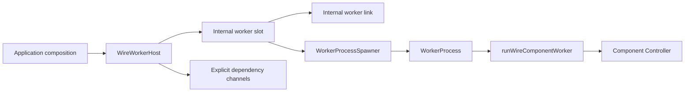

# Workers

A worker is a named, process-hosted `WireComponent` owned by a `WireWorkerHost`.
The host creates logical workers and exposes a stable typed client. Internally, each worker has one
slot that owns readiness, supervision, reconnects, graceful shutdown, and process generations.
Low-level spawners create exactly one process generation.

See [Components](./components.md) for the authored component shape, local creation examples,
dependency requirements, and testing guidance. This page focuses on process supervision.

## Layers



- `WireWorkerHost` is a process ownership boundary. Composition roots inject a
  `WorkerProcessSpawner`, logger, clock, and defaults.
- The internal worker slot is the only multi-generation state machine. It keeps one stable
  connection/client while child processes restart underneath it; it is not an author-facing API.
- `WorkerProcessSpawner` is platform-specific and creates one generation. Use
  `@emdash/wire/worker/node` for Node child processes or
  `@emdash/wire/worker/electron` for Electron utility processes.
- `runWireComponentWorker(component)` is the child-side IPC bridge. It bootstraps typed config,
  connects explicit dependency clients, creates the component, serves its controller, and signals
  readiness.

## Parent Side

```ts
import { createWireWorkerHost } from '@emdash/wire/worker';
import { childProcessSpawner } from '@emdash/wire/worker/node';
import { createScope } from '@emdash/shared/concurrency';
import { counterComponent } from './component';
import { workerPath } from './worker-manifest';

const scope = createScope({ label: 'main' });
const host = createWireWorkerHost({
  scope,
  processSpawner: childProcessSpawner(),
});

const worker = host.create(counterComponent, {
  name: 'counter',
  executable: workerPath('counter'),
  dependencies: {},
  config: {},
});

await worker.ready();
const client = worker.client;
await client.increment(undefined);
await host.dispose();
```

`worker.client` is available immediately and keeps the same identity across
process restarts. `worker.ready()` starts the process and waits for the child
ready signal. Calls fail fast while the worker is unavailable; Wire does not
buffer requests during downtime.

Startup and exposure are explicit composition-site decisions. For eager startup, run
`worker.ready()` under an owning scope or call `host.spawn(component, options)`. For Electron
windows, compose a forwarding controller and use `exposeWireToWindows()` with a `beforeOpen` hook
that awaits `worker.ready()`.

## Child Side

```ts
import { runWireComponentWorker } from '@emdash/wire/worker';
import { counterComponent } from './component';

void runWireComponentWorker(counterComponent);
```

The child helper resolves the parent IPC channel, requests bootstrap config and dependency channels,
serves framed runtime wire messages, sends the ready signal after the component controller is
installed, disposes the child scope on shutdown/disconnect, and exits with code `1` if creation
fails.
