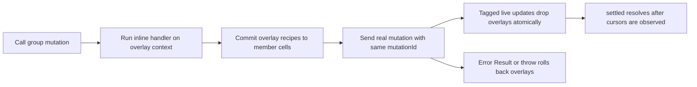

# Utils

Wire utilities sit around the API layer. They do not define new transport
messages; they compose with existing `bindContract()` and `contractClient()`
behavior.

## `Scope`

`Scope` owns a tree of cleanup callbacks and disposable resources:

```ts
import { createScope } from '@emdash/wire/util';

const scope = createScope({ label: 'view' });
scope.add(() => detachTopic());
scope.use({ dispose: () => stopRuntime() });

await scope.dispose();
```

Cleanups run in reverse registration order, child scopes dispose before their
parent, and late cleanups added after disposal run immediately.

See [Scope and ManagedSource](./scope-managed-source.md) and
[../examples/scope/client.ts](../examples/scope/client.ts).

## `ManagedSource`

`ManagedSource` creates resources on first demand and disposes them after the
last lease is released:

```ts
const sessions = createManagedSource({
  key: (input: { id: string }) => input.id,
  graceMs: 5_000,
  create: async (input, scope) => {
    const session = await startSession(input.id);
    scope.add(() => session.stop());
    return session;
  },
});

const lease = sessions.acquire({ id: 'one' });
const session = await lease.ready();
await lease.release();
```

See [Scope and ManagedSource](./scope-managed-source.md) and
[../examples/managed-source/client.ts](../examples/managed-source/client.ts).

## `deduplicateRequests`

Import from the dependency-free utility export:

```ts
import { deduplicateRequests } from '@emdash/wire/util';
```

Use it on the server side inside `bindContract()` procedure implementations:

```ts
const api = defineContract({
  expensiveStats: procedure({
    input: z.object({ repo: z.string(), branch: z.string() }),
    output: z.object({ repo: z.string(), branch: z.string(), executions: z.number() }),
  }),
});

let executions = 0;

const controller = bindContract(api, {
  impl: {
    expensiveStats: deduplicateRequests(async (input) => {
      executions += 1;
      const execution = executions;
      await sleep(10);
      return { ...input, executions: execution };
    }),
  },
});
```

Concurrent calls with the same input share the same in-flight promise:

```ts
const [first, second, third] = await Promise.all([
  client.expensiveStats({ repo: 'emdash', branch: 'main' }),
  client.expensiveStats({ branch: 'main', repo: 'emdash' }),
  client.expensiveStats({ repo: 'emdash', branch: 'feature' }),
]);

console.log(first.executions); // 1
console.log(second.executions); // 1
console.log(third.executions); // 2
```

Behavior:

- Default key is `stableStringify(input)`, so object property order does not
  matter.
- Only in-flight calls are deduplicated. Once a call settles, the next identical
  call executes again.
- Rejections are not cached.
- `meta.signal` is not part of the key and shared execution is not aborted by
  one caller.
- Do not wrap mutations. Two identical mutation calls are two write intents and
  need distinct mutation ids.

Use a custom key when only part of the input defines identity:

```ts
const loadByRepo = deduplicateRequests(loadStats, {
  key: (input) => input.repo,
});
```

See [../examples/dedupe/server.ts](../examples/dedupe/server.ts).

## `OptimisticLiveModelGroup`

Import from the MobX-backed optimistic export:

```ts
import { OptimisticLiveModelGroup } from '@emdash/wire/util/optimistic';
```

`OptimisticLiveModelGroup` works only with `liveModelGroup` definitions. That is
intentional: a group contract has all information needed for a safe preview:
member models, shared key, and inline group mutation handlers.

```ts
const api = defineContract({
  conversation: liveModelGroup({
    key: conversationKeySchema,
    models: {
      state: liveModel({ data: stateSchema }),
      usage: liveModel({ data: usageSchema }),
    },
    mutations: {
      setTitle: mutation(
        { input: z.object({ title: z.string() }), data: stateSchema, error: z.string() },
        (ctx, input) => {
          ctx.produce('state', (draft) => {
            (draft as { title: string }).title = input.title;
          });
          ctx.produce('usage', (draft) => {
            (draft as { tokens: number }).tokens += input.title.length;
          });
          return ok({ title: input.title });
        }
      ),
    },
  }),
});
```

Create the normal server registry and client, then wrap the group endpoint:

```ts
const instance = createGroupInstance(api.conversation, key, {
  state: { title: 'Initial' },
  usage: { tokens: 0 },
});
registry.registerGroup(api.conversation, key, instance);

const client = contractClient(api, connect(pair.left));
const conversation = new OptimisticLiveModelGroup(api.conversation, key, client.conversation);
await conversation.ready;
```

The public surface separates observable values from mutation methods:

```ts
console.log(conversation.values.state); // { title: 'Initial' }

const setTitle = conversation.mutations.setTitle({ title: 'Optimistic wire' });
console.log(conversation.values.state); // optimistic value immediately
console.log(conversation.isPending); // true

const result = await setTitle;
await result.settled;
console.log(conversation.isPending); // false

await conversation.dispose();
```

## Optimistic Lifecycle



Details:

- The local handler run is used only for its `ctx.produce()` side effects. The
  server result is authoritative.
- The wire call uses the same generated mutation id as the overlay. When a live
  model update arrives with that id, the relevant member overlay is removed in
  the same MobX action as the authoritative base update.
- If the server returns an error result or throws, all overlays for that mutation
  id are removed.
- If a seed/resync lands, all pending overlays for that member are cleared
  because the snapshot is authoritative.
- `settled.finally` also clears overlays as a safety net after cursor settling.

## Handler Purity

Group mutation handlers may run on both server and client. Keep them pure:

- OK: derive values from input and current member drafts.
- OK: call `ctx.produce()` on one or more group members.
- Avoid: network calls, filesystem access, time, randomness, and server-only
  stores in the inline handler.

If a workflow needs server-only work, keep that work outside the inline group
handler and model it as a `procedure()` or `job()` that updates domain state.

See [../examples/optimistic-group/client.ts](../examples/optimistic-group/client.ts).

## Dependency Boundary

`@emdash/wire/util` is dependency-free beyond the core wire package dependencies.
`@emdash/wire/util/optimistic` depends on MobX and is published as a separate
subpath export. Server-only code should import `deduplicateRequests` from
`@emdash/wire/util`, not from the optimistic subpath.
